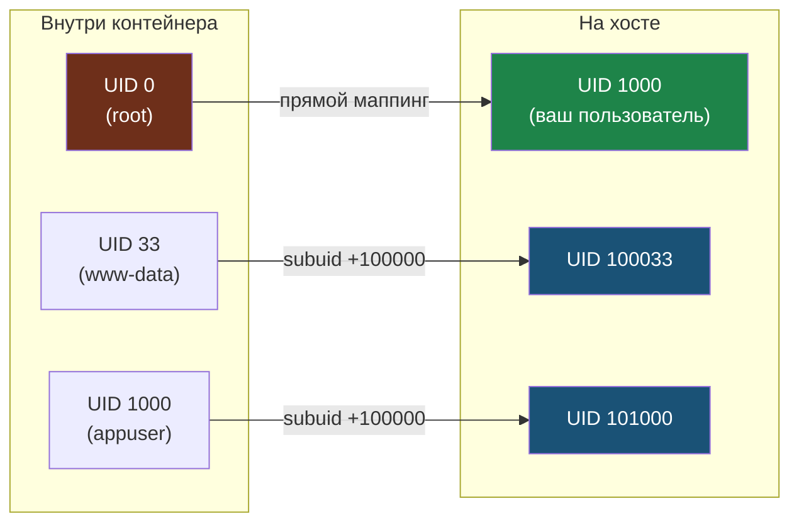

# Глава 5: Rootless-контейнеры — безопасность по умолчанию

## Что вы узнаете

- почему запуск контейнеров от root — это реальная угроза, а не теоретическая;
- как Linux user namespaces создают изоляцию UID без реального root;
- как `/etc/subuid` и `/etc/subgid` отвечают за маппинг идентификаторов;
- какие ограничения есть у rootless и как с ними работать.

---

## Почему root в контейнере — это риск

Когда разработчик пишет `docker run myapp` — процесс внутри контейнера работает как root. Это удобно: не нужно думать о правах. Но что происходит если в приложении есть уязвимость?

**Сценарий с Docker (root-демон):**

```text
1. Приложение в контейнере — уязвимость типа Path Traversal или RCE
2. Злоумышленник выполняет команды внутри контейнера как root (UID 0)
3. Container escape: через уязвимость ядра или неправильно настроенный mount
   выходит за пределы контейнера
4. На хосте — он root. Полный доступ к файлам, сети, другим контейнерам.
5. Хост скомпрометирован.
```

```text
Тот же сценарий с rootless Podman:

1-3. Те же шаги: уязвимость, RCE внутри контейнера, escape
4. На хосте злоумышленник оказывается... пользователем с UID 1000
   Нет доступа к /etc, /root, /var/lib, другим пользователям
5. Хост защищён. Ущерб ограничен файлами одного пользователя.
```

Это не маркетинг — это разница между «потеряли один сервис» и «потеряли сервер».

---

## Маппинг UID: как rootless работает изнутри

Основа rootless — **user namespaces** (пространства имён пользователей). Это механизм ядра Linux, появившийся в версии 3.8.

Идея: внутри namespace можно иметь свой UID 0 (root), который снаружи соответствует обычному непривилегированному пользователю.

```text
Внутри контейнера          /etc/subuid маппинг          На хосте
────────────────────────────────────────────────────────────────
UID  0  (root)      →    username:100000:65536    →    UID 100000
UID  1  (daemon)    →                             →    UID 100001
UID 33  (www-data)  →                             →    UID 100033
UID 1000 (appuser)  →                             →    UID 101000

Результат: "root" в контейнере — обычный пользователь на хосте
```

Тот же маппинг наглядно: UID 0 внутри контейнера соответствует реальному UID пользователя на хосте, а остальные UID берутся из выделенного в `/etc/subuid` диапазона.



«Страшный» UID 0 из контейнера упирается в обычного непривилегированного пользователя — поэтому escape из rootless-контейнера не даёт root на хосте.

### /etc/subuid и /etc/subgid

Эти файлы определяют какой диапазон UID/GID зарезервирован для маппинга каждого пользователя.

```bash
cat /etc/subuid
# alice:100000:65536
# bob:165536:65536

# Формат: username:начало:количество
# alice получает UIDs 100000–165535
# bob получает UIDs 165536–231071
```

Каждый пользователь получает свой диапазон — они не пересекаются. Это гарантирует что контейнеры разных пользователей изолированы даже на уровне UID.

```bash
# Посмотреть свой маппинг
cat /etc/subuid | grep $USER

# Если записи нет — добавить:
sudo usermod --add-subuids 100000-165535 --add-subgids 100000-165535 $USER

# После изменения /etc/subuid нужно:
podman system migrate
```

### Как выглядит маппинг на практике

```bash
# Запустить контейнер в фоне
podman run -d --name demo alpine sleep 300

# Внутри контейнера - мы root:
podman exec demo id
# uid=0(root) gid=0(root) groups=0(root)

# На хосте этот процесс выглядит иначе:
ps aux | grep "sleep 300"
# alice    15234  0.0  0.0   1608   792 ?  Ss   10:00   0:00 sleep 300
# UID = alice (1000), не root

# Точный маппинг:
podman exec demo cat /proc/self/uid_map
#          0       1000          1
# UID 0 внутри = UID 1000 снаружи, только 1 UID в диапазоне

# Проверить через podman unshare (войти в user namespace без контейнера):
podman unshare cat /proc/self/uid_map
#          0       1000          1
#      65536     100000      65536
# Диапазон 65536 UID для маппинга вложенных процессов

podman stop demo && podman rm demo
```

---

## newuidmap и newgidmap

Это вспомогательные утилиты с бит setuid — они умеют настраивать маппинги UID от имени непривилегированного пользователя. Именно через них Podman создаёт user namespace.

```bash
# Проверить наличие
which newuidmap newgidmap
ls -la /usr/bin/newuidmap /usr/bin/newgidmap
# -rwsr-xr-x ... /usr/bin/newuidmap
# Бит s = setuid, выполняется с правами владельца

# Если нет — установить:
sudo apt install uidmap
```

---

## Работа с томами в rootless

Самая частая проблема при переходе на rootless — права на файлы в монтированных томах. Разберём почему и как лечить.

### Проблема: UID внутри не соответствует UID снаружи

```bash
# Создадим файл от своего пользователя (UID 1000)
mkdir /tmp/mydata
echo "hello" > /tmp/mydata/test.txt
ls -la /tmp/mydata/
# -rw-r--r-- 1 alice alice 6 May 28 10:00 test.txt

# Смонтируем в контейнер и посмотрим права
podman run --rm -v /tmp/mydata:/data alpine ls -la /data/
# -rw-r--r--    1 nobody   nobody       6 May 28 10:00 test.txt
# Файл виден как nobody! Это user namespace в действии.
```

Почему `nobody`? Внутри контейнера UID 1000 не замаппирован — он выходит за пределы диапазона (0 mapped to 1000, 65536 to 100000). Файл с UID 1000 снаружи внутри выглядит как неизвестный UID = nobody.

### Решение 1: --userns=keep-id

Самый простой способ — попросить Podman замаппировать UID текущего пользователя как UID внутри контейнера:

```bash
podman run --rm -v /tmp/mydata:/data --userns=keep-id alpine ls -la /data/
# -rw-r--r--    1 alice    alice        6 May 28 10:00 test.txt
# Теперь alice, потому что UID 1000 внутри = UID 1000 снаружи
```

С `--userns=keep-id` файлы которые создаёт контейнер будут принадлежать вашему пользователю на хосте.

```bash
# Создать файл внутри контейнера
podman run --rm -v /tmp/mydata:/data --userns=keep-id alpine touch /data/created-inside.txt

ls -la /tmp/mydata/created-inside.txt
# -rw-r--r-- 1 alice alice 0 May 28 10:05 created-inside.txt
# Владелец — alice, всё правильно
```

### Решение 2: SELinux метка :z

На системах с SELinux (RHEL, Fedora) том может быть недоступен из-за SELinux-контекста, даже если UID правильный. Добавьте `:z` для автоматической перемаркировки:

```bash
# Без :z на SELinux-системе:
podman run --rm -v /tmp/mydata:/data alpine cat /data/test.txt
# Permission denied (SELinux)

# С :z — SELinux-контекст обновляется для доступа из контейнера:
podman run --rm -v /tmp/mydata:/data:z alpine cat /data/test.txt
# hello
```

> **Осторожно с :z:** Эта метка говорит что том может использоваться несколькими контейнерами одновременно. Для монтирования в несколько контейнеров. Если том нужен только одному контейнеру — используйте `:Z` (приватная метка).

### Решение 3: Явно задать UID в контейнере

Иногда проще запустить процесс в контейнере с нужным UID:

```bash
# Запустить процесс с UID 1000 внутри контейнера
podman run --rm -v /tmp/mydata:/data --user 1000:1000 alpine ls -la /data/
# Файлы alice видны нормально

# Или через переменную:
podman run --rm -v /tmp/mydata:/data --user $(id -u):$(id -g) alpine ls -la /data/
```

---

## Ограничения rootless и как с ними работать

### Порты < 1024

Уже разобрали в главе 4. Три варианта: использовать 8080+, настроить sysctl, или setcap.

### Нет доступа к сетевым интерфейсам хоста

```bash
# В rootless нельзя создавать bridge-интерфейсы на хосте
# Podman использует slirp4netns или pasta — userspace сеть

# Если нужна полная сетевая интеграция — использовать --network=host:
podman run --network=host nginx
# Но это снижает изоляцию
```

### Нет загрузки модулей ядра

```bash
# Это не работает в rootless:
podman run --privileged alpine modprobe nfs
# Error: operation not permitted

# Для загрузки модулей нужен реальный root на хосте:
sudo modprobe nfs
# А потом контейнер может использовать NFS уже без --privileged
```

### FUSE-монтирование

Некоторые файловые системы (mergerfs, sshfs, fuse-overlayfs) требуют FUSE. В rootless:

```bash
# Добавить устройство /dev/fuse (если нужно FUSE внутри контейнера):
podman run --device /dev/fuse --cap-add SYS_ADMIN myapp-with-fuse
```

### Cgroups v1 (старые системы)

Rootless Podman полноценно поддерживает cgroups v2. На старых системах с только cgroups v1 (CentOS 7, Ubuntu 18.04) могут быть ограничения.

```bash
# Проверить версию cgroups
mount | grep cgroup
# cgroup2 on /sys/fs/cgroup — v2, всё хорошо
# cgroup on /sys/fs/cgroup — v1, могут быть ограничения
```

---

## Когда rootless не подходит

Честный список ситуаций когда лучше использовать privileged-режим или root Podman:

- **Инфраструктурные контейнеры** которым нужен доступ к устройствам хоста (GPU, сетевые карты).
- **NFS и CIFS монтирование** внутри контейнера.
- **Загрузка модулей ядра** (eBPF, сетевые плагины, файловые системы).
- **Системные контейнеры** (запуск полноценного init, systemd внутри).

Для этих случаев используйте `sudo podman run` или `podman run --userns=host` (теряет изоляцию UID, но даёт доступ к системным ресурсам).

---

## Безопасность: итоговая картина

```text
Сравнение моделей безопасности:

Docker rootful (по умолчанию):
  Контейнер → escape → root на хосте
  Риск: КРИТИЧЕСКИЙ

Docker rootless (настраивается):
  Контейнер → escape → текущий пользователь на хосте
  Риск: СРЕДНИЙ (ограничен файлами пользователя)

Podman rootless (по умолчанию):
  Контейнер → escape → текущий пользователь на хосте
  Риск: СРЕДНИЙ
  + Нет SPOF (нет root-демона)
  + Нет Docker socket в /var/run (нет глобального root-входа)

Podman rootless + seccomp + SELinux:
  Контейнер → escape → текущий пользователь + seccomp блокирует syscalls
  Риск: НИЗКИЙ
```

Rootless не серебряная пуля — container escape через уязвимости ядра всё равно возможен. Но он убирает самый распространённый вектор: «получил shell в контейнере → стал root на хосте».

---

## Типичные ошибки

**«nobody» вместо имени пользователя при ls в томе**
Файл принадлежит UID который не замаппирован внутри контейнера. Решение: `--userns=keep-id`.

**«Permission denied» на том с SELinux**
Добавить `:z` или `:Z` к монтированию тома.

**«user namespaces not supported»**
Проверить: `cat /proc/sys/user/max_user_namespaces`. Если 0 — включить через sysctl.

**Контейнер не может писать в том даже с --userns=keep-id**
Проверить права директории на хосте: `ls -la /path/to/mount`. Директория должна быть доступна на запись текущему пользователю.

---

## Чек-лист для самопроверки

- [ ] Понимаю почему UID 0 внутри rootless-контейнера ≠ root на хосте
- [ ] Знаю что такое `/etc/subuid` и какой диапазон UID выделен мне
- [ ] Проверил UID процесса контейнера на хосте через `ps aux`
- [ ] Решил проблему с правами на том через `--userns=keep-id`
- [ ] Знаю в каких случаях rootless не подходит

## Попробуйте сами

1. Посмотрите на маппинг UID в действии:
   ```bash
   # Запустить контейнер
   podman run -d --name uid-demo alpine sleep 120
   
   # UID внутри:
   podman exec uid-demo id
   
   # UID снаружи (пока контейнер работает):
   ps aux | grep "sleep 120"
   
   # Сравните: совпадают?
   podman stop uid-demo && podman rm uid-demo
   ```

2. Воспроизведите проблему с правами и решите её:
   ```bash
   mkdir /tmp/test-vol
   echo "привет" > /tmp/test-vol/hello.txt
   
   # Без --userns=keep-id:
   podman run --rm -v /tmp/test-vol:/data alpine ls -la /data/
   # Кто владелец файла?
   
   # С --userns=keep-id:
   podman run --rm -v /tmp/test-vol:/data --userns=keep-id alpine ls -la /data/
   # Изменилось?
   ```

3. Создайте файл внутри контейнера с `--userns=keep-id` и проверьте владельца на хосте:
   ```bash
   podman run --rm -v /tmp/test-vol:/data --userns=keep-id \
     alpine touch /data/from-container.txt
   ls -la /tmp/test-vol/from-container.txt
   # Кто владелец?
   ```
