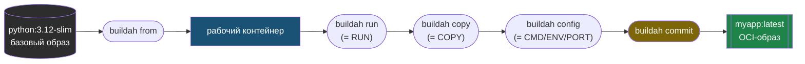

# Глава 10: Сборка образов без Docker — buildah

## Что вы узнаете

- чем buildah отличается от `podman build` и когда он нужен напрямую;
- как собирать OCI-образы без Dockerfile через shell-скрипты;
- как использовать buildah в CI/CD без привилегированного режима;
- как инспектировать и отлаживать процесс сборки.

---

## buildah и podman build: в чём разница

`podman build` и `buildah` — это не два разных инструмента. `podman build` вызывает buildah под капотом. Разница в уровне контроля.

```text
podman build (высокий уровень):
  + Привычный синтаксис Dockerfile
  + Всё управляется автоматически
  - Нет доступа к промежуточным слоям
  - Нельзя строить образ скриптом без Dockerfile

buildah (низкий уровень):
  + Полный контроль над каждым слоем
  + Сборка без Dockerfile — через shell или любой язык
  + Можно инспектировать рабочий контейнер между шагами
  + Работает в rootless CI без privileged и без Dockerfile
  - Многословнее
  - Нужно понимать как работают слои
```

На практике: `podman build` для большинства задач, buildah напрямую — для CI без Docker daemon, для нестандартных сборок, для скриптованной генерации образов.

---

## Установка

```bash
# Ubuntu/Debian
sudo apt install buildah

# Fedora/RHEL
sudo dnf install buildah

# Версия (нужна 1.28+ для современных функций)
buildah --version
# buildah version 1.35.3
```

---

## Сборка через Dockerfile

Через `buildah bud` (Build Using Dockerfile) — идентично `podman build`:

```bash
# Собрать образ из Dockerfile в текущей директории
buildah bud -t myapp:latest .

# С указанием Dockerfile
buildah bud -f Dockerfile.prod -t myapp:prod .

# Без кэша
buildah bud --no-cache -t myapp:fresh .

# Для конкретной платформы
buildah bud --platform linux/amd64 -t myapp:amd64 .
buildah bud --platform linux/arm64 -t myapp:arm64 .
```

Кэш buildah и кэш `podman build` **независимы** — они не шарят слои между собой. Если переключаетесь между инструментами — ожидайте пересборку.

---

## Сборка без Dockerfile

Это то, ради чего стоит знать buildah напрямую. Вместо Dockerfile — обычный shell-скрипт, Python, Makefile или что угодно.

### Базовый паттерн

```bash
# 1. Создать рабочий контейнер из базового образа
container=$(buildah from python:3.12-slim)
echo "Создан рабочий контейнер: $container"

# 2. Выполнять команды внутри (как RUN в Dockerfile)
buildah run $container -- apt-get update -qq
buildah run $container -- apt-get install -y --no-install-recommends curl

# 3. Копировать файлы (как COPY в Dockerfile)
buildah copy $container requirements.txt /app/requirements.txt
buildah run $container -- pip install --no-cache-dir -r /app/requirements.txt
buildah copy $container . /app

# 4. Настроить метаданные образа (как CMD, ENV, EXPOSE в Dockerfile)
buildah config \
  --workingdir /app \
  --env PYTHONUNBUFFERED=1 \
  --env APP_ENV=production \
  --port 8000 \
  --cmd '["python", "main.py"]' \
  $container

# 5. Зафиксировать как образ
buildah commit $container myapp:latest

# 6. Удалить рабочий контейнер
buildah rm $container
```

Этот цикл — точное соответствие шагам Dockerfile, только каждый шаг вызывается явной командой. От базового образа через `from` к зафиксированному образу через `commit`:



Между `from` и `commit` рабочий контейнер можно инспектировать и даже зайти в него shell-ом — то, чего не даёт обычный `podman build`.

### Все опции buildah config

```bash
# CMD и ENTRYPOINT
buildah config --cmd '["python", "app.py"]' $container
buildah config --entrypoint '["python"]' $container

# Переменные окружения
buildah config --env KEY=value $container
buildah config --env "KEY=value with spaces" $container

# Рабочая директория
buildah config --workingdir /app $container

# Порты
buildah config --port 8080 $container
buildah config --port 8080/tcp $container

# Пользователь
buildah config --user appuser $container
buildah config --user 1000:1000 $container

# Labels
buildah config --label version=1.0 $container
buildah config --label maintainer="dev@example.com" $container

# Volumes (объявить, не монтировать)
buildah config --volume /data $container

# Healthcheck
buildah config \
  --healthcheck "CMD curl -f http://localhost:8000/health || exit 1" \
  --healthcheck-interval 30s \
  $container
```

---

## Практический пример: образ для Python-приложения

Сравним Dockerfile и buildah-скрипт, чтобы понять соответствие.

**Dockerfile:**
```dockerfile
FROM python:3.12-slim
WORKDIR /app
COPY requirements.txt .
RUN pip install --no-cache-dir -r requirements.txt
COPY . .
RUN adduser --disabled-password --gecos "" appuser
USER appuser
EXPOSE 8000
HEALTHCHECK --interval=30s CMD curl -f http://localhost:8000/health || exit 1
CMD ["python", "main.py"]
```

**Эквивалентный buildah-скрипт:**
```bash
#!/bin/bash
set -euo pipefail

IMAGE_NAME="${1:-myapp:latest}"

echo "=== Сборка $IMAGE_NAME ==="

# Базовый образ
ctr=$(buildah from docker.io/library/python:3.12-slim)

# Зависимости (кэшируемый слой)
buildah copy $ctr requirements.txt /app/requirements.txt
buildah run $ctr -- pip install --no-cache-dir -r /app/requirements.txt

# Код приложения
buildah copy $ctr . /app

# Создать непривилегированного пользователя
buildah run $ctr -- adduser --disabled-password --gecos "" appuser

# Метаданные
buildah config \
  --workingdir /app \
  --user appuser \
  --port 8000 \
  --healthcheck "CMD curl -f http://localhost:8000/health || exit 1" \
  --healthcheck-interval "30s" \
  --cmd '["python", "main.py"]' \
  --label "build.date=$(date -u +%Y%m%d)" \
  --label "build.version=${GIT_SHA:-local}" \
  $ctr

# Зафиксировать
buildah commit --squash $ctr "$IMAGE_NAME"
buildah rm $ctr

echo "=== Готово: $IMAGE_NAME ==="
buildah images "$IMAGE_NAME"
```

```bash
# Запустить скрипт
chmod +x build.sh
./build.sh myapp:v1.0

# Проверить образ
podman run --rm myapp:v1.0 python --version
```

---

## Инспектировать рабочий контейнер

Одно из преимуществ buildah: можно остановиться между шагами и посмотреть что происходит.

```bash
# Создать рабочий контейнер
ctr=$(buildah from ubuntu:22.04)

# Установить пакет
buildah run $ctr -- apt-get update
buildah run $ctr -- apt-get install -y python3

# Посмотреть что в файловой системе
buildah run $ctr -- ls /usr/bin/python*
# /usr/bin/python3  /usr/bin/python3.10

# Войти в контейнер как в shell (для отладки)
buildah run -t $ctr -- bash
# Теперь вы внутри рабочего контейнера
# ls /usr, python3 --version, ...
# exit

# Посмотреть незафиксированные изменения
buildah diff $ctr

# Список рабочих контейнеров (не образы!)
buildah containers
# CONTAINER ID  BUILDER  IMAGE ID     IMAGE NAME      CONTAINER NAME
# abc123...     *        def456...    ubuntu:22.04    ubuntu-working-container-1

# Удалить рабочий контейнер без создания образа
buildah rm $ctr
```

---

## Работа со слоями

```bash
# Создать образ с несколькими коммитами (один commit = один слой)
ctr=$(buildah from alpine:latest)

buildah run $ctr -- apk add --no-cache curl
# Первый слой: curl
buildah commit $ctr myapp:with-curl

buildah run $ctr -- apk add --no-cache jq
# Второй слой: jq
buildah commit $ctr myapp:with-jq

buildah rm $ctr

# Посмотреть историю образа
buildah history myapp:with-jq

# Объединить все слои в один (squash = уменьшает размер, теряет историю)
buildah commit --squash $ctr myapp:squashed
```

---

## buildah в CI/CD без privileged

Главное применение buildah в CI: сборка образов в контейнере без `--privileged`.

### GitLab CI

```yaml
# .gitlab-ci.yml
variables:
  IMAGE: $CI_REGISTRY_IMAGE:$CI_COMMIT_SHA

build:
  stage: build
  image: quay.io/buildah/stable
  before_script:
    - buildah login -u $CI_REGISTRY_USER -p $CI_REGISTRY_PASSWORD $CI_REGISTRY
  script:
    - buildah bud
        --layers
        --cache-from $CI_REGISTRY_IMAGE:cache
        -t $IMAGE
        .
    - buildah push $IMAGE
    # Обновить кэш-тег
    - buildah tag $IMAGE $CI_REGISTRY_IMAGE:cache
    - buildah push $CI_REGISTRY_IMAGE:cache
  variables:
    # Критично для работы в контейнере без --privileged:
    BUILDAH_ISOLATION: chroot
    # Путь к хранилищу (по умолчанию может быть недоступен):
    STORAGE_DRIVER: vfs
```

**Почему `BUILDAH_ISOLATION=chroot`?**

По умолчанию buildah использует `rootless` изоляцию через user namespaces. Внутри CI-контейнера (который сам rootless) это создаёт вложенные namespaces — и они могут не работать. `chroot` изоляция работает везде без namespaces.

**Почему `STORAGE_DRIVER=vfs`?**

`overlay` требует kernel-поддержки которая может быть недоступна внутри контейнера. `vfs` — медленнее, но работает везде.

### GitHub Actions

```yaml
# .github/workflows/build.yml
name: Build with buildah
on: [push]

jobs:
  build:
    runs-on: ubuntu-latest
    permissions:
      contents: read
      packages: write

    steps:
      - uses: actions/checkout@v4

      - name: Install buildah
        run: sudo apt-get install -y buildah

      - name: Login to GHCR
        run: |
          echo "${{ secrets.GITHUB_TOKEN }}" | \
          buildah login ghcr.io -u ${{ github.actor }} --password-stdin

      - name: Build and push
        env:
          BUILDAH_ISOLATION: chroot
        run: |
          IMAGE=ghcr.io/${{ github.repository }}:${{ github.sha }}
          buildah bud -t $IMAGE .
          buildah push $IMAGE

      - name: Tag as latest
        if: github.ref == 'refs/heads/main'
        run: |
          IMAGE=ghcr.io/${{ github.repository }}
          buildah tag ${IMAGE}:${{ github.sha }} ${IMAGE}:latest
          buildah push ${IMAGE}:latest
```

---

## Многоплатформенная сборка

```bash
# Собрать образ для нескольких архитектур
buildah manifest create myapp:multi

buildah bud \
  --platform linux/amd64 \
  --manifest myapp:multi \
  -t myapp:amd64 .

buildah bud \
  --platform linux/arm64 \
  --manifest myapp:multi \
  -t myapp:arm64 .

# Запушить манифест (включает оба образа)
buildah manifest push --all myapp:multi \
  docker://registry.example.com/myapp:latest

# Проверить
skopeo inspect --raw docker://registry.example.com/myapp:latest \
  | python3 -m json.tool | grep architecture
```

---

## Типичные ошибки

**`Error: creating build container: Error writing blob: ... overlay: ...`**
В CI-контейнере не работает overlay. Добавить `STORAGE_DRIVER=vfs`.

**Рабочий контейнер завис после прерванной сборки**
```bash
# Посмотреть все рабочие контейнеры
buildah containers

# Удалить все (осторожно если есть нужные)
buildah rm --all
```

**`buildah bud` и `podman build` дают разные размеры образов**
Разный кэш, разный порядок squash. Используйте один инструмент для воспроизводимости.

**`cannot find newuidmap` в CI**
Не установлен `uidmap`. В CI-образе `quay.io/buildah/stable` он уже есть.

---

## Чек-лист для самопроверки

- [ ] Собрал образ через `buildah bud` и убедился что он идентичен `podman build`
- [ ] Написал buildah-скрипт который создаёт образ без Dockerfile
- [ ] Открыл shell внутри рабочего контейнера через `buildah run -t $ctr -- bash`
- [ ] Понимаю разницу между `BUILDAH_ISOLATION=chroot` и `rootless` и когда что нужно
- [ ] Знаю почему кэш buildah и podman build не шарятся

## Попробуйте сами

1. Напишите buildah-скрипт который создаёт образ из `alpine` с установленным `curl` и `jq`. Проверьте:
   ```bash
   podman run --rm mytools:latest curl --version
   podman run --rm mytools:latest jq --version
   ```

2. Используйте `buildah run -t $ctr -- bash` чтобы войти в рабочий контейнер и вручную попробовать команды перед тем как добавить их в скрипт. Как это меняет процесс отладки по сравнению с Dockerfile?

3. Сравните размер образа собранного с `--squash` и без:
   ```bash
   ctr=$(buildah from alpine)
   buildah run $ctr -- apk add curl
   buildah run $ctr -- apk add jq
   buildah commit $ctr alpine-tools:layered
   buildah commit --squash $ctr alpine-tools:squashed
   buildah rm $ctr
   podman images alpine-tools
   # Какая разница в размере?
   ```
