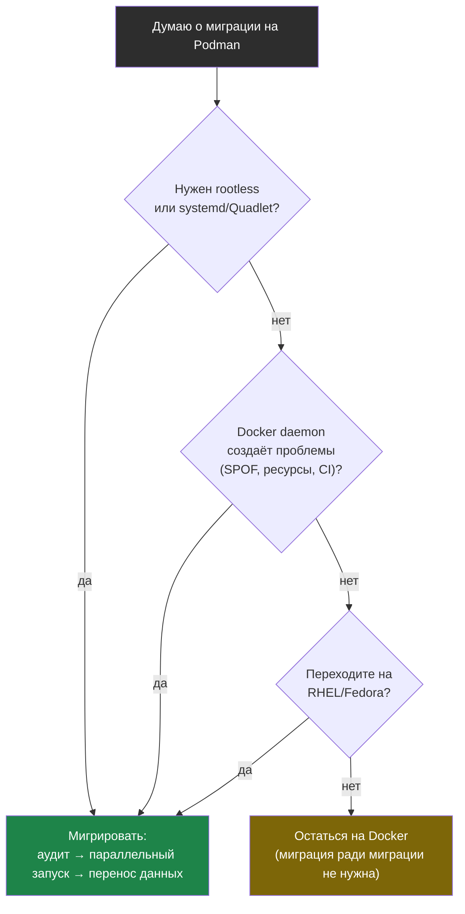

# Глава 11: Миграция с Docker на Podman

## Что вы узнаете

- как оценить готовность проекта к миграции без неожиданностей;
- как перейти с Docker на Podman пошагово без даунтайма;
- как перенести данные из Docker volumes в Podman;
- как поддерживать совместимость если часть команды остаётся на Docker.

---

## Когда мигрировать, когда не мигрировать

Миграция ради миграции — не цель. Переходить стоит если:

- Нужен rootless по соображениям безопасности (CI, shared-серверы)
- Хотите интеграцию с systemd через Quadlet без лишних скриптов
- Переходите на RHEL/Fedora где Podman — дефолт
- Docker daemon создаёт проблемы (падает, SPOF, потребляет ресурсы)

**Не мигрировать** если:
- Всё работает, команда довольна, нет конкретной проблемы
- Используете Docker Desktop на macOS/Windows (Podman Machine уступает по UX)
- Нет времени разобраться с новыми edge-cases

Свести решение к нескольким вопросам помогает дерево: начинаем с конкретной проблемы или требования, а не с желания «попробовать новое».



Если ни одна ветка не привела к «Мигрировать» — у вас нет проблемы, которую решает Podman, и рефакторинг можно отложить.

---

## Предмиграционный чеклист

Перед тем как менять что-либо — проверьте проект по этому списку:

```bash
# Создать скрипт-аудитор
cat > audit-docker.sh << 'SCRIPT'
#!/bin/bash
echo "=== Аудит docker-compose.yml ==="

if [ ! -f docker-compose.yml ]; then
  echo "WARN: docker-compose.yml не найден"
  exit 0
fi

# Swarm-директивы (не поддерживаются в podman-compose)
echo ""
echo "-- Swarm-директивы (несовместимы с podman-compose) --"
grep -n "^\s*deploy:" docker-compose.yml && echo "FOUND: deploy:" || echo "OK: нет deploy"
grep -n "^\s*secrets:" docker-compose.yml && echo "FOUND: secrets:" || echo "OK: нет secrets"
grep -n "^\s*configs:" docker-compose.yml && echo "FOUND: configs:" || echo "OK: нет configs"

# Docker socket монтирование
echo ""
echo "-- Docker socket монтирование --"
grep -n "docker.sock" docker-compose.yml && echo "WARN: нужно заменить на podman.sock" || echo "OK: нет docker.sock"

# Порты < 1024
echo ""
echo "-- Порты < 1024 (требуют настройки в rootless) --"
grep -E '"[0-9]{1,3}:[0-9]+"|"[0-9]{1,3}$"' docker-compose.yml \
  | grep -E '"[0-9]:|"[1-9][0-9]{0,2}:' && echo "WARN: порт < 1024" || echo "OK: нет портов < 1024"

# Volumes
echo ""
echo "-- Volumes (данные нужно будет перенести) --"
grep -n "^\s*volumes:" docker-compose.yml

echo ""
echo "=== Готово ==="
SCRIPT
chmod +x audit-docker.sh
./audit-docker.sh
```

---

## Миграция шаг за шагом

### Шаг 0: Установить Podman рядом с Docker

Docker и Podman не конфликтуют — оба могут быть установлены одновременно:

```bash
sudo apt install podman podman-compose

# Проверить что оба работают
docker --version
podman --version
```

### Шаг 1: Проверить совместимость compose-файла

```bash
cd /path/to/project

# Проверить синтаксис без запуска
podman-compose config

# Если есть ошибки — они будут здесь
# Если нет вывода ошибок — файл совместим
```

### Шаг 2: Запустить через Podman параллельно

Не останавливайте Docker-контейнеры! Сначала убедитесь что всё работает через Podman:

```bash
# Изменить порты чтобы не конфликтовать с работающим Docker-стеком
# Временно: в docker-compose.yml или через --env-file

# Запустить через podman-compose
podman-compose up -d

# Проверить
podman-compose ps
podman-compose logs --tail=50

# Протестировать на временных портах
curl http://localhost:8081/health  # если nginx был на 8080 → 8081
```

### Шаг 3: Перенести данные

Это самый критичный шаг. Docker volumes и Podman volumes — разные хранилища.

```bash
# Посмотреть Docker volumes
docker volume ls
# DRIVER    VOLUME NAME
# local     myproject_pgdata
# local     myproject_uploads

# Для каждого volume — перенести данные

# Метод 1: через tar (рекомендуется)
# Экспорт из Docker:
docker run --rm \
  -v myproject_pgdata:/source:ro \
  -v /tmp:/backup \
  alpine tar czf /backup/pgdata.tar.gz -C /source .

# Создать Podman volume:
podman volume create myproject_pgdata

# Импорт в Podman:
podman run --rm \
  -v myproject_pgdata:/dest \
  -v /tmp:/backup \
  alpine sh -c "cd /dest && tar xzf /backup/pgdata.tar.gz"

# Проверить что данные перенеслись:
podman run --rm -v myproject_pgdata:/data alpine ls -la /data/
```

```bash
# Метод 2: через rsync (если директории доступны)
# Docker хранит volumes в /var/lib/docker/volumes/
sudo ls /var/lib/docker/volumes/myproject_pgdata/_data/

# Podman rootless хранит в ~/.local/share/containers/storage/volumes/
podman volume inspect myproject_pgdata --format '{{.Mountpoint}}'

# Скопировать
sudo rsync -av \
  /var/lib/docker/volumes/myproject_pgdata/_data/ \
  $(podman volume inspect myproject_pgdata --format '{{.Mountpoint}}')/
```

### Шаг 4: Полноценный тест через Podman

```bash
# Остановить временный тест
podman-compose down

# Обновить docker-compose.yml: вернуть оригинальные порты
# (они освободятся когда остановим Docker-стек)

# Остановить Docker-стек
docker-compose down
# НЕ docker-compose down -v ! Это удалит Docker volumes

# Запустить через Podman
podman-compose up -d

# Полное тестирование:
podman-compose ps
curl http://localhost:8080/
# Проверить функциональность приложения
# Проверить доступ к данным из БД
```

### Шаг 5: Настроить алиасы и автозапуск

```bash
# Алиасы
echo 'alias docker=podman' >> ~/.bashrc
echo 'alias docker-compose=podman-compose' >> ~/.bashrc
source ~/.bashrc

# Если нужен автозапуск через systemd — настроить Quadlet (глава 9)
# Если достаточно podman-compose — можно добавить в cron или rc.local
```

### Шаг 6: Проверить CI/CD

```bash
# В CI-скриптах заменить:
# docker → podman
# docker-compose → podman-compose

# Или через переменную (сохраняет совместимость с Docker):
CONTAINER_TOOL=${CONTAINER_TOOL:-podman}
$CONTAINER_TOOL build -t myapp:latest .
```

---

## Перенос bind-mount директорий

Bind-mounts (монтирование конкретной директории хоста) не нужно переносить — данные уже на диске. Но есть нюанс с правами в rootless:

```bash
# Если приложение создавало файлы в bind-mount от root (через Docker):
ls -la /var/data/uploads/
# drwxr-xr-x  root  root  ...   ← владелец root

# В rootless Podman файлы будут недоступны на запись
# Решение: сменить владельца или использовать --userns=keep-id

# Сменить владельца:
sudo chown -R $USER:$USER /var/data/uploads/

# Или использовать --userns=keep-id в docker-compose.yml:
# volumes:
#   - /var/data/uploads:/app/uploads:z  # добавить :z для SELinux
```

---

## Совместимость Docker + Podman в команде

Если не все члены команды переходят одновременно — нужна совместимость:

### Подход 1: Переменная CONTAINER_TOOL

```bash
# Makefile
CONTAINER_TOOL ?= docker

up:
	$(CONTAINER_TOOL)-compose up -d

down:
	$(CONTAINER_TOOL)-compose down

build:
	$(CONTAINER_TOOL) build -t myapp:latest .

.PHONY: up down build
```

```bash
# Docker-пользователь:
make up

# Podman-пользователь:
CONTAINER_TOOL=podman make up
```

### Подход 2: Скрипт-обёртка

```bash
#!/bin/bash
# scripts/container-tool.sh
if command -v podman &>/dev/null; then
  exec podman "$@"
elif command -v docker &>/dev/null; then
  exec docker "$@"
else
  echo "Error: neither podman nor docker found" >&2
  exit 1
fi
```

### Подход 3: CI через переменную

```yaml
# .gitlab-ci.yml
variables:
  CONTAINER_TOOL: podman  # переопределить на docker если нужно

build:
  script:
    - $CONTAINER_TOOL build -t $IMAGE .
    - $CONTAINER_TOOL push $IMAGE
```

---

## Что не нужно трогать при миграции

Хорошая новость: большинство артефактов переиспользуется без изменений.

```text
Не нужно менять:          Причина
──────────────────────────────────────────────────────────────
Dockerfile                Синтаксис одинаковый
docker-compose.yml        podman-compose читает тот же файл
.dockerignore             buildah тоже его уважает
Образы в реестрах         OCI-совместимые, работают везде
Скрипты с docker build    После alias docker=podman работают
README с docker run       После alias работают
CI Dockerfile-шаги        Заменить docker → podman в скриптах
```

---

## Откат: вернуться на Docker

Если что-то пошло не так — откатиться просто (именно поэтому мы не удаляли Docker сразу):

```bash
# Остановить Podman-стек
podman-compose down

# Убрать алиасы из ~/.bashrc

# Запустить Docker-стек
docker-compose up -d

# Данные в Docker volumes не трогали — они там же
docker-compose ps
```

---

## Типичные ошибки при миграции

**Потеря данных из-за `docker-compose down -v`**
Команда `down -v` удаляет volumes. Никогда не используйте её при миграции — только `down` без флага.

**Права на файлы после переноса**
После `rsync` из `/var/lib/docker/volumes/` файлы могут принадлежать root. Исправить:
```bash
sudo chown -R $USER:$USER \
  $(podman volume inspect myproject_pgdata --format '{{.Mountpoint}}')
```

**Конфликт портов при параллельном запуске**
Docker и Podman запускают контейнеры на разных портах для тестирования — но если тот же порт 8080 занят Docker, Podman не сможет его занять. Либо менять порт, либо останавливать Docker-стек перед запуском Podman.

**Образы не видны после миграции**
Docker images и Podman images — разные хранилища. Образы нужно либо скачать заново, либо скопировать через skopeo:
```bash
# Скопировать из Docker storage в Podman storage
skopeo copy docker-daemon:myapp:latest containers-storage:myapp:latest
```

---

## Чек-лист для самопроверки

- [ ] Выполнил аудит docker-compose.yml на Swarm-директивы и docker.sock
- [ ] Запустил стек через podman-compose не останавливая Docker (параллельно, на другом порту)
- [ ] Перенёс данные из Docker volumes в Podman volumes через tar
- [ ] Проверил что приложение работает полностью (не только запускается, но и данные на месте)
- [ ] Знаю как вернуться на Docker если что-то пойдёт не так

## Попробуйте сами

1. Возьмите любой `docker-compose.yml` (можно создать минимальный с nginx + postgres) и пройдите полный цикл миграции:
   ```bash
   # Запустить через Docker
   docker-compose up -d
   # Создать данные (например, записать в PostgreSQL)
   # Остановить, перенести volumes, запустить через Podman
   podman-compose up -d
   # Проверить что данные сохранились
   ```

2. Напишите Makefile с целями `up`, `down`, `build` которые работают как с Docker так и с Podman через переменную `CONTAINER_TOOL`:
   ```bash
   make up                    # использует docker
   CONTAINER_TOOL=podman make up  # использует podman
   ```

3. Используйте `skopeo copy docker-daemon:nginx:alpine containers-storage:nginx:alpine` чтобы скопировать образ из Docker в Podman без повторного скачивания. Проверьте через `podman images`.
