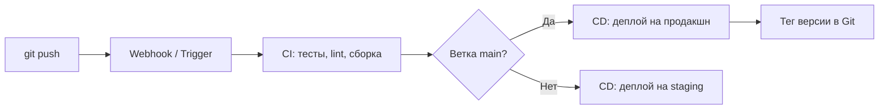

# Глава 0: Зачем Git DevOps-инженеру

## Что вы узнаете

- зачем Git нужен не только разработчикам, но и инженерам инфраструктуры;
- почему конфигурационные файлы и скрипты должны жить в репозитории;
- как Git связан с CI/CD и почему без него автодеплой не работает;
- что такое «инфраструктура как код» и при чём тут Git.

---

## Git — это не только для программистов

Многие начинают изучать Git потому что «надо для работы с кодом». Но DevOps-инженер использует Git шире: почти всё что он делает — это файлы. А файлы с историей — лучше чем файлы без неё.

Что хранят в Git DevOps-инженеры:

| Что | Примеры |
|-----|---------|
| Конфигурация сервисов | `nginx.conf`, `prometheus.yml`, `telegraf.conf` |
| Инфраструктура как код | Terraform `.tf`-файлы, Ansible плейбуки |
| Конфигурация Kubernetes | Deployment, Service, ConfigMap YAML |
| CI/CD пайплайны | `.gitlab-ci.yml`, `Jenkinsfile`, GitHub Actions `.yml` |
| Скрипты автоматизации | bash-скрипты деплоя, бэкапов, мониторинга |
| Dockerfile и compose | сборка образов, стеки сервисов |

Без Git любое из перечисленного — это просто файл. С Git — это версионированная, проверяемая, откатываемая конфигурация.

---

## Три вопроса на которые отвечает Git

### Кто поменял и когда?

```bash
git log --oneline nginx.conf
# a3f1b2c Увеличить worker_connections до 1024
# 7e9d4a1 Добавить SSL для домена api.example.com
# 3b2c8f0 Начальная конфигурация nginx
```

Инцидент в пятницу вечером. Сервис упал. Что поменялось? `git log` покажет последние изменения в нужном файле за минуту.

### Что именно изменилось?

```bash
git diff main feature/new-limits
```

Перед деплоем нового Terraform-плана можно сравнить что изменится по отношению к текущей ветке. Это не `diff` двух файлов — это разница между двумя состояниями инфраструктуры.

### Вернуть как было

```bash
git revert a3f1b2c   # отменить конкретный коммит, сохранив историю
git checkout 7e9d4a1 -- nginx.conf  # вернуть файл к конкретному коммиту
```

Не «найди версию из архива» — а конкретная операция с конкретным результатом.

---

## Git и CI/CD — неразрывная связь

CI/CD системы (GitHub Actions, GitLab CI, Jenkins) смотрят на репозиторий Git чтобы понять: когда запускать деплой, что именно задеплоить, какую версию.



Без Git нет истории — CI/CD не знает что запускать. Без веток — нет разделения между «тестируем» и «деплоим в продакшн». Без тегов — нет версионирования артефактов.

**Практический пример.** Конфиг `.github/workflows/deploy.yml`:

```yaml
on:
  push:
    branches:
      - main          # деплой при любом пуше в main
  pull_request:
    branches:
      - main          # тесты при создании PR в main
```

CI/CD читает события Git и реагирует на них. Это не абстракция — это конкретная точка интеграции.

---

## Инфраструктура как код

«Infrastructure as Code» (IaC) означает: описывать инфраструктуру в файлах, а не кликать в GUI. Terraform описывает облачные ресурсы. Ansible описывает состояние серверов. Kubernetes-манифесты описывают контейнеры и сервисы.

Все эти файлы — код. Код должен жить в Git.

```text
Без IaC + Git:
"Сервер настроен" — вручную, по SSH, команды в памяти.
Повторить? Только если помнишь что делал.
Проверить изменения? Нельзя — нет истории.

С IaC + Git:
terraform/main.tf — вся инфраструктура описана.
git diff — видно что изменится до применения.
git blame — понятно кто добавил ресурс и зачем.
```

---

## Что будет в этой книге

После прочтения ты:

- уверенно работаешь с базовыми командами (`add`, `commit`, `push`, `pull`, `log`);
- создаёшь ветки и разрешаешь конфликты без паники;
- понимаешь разницу между `merge` и `rebase` и знаешь когда что использовать;
- работаешь с GitHub и GitLab через SSH;
- знаешь стратегии ветвления для команды;
- понимаешь как Git встраивается в CI/CD пайплайн.

Книга не про все возможности Git — их несколько сотен. Книга про практический минимум, который нужен каждый день.

---

## Чек-лист для самопроверки

- [ ] Понимаю зачем Git нужен DevOps-инженеру, а не только разработчику
- [ ] Могу назвать 3 типа файлов которые DevOps хранит в Git
- [ ] Понимаю как Git и CI/CD связаны через триггеры на события
- [ ] Знаю что такое IaC и почему его хранят в Git

## Попробуйте сами

1. Найдите любой открытый Ansible или Terraform репозиторий на GitHub. Запустите `git log --oneline` первые 10 коммитов — что в них меняли?
2. Откройте `.github/workflows/` в любом популярном репозитории. Какие ветки триггерят CI?
3. Подумайте: какие файлы на ваших серверах стоит перенести в Git прямо сейчас?
