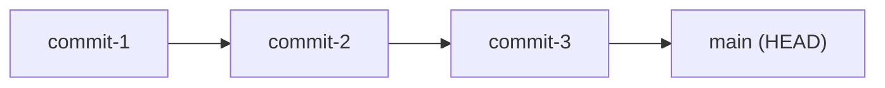
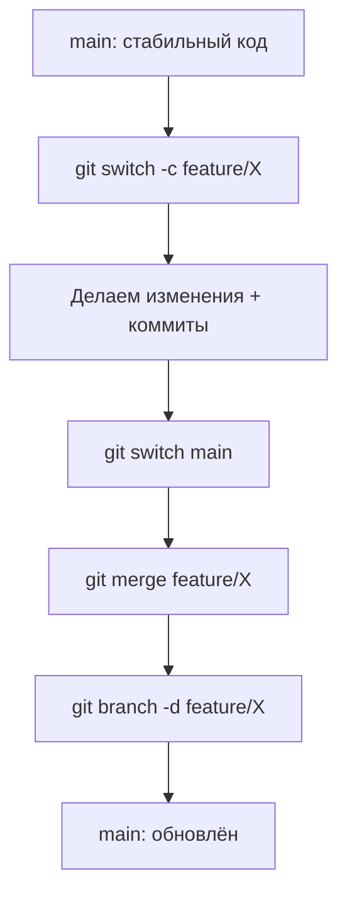

# Глава 4: Ветки — создание, переключение, слияние

## Что вы узнаете

- что такое ветка и почему это «всего лишь указатель»;
- как создавать ветки и переключаться между ними;
- как объединять ветки через `merge`;
- что такое fast-forward merge и merge-коммит.

---

## Что такое ветка

Ветка в Git — это просто указатель на конкретный коммит. Не копия кода, не отдельная папка — один файл с SHA-1 хешем.

```bash
cat .git/refs/heads/main
# abc1234def5678901234567890123456789012345678
# ← это и есть вся «ветка» main
```

Когда ты делаешь коммит в ветке — ветка автоматически двигается на новый коммит. HEAD следует за веткой.



---

## Создание ветки

```bash
# Создать ветку (не переключаться)
git branch feature/auth

# Создать ветку и сразу переключиться
git checkout -b feature/auth

# Современный синтаксис (Git 2.23+)
git switch -c feature/auth

# Создать ветку из конкретного коммита или другой ветки
git switch -c hotfix/nginx-502 main
```

Посмотреть все ветки:

```bash
git branch
# * main           ← звёздочка = текущая ветка (HEAD)
#   feature/auth

git branch -v
# * main        abc1234 Добавить конфиг nginx
#   feature/auth 7e9d4a1 Начальная конфигурация
```

---

## Переключение между ветками

```bash
# Старый синтаксис
git checkout main

# Современный синтаксис (предпочтительный)
git switch main
```

При переключении Git обновляет рабочую директорию и индекс, чтобы соответствовать состоянию целевой ветки.

> **Важно:** перед переключением убедись что нет незакоммиченных изменений. Если они есть — Git предупредит или предложит их сохранить через `git stash` (Глава 8).

---

## Работа в ветке

Типичный сценарий:

```bash
# Создать ветку для новой задачи
git switch -c feature/add-ssl

# Делать изменения, коммиты
echo "ssl_certificate /etc/nginx/ssl/cert.pem;" >> nginx.conf
git add nginx.conf
git commit -m "Добавить SSL сертификат в nginx"

echo "ssl_certificate_key /etc/nginx/ssl/key.pem;" >> nginx.conf
git add nginx.conf
git commit -m "Добавить приватный ключ SSL"

# Посмотреть ветки
git log --oneline --graph --all
# * 9f2a3b1 (HEAD -> feature/add-ssl) Добавить приватный ключ SSL
# * 5c1e8d2 Добавить SSL сертификат в nginx
# * abc1234 (main) Добавить конфиг nginx
```

Ветка `feature/add-ssl` ушла вперёд. `main` остался на месте.

---

## git merge — слияние веток

Когда работа в ветке завершена — нужно слить её в `main`.

```bash
# Переключиться на целевую ветку
git switch main

# Слить feature-ветку в main
git merge feature/add-ssl
```

Есть два вида слияния:

### Fast-forward (линейное слияние)

Если `main` не ушёл вперёд пока ты работал в `feature` — Git просто двигает указатель `main` на конец `feature`. Никакого дополнительного коммита не создаётся.

```text
До:
main → C3
         \
          C4 → C5 (feature/add-ssl)

После fast-forward:
main → C3 → C4 → C5
```

```bash
git merge feature/add-ssl
# Updating abc1234..9f2a3b1
# Fast-forward
#  nginx.conf | 2 ++
#  1 file changed, 2 insertions(+)
```

### Merge commit (коммит слияния)

Если `main` тоже получил новые коммиты пока ты работал — Git создаёт дополнительный «коммит слияния», объединяющий две ветки.

```text
До:
main → C3 → C4
         \
          C5 → C6 (feature/add-ssl)

После:
main → C3 → C4 → M (merge commit)
         \       /
          C5 → C6
```

```bash
git merge feature/add-ssl
# Merge made by the 'ort' strategy.
# Auto-merging nginx.conf
# MERGE_COMMIT: 'Merge branch feature/add-ssl into main'
```

### Merge с явным коммитом (no fast-forward)

Иногда хочется всегда создавать merge-коммит, даже если fast-forward возможен. Это сохраняет историю того что делалось в ветке:

```bash
git merge --no-ff feature/add-ssl -m "Merge feature/add-ssl: добавить SSL"
```

---

## Удаление ветки

После слияния ветку можно удалить — история останется в `main`:

```bash
# Удалить слитую ветку
git branch -d feature/add-ssl

# Принудительно удалить (даже если не слита)
git branch -D feature/wip

# Посмотреть слитые ветки (безопасно удалить)
git branch --merged main
```

---

## Типичный workflow с ветками



---

## Именование веток

Соглашение по именованию помогает сразу понять контекст ветки:

| Префикс | Когда использовать | Пример |
|---------|-------------------|--------|
| `feature/` | Новая функциональность | `feature/add-ssl` |
| `fix/` | Исправление бага | `fix/nginx-502` |
| `hotfix/` | Срочное исправление в продакшне | `hotfix/memory-leak` |
| `chore/` | Рутинные задачи, обновления | `chore/update-deps` |
| `docs/` | Только документация | `docs/add-runbook` |
| `refactor/` | Рефакторинг без изменения поведения | `refactor/extract-db-config` |

Избегай пробелов и спецсимволов в именах веток. Слеш (`/`) разрешён и создаёт «папки» в инструментах вроде GitHub.

---

## Чек-лист для самопроверки

- [ ] Понимаю что ветка — это указатель на коммит, а не копия кода
- [ ] Умею создавать ветку и переключаться на неё
- [ ] Знаю как смотреть список веток и текущую ветку
- [ ] Понимаю разницу между fast-forward и merge commit
- [ ] Умею удалять ветку после слияния
- [ ] Знаю соглашения об именовании веток

## Попробуйте сами

1. Создайте репозиторий, сделайте 2 коммита в `main`. Создайте `feature/test`, сделайте там 2 коммита. Запустите `git log --oneline --graph --all` — посмотрите граф.
2. Смержите ветку в `main` через `git merge feature/test` (fast-forward). Посмотрите граф снова — видно ли что была ветка?
3. Теперь создайте новую ветку, сделайте коммит, затем вернитесь в `main` и тоже сделайте коммит. Теперь смержите — получится merge commit. Посмотрите `git log --graph`.
