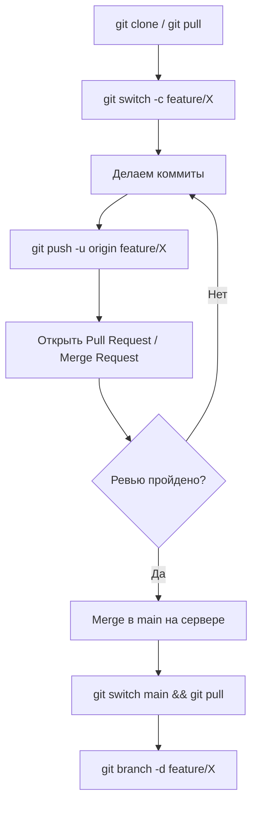

# Глава 5: Работа с удалёнными репозиториями

## Что вы узнаете

- что такое remote и зачем он нужен;
- как клонировать репозиторий и работать с GitHub/GitLab;
- разница между `git fetch` и `git pull`;
- как отправить ветку в удалённый репозиторий.

---

## Что такое remote

Remote (удалённый репозиторий) — это репозиторий Git на другом сервере (GitHub, GitLab, Gitea, корпоративный сервер). Локальный репозиторий может быть связан с несколькими remotes.

Типичная схема: у каждого разработчика локальная копия, общий remote на GitHub/GitLab.

```text
Разработчик А  ─── push/pull ───┐
Разработчик Б  ─── push/pull ───┤── [GitHub/GitLab] origin
CI/CD          ─── pull         ┘
```

По соглашению основной remote называется `origin`.

---

## git clone — клонировать репозиторий

```bash
# Клонировать по HTTPS
git clone https://github.com/user/repo.git

# Клонировать по SSH (нужны настроенные ключи, Глава 10)
git clone git@github.com:user/repo.git

# Клонировать в конкретную директорию
git clone git@github.com:user/repo.git my-local-name

# Клонировать только последний коммит (shallow clone, экономит место в CI)
git clone --depth 1 git@github.com:user/repo.git
```

После клонирования:
- Создана директория с кодом репозитория
- `origin` автоматически настроен
- Локальная ветка `main` отслеживает `origin/main`

```bash
cd repo
git remote -v
# origin  git@github.com:user/repo.git (fetch)
# origin  git@github.com:user/repo.git (push)
```

---

## Добавить remote вручную

Если репозиторий создан локально (`git init`) и нужно связать с GitHub/GitLab:

```bash
# Добавить remote с именем origin
git remote add origin git@github.com:user/repo.git

# Посмотреть все remotes
git remote -v

# Изменить URL существующего remote
git remote set-url origin git@github.com:user/new-repo.git

# Удалить remote
git remote remove origin
```

---

## git push — отправить изменения

```bash
# Первый push: указать upstream (куда отправлять)
git push -u origin main
# -u = --set-upstream: запомнить что main → origin/main

# После настройки upstream — просто
git push

# Отправить конкретную ветку
git push origin feature/add-ssl

# Удалить ветку на remote
git push origin --delete feature/old-branch
```

Если настроен `push.autoSetupRemote = true` (Глава 1) — `-u` не нужен при первом пуше.

### Rejected push

```bash
git push
# ! [rejected]        main -> main (fetch first)
# error: failed to push some refs
```

Это значит: remote содержит коммиты которых нет у тебя. Нужно сначала забрать изменения:

```bash
git pull --rebase origin main
git push
```

---

## git fetch — забрать изменения без слияния

`git fetch` загружает все новые данные с remote, но **не изменяет рабочие файлы и не сливает ветки**. Это «посмотреть что есть на сервере».

```bash
git fetch origin

# Посмотреть что появилось
git log --oneline origin/main
git diff main origin/main
```

После `git fetch`:

```text
Локальные ветки:  main → C3
Remote ветки:     origin/main → C5 (появились C4 и C5)
```

`origin/main` — это «теневая» копия remote-ветки. Она обновляется только через `fetch` или `pull`.

---

## git pull — забрать и слить

`git pull` = `git fetch` + `git merge` (или `git rebase`).

```bash
# Стандартный pull (fetch + merge)
git pull

# Pull с rebase вместо merge (сохраняет линейную историю)
git pull --rebase
```

### Рекомендация

Предпочитай `git pull --rebase` — это избегает лишних merge-коммитов при синхронизации с remote.

```bash
# Настроить pull --rebase глобально
git config --global pull.rebase true
```

После этого `git pull` всегда будет делать rebase, а не merge.

---

## Удалённые ветки: tracking

При клонировании `main` автоматически отслеживает `origin/main`. Проверить:

```bash
git branch -vv
# * main  abc1234 [origin/main] Последний коммит
```

`[origin/main]` означает: локальная `main` отслеживает `origin/main`. При `git push` / `git pull` без аргументов Git знает куда/откуда.

Для новых локальных веток tracking нужно настроить:

```bash
git push -u origin feature/new-branch
# Branch 'feature/new-branch' set up to track 'origin/feature/new-branch'.
```

---

## Полный цикл работы с remote



---

## Несколько remotes

Бывает нужно несколько remotes, например:

- `origin` — личный форк на GitHub
- `upstream` — оригинальный репозиторий

```bash
git remote add upstream git@github.com:original-org/repo.git

# Обновить из upstream (получить свежие изменения из оригинала)
git fetch upstream
git rebase upstream/main
```

---

## Чек-лист для самопроверки

- [ ] Понимаю что такое remote и зачем он нужен
- [ ] Умею клонировать репозиторий
- [ ] Знаю разницу между `git fetch` и `git pull`
- [ ] Умею отправить ветку на remote и настроить tracking
- [ ] Понимаю что делать если `git push` отвергнут (rejected)

## Попробуйте сами

1. Создайте репозиторий на GitHub (через веб-интерфейс). Склонируйте его через HTTPS. Создайте файл, закоммитьте, запустите `git push` — убедитесь что видите изменения на GitHub.
2. Создайте ветку `feature/test`, сделайте коммит, запустите `git push -u origin feature/test`. Перейдите на GitHub — откройте Pull Request.
3. Запустите `git fetch origin` после того как на GitHub появились новые коммиты (сделайте коммит через веб-интерфейс GitHub). Затем `git diff main origin/main` — видно ли разницу? Потом `git pull --rebase`.
