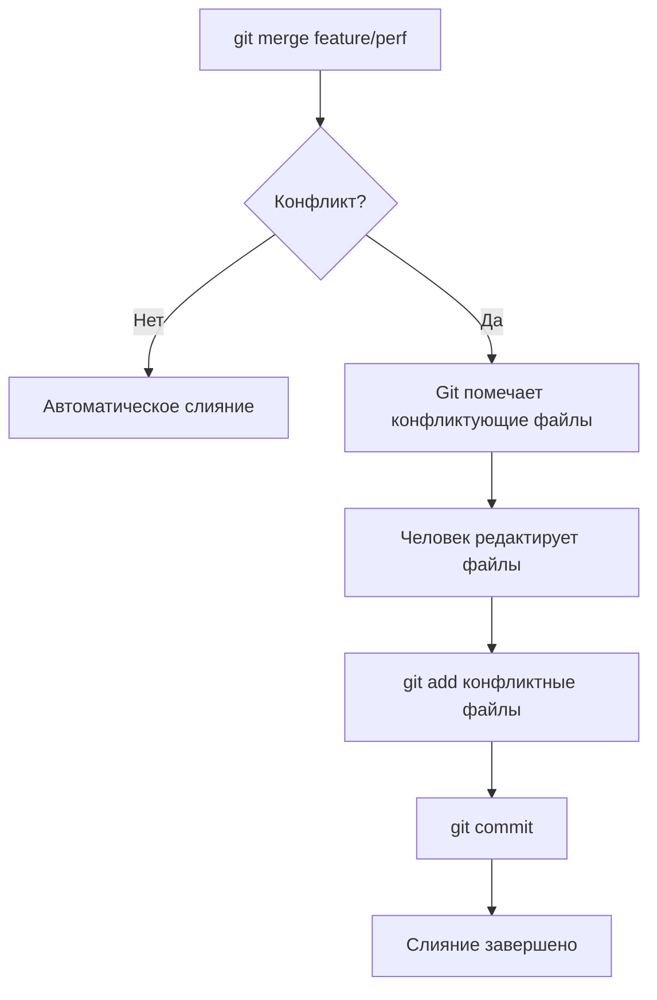

# Глава 6: Конфликты слияния — как читать и разрешать

## Что вы узнаете

- почему возникают конфликты и это нормально;
- как читать маркеры конфликта в файлах;
- как разрешить конфликт вручную и через инструменты;
- как прервать слияние если что-то пошло не так.

---

## Почему возникают конфликты

Конфликт слияния — это не ошибка, а нормальная ситуация. Он происходит когда два человека (или две ветки) изменили одно и то же место в одном и том же файле по-разному.

```text
main:         nginx.conf → worker_connections 512;
feature/perf: nginx.conf → worker_connections 2048;
```

Git не знает какую версию оставить. Он сообщает об этом и просит человека принять решение.



---

## Как выглядит конфликт в файле

```text
worker_processes auto;

<<<<<<< HEAD
worker_connections 512;
=======
worker_connections 2048;
>>>>>>> feature/perf

http {
    include mime.types;
}
```

Разбор маркеров:

| Маркер | Означает |
|--------|----------|
| `<<<<<<< HEAD` | Начало изменений из текущей ветки (HEAD) |
| `=======` | Разделитель |
| `>>>>>>> feature/perf` | Конец изменений из сливаемой ветки |

Всё что между `<<<<<<<` и `=======` — версия из текущей ветки. Между `=======` и `>>>>>>>` — версия из сливаемой ветки.

---

## Разрешение конфликта вручную

Нужно **отредактировать файл**: убрать маркеры и оставить то что должно быть.

Варианты:

```bash
# Вариант 1: оставить версию из текущей ветки (HEAD)
worker_connections 512;

# Вариант 2: оставить версию из сливаемой ветки
worker_connections 2048;

# Вариант 3: написать что-то третье (объединить логику)
worker_connections 1024;   # компромисс
```

После редактирования в файле **не должно остаться маркеров** (`<<<<<<<`, `=======`, `>>>>>>>`).

### Порядок действий

```bash
# 1. Узнать какие файлы конфликтуют
git status
# both modified:   nginx.conf

# 2. Открыть файл и разрешить конфликт
nano nginx.conf
# (убрать маркеры, оставить нужную версию)

# 3. Добавить разрешённый файл в индекс
git add nginx.conf

# 4. Завершить слияние
git commit
# (откроется редактор с готовым сообщением "Merge branch ...")
# Сохранить и закрыть — коммит создастся автоматически
```

---

## Разрешение через инструменты

### git mergetool

Стандартный способ — запустить внешний инструмент слияния:

```bash
git mergetool
```

По умолчанию откроется `vimdiff`. Можно настроить другой:

```bash
# VS Code как инструмент слияния
git config --global merge.tool vscode
git config --global mergetool.vscode.cmd 'code --wait $MERGED'

# После настройки
git mergetool
# откроется VS Code с тремя панелями: LEFT (HEAD) | CENTER (результат) | RIGHT (сливаемая)
```

### Принять одну сторону целиком

Если в файле конфликт и ты точно знаешь что одна версия правильная:

```bash
# Принять версию из нашей ветки (ours)
git checkout --ours nginx.conf

# Принять версию из сливаемой ветки (theirs)
git checkout --theirs nginx.conf

# Затем добавить в индекс
git add nginx.conf
```

---

## Прервать слияние

Если в процессе слияния понял что сделал что-то не так — можно всё отменить:

```bash
git merge --abort
```

Репозиторий вернётся в состояние до начала `git merge`. Все незавершённые изменения исчезнут.

---

## Предотвращение конфликтов

Конфликты нельзя полностью избежать, но можно сократить:

```text
1. Делай ветки короткими — не держи открытую ветку месяц.
2. Регулярно обновляй ветку от main:
   git switch feature/my
   git rebase main
   
3. Не трогай форматирование без необходимости — 
   это создаёт «пустые» конфликты на пробелах.
   
4. Коммуникация с командой: 
   "я переписываю nginx.conf, не трогайте его пока".
```

### Обновить ветку от main до слияния

Перед тем как открыть Pull Request — хорошая практика обновить ветку:

```bash
git switch feature/add-ssl
git rebase main
# Если конфликты — разрешить их, потом:
git rebase --continue
# Если хочешь отменить rebase:
git rebase --abort
```

---

## Пример: полный цикл с конфликтом

```bash
# Подготовка
git init conflict-demo
cd conflict-demo
echo "connections 512" > config.txt
git add config.txt && git commit -m "Начальный конфиг"

# Ветка 1
git switch -c feature/high-perf
echo "connections 2048" > config.txt
git add config.txt && git commit -m "Увеличить connections для нагрузки"

# Ветка 2 (в main)
git switch main
echo "connections 1024" > config.txt
git add config.txt && git commit -m "Умеренное увеличение connections"

# Слияние → конфликт
git merge feature/high-perf
# Auto-merging config.txt
# CONFLICT (content): Merge conflict in config.txt
# Automatic merge failed; fix conflicts and then commit the result.

# Смотрим файл
cat config.txt
# <<<<<<< HEAD
# connections 1024
# =======
# connections 2048
# >>>>>>> feature/high-perf

# Разрешаем: берём 2048 как более продуманное решение
echo "connections 2048" > config.txt

# Завершаем
git add config.txt
git commit -m "Merge feature/high-perf: connections=2048"
```

---

## Чек-лист для самопроверки

- [ ] Понимаю что конфликт — это нормально, а не ошибка Git
- [ ] Умею читать маркеры `<<<<<<<`, `=======`, `>>>>>>>`
- [ ] Знаю порядок действий: отредактировать → `git add` → `git commit`
- [ ] Умею прервать слияние через `git merge --abort`
- [ ] Знаю как принять одну сторону целиком (`--ours` / `--theirs`)

## Попробуйте сами

1. Создайте ситуацию конфликта (как в примере выше). Разрешите его вручную. Убедитесь что после разрешения в файле нет маркеров.
2. Создайте конфликт с двумя разными изменениями в одном файле. Попробуйте `git checkout --ours` и `git checkout --theirs` — убедитесь что понимаете что происходит.
3. Намеренно прервите слияние через `git merge --abort`. Запустите `git status` до и после — что изменилось?
