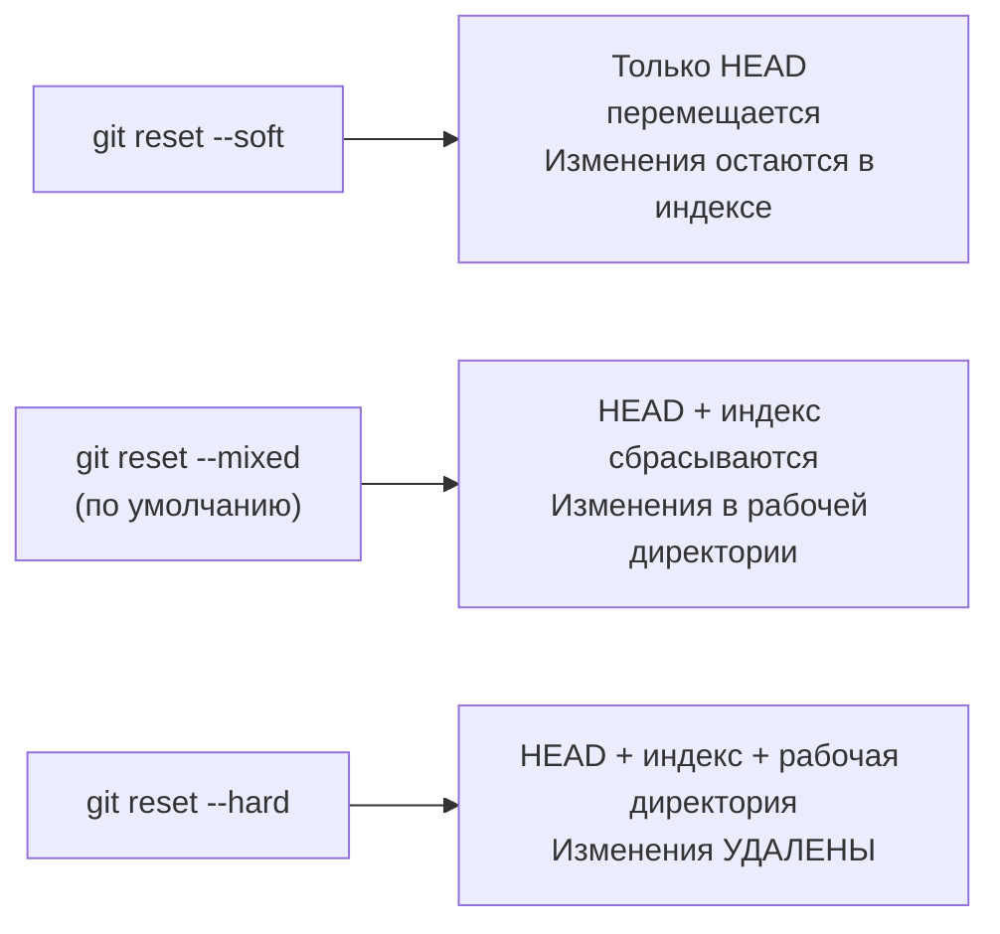

# Глава 8: История и откаты — reset, revert, stash

## Что вы узнаете

- как путешествовать по истории коммитов;
- три режима `git reset` и когда что применять;
- зачем нужен `git revert` и чем он безопаснее;
- как временно сохранить незакоммиченные изменения через `git stash`.

---

## Изучение истории

```bash
# Компактный лог
git log --oneline
# 9e8d7f6 Добавить HTTPS редирект
# f1a2b3c Добавить SSL сертификат
# a1b2c3d Начальная конфигурация nginx

# Лог с графом веток
git log --oneline --graph --all

# Конкретный коммит: что изменилось
git show f1a2b3c

# Кто менял строку в файле
git blame nginx.conf

# Кто менял конкретные строки файла
git blame -L 10,20 nginx.conf
# a1b2c3d (Ivan 2026-06-01 14:30) worker_connections 1024;

# Поиск коммитов которые изменили конкретную строку
git log -S "worker_connections" --oneline

# Поиск коммитов по содержимому сообщения
git log --grep "nginx" --oneline
```

### git show — подробно о коммите

```bash
git show 9e8d7f6
# commit 9e8d7f6...
# Author: Ivan <ivan@example.com>
# Date:   Mon Jun 2 14:30:00 2026
#
#     Добавить HTTPS редирект
#
# diff --git a/nginx.conf b/nginx.conf
# ...
```

### Посмотреть файл в другом коммите

```bash
# Показать содержимое файла в конкретном коммите
git show f1a2b3c:nginx.conf

# Восстановить файл из коммита в рабочую директорию
git checkout f1a2b3c -- nginx.conf
```

---

## git stash — временно отложить изменения

Ситуация: ты работаешь в ветке, не дописал изменения, а нужно срочно переключиться и поправить баг.

```bash
# Сохранить незакоммиченные изменения «на стек»
git stash

# Рабочая директория чистая, можно переключиться
git switch main
# ... исправить баг, закоммитить ...

# Вернуться к своей ветке
git switch feature/my-thing

# Достать изменения обратно
git stash pop

# Альтернатива: применить без удаления из стека
git stash apply
```

### Несколько stash'ей

```bash
git stash list
# stash@{0}: WIP on feature/auth: f1a2b3c Добавить middleware
# stash@{1}: WIP on main: a1b2c3d Начальная конфигурация

# Применить конкретный
git stash apply stash@{1}

# Удалить конкретный
git stash drop stash@{1}

# Очистить всё
git stash clear
```

### Stash с именем

```bash
git stash push -m "WIP: работаю над SSL настройкой"
git stash list
# stash@{0}: On feature/ssl: WIP: работаю над SSL настройкой
```

---

## git reset — переместить HEAD

`git reset` переносит HEAD (и ветку) на другой коммит. Есть три режима:



### Примеры

```bash
# Последний коммит → убрать из истории, изменения в индексе
git reset --soft HEAD~1
# Хорошо для: "сделал коммит слишком рано, хочу добавить ещё файл"

# Последний коммит → убрать из истории, изменения в рабочей директории
git reset --mixed HEAD~1
# (это поведение по умолчанию, --mixed можно не писать)
# Хорошо для: "хочу переделать коммит заново"

# Последний коммит → необратимо удалить коммит и изменения
git reset --hard HEAD~1
# Хорошо для: "последний коммит был ошибкой, удалить полностью"
```

> ☠️ **Осторожно:** `git reset --hard` необратимо удаляет незакоммиченные изменения и коммиты. Восстановить можно только через `git reflog` в течение ~30 дней.

### Несколько коммитов назад

```bash
# Вернуться на 3 коммита назад
git reset --hard HEAD~3

# Вернуться к конкретному коммиту
git reset --hard abc1234
```

### Убрать файл из индекса

```bash
# git reset без --hard/--soft/--mixed для конкретного файла:
git reset HEAD nginx.conf
# = git restore --staged nginx.conf
# Файл убирается из индекса, изменения остаются в рабочей директории
```

---

## git revert — безопасный откат

`git revert` создаёт **новый коммит**, который отменяет изменения предыдущего. История не переписывается.

```bash
# Отменить конкретный коммит
git revert f1a2b3c

# Отменить последний коммит
git revert HEAD

# Отменить диапазон коммитов
git revert HEAD~3..HEAD

# Не создавать коммит сразу (потом сделаешь git commit)
git revert --no-commit f1a2b3c
```

### Когда revert, а когда reset

```text
git reset:
+ Убирает коммит из истории полностью
- Нельзя использовать если ветка уже запушена
- Другие разработчики потеряют синхронизацию

git revert:
+ Безопасно для запушенных веток
+ История честная: видно что изменение было и было отменено
- Добавляет лишний коммит в историю
```

**Правило:** если ветка ещё не запушена — `git reset`. Если уже запушена — `git revert`.

---

## git cherry-pick — взять конкретный коммит

Иногда нужно взять один коммит из другой ветки, не сливая всё.

```bash
# Применить коммит из другой ветки
git cherry-pick abc1234

# Применить несколько коммитов
git cherry-pick abc1234 def5678

# Применить диапазон
git cherry-pick main~3..main

# Применить без создания коммита
git cherry-pick --no-commit abc1234
```

Типичный сценарий: hotfix в `main` который нужен и в `release/2.0`.

```bash
git switch main
git cherry-pick hotfix-commit-sha
```

---

## git reflog — история HEAD

Если сделал `git reset --hard` и хочешь вернуться:

```bash
git reflog
# 9e8d7f6 HEAD@{0}: reset: moving to HEAD~1
# f1a2b3c HEAD@{1}: commit: Добавить SSL сертификат
# a1b2c3d HEAD@{2}: commit: Начальная конфигурация

# Вернуться к состоянию до сброса
git reset --hard f1a2b3c
```

`git reflog` хранит все перемещения HEAD за последние ~30 дней. Это «аварийный выход» из большинства ошибок с git reset.

---

## Чек-лист для самопроверки

- [ ] Умею смотреть историю файла через `git log` с фильтрами
- [ ] Знаю три режима `git reset` и когда что использовать
- [ ] Понимаю разницу между `git reset` и `git revert`
- [ ] Умею использовать `git stash` для временного сохранения изменений
- [ ] Знаю что `git reflog` может помочь восстановить «потерянные» коммиты

## Попробуйте сами

1. Сделайте коммит. Запустите `git reset --soft HEAD~1` — изменения должны остаться в индексе. Запустите `git reset --mixed HEAD~1` — изменения переходят в рабочую директорию. Убедитесь что понимаете разницу.
2. Запушите ветку на GitHub. Попробуйте `git reset --hard HEAD~1` и `git push` — Git отклонит (rejected). Вернитесь через `git reflog` и используйте `git revert` — это безопасный путь.
3. Создайте несколько stash'ей с разными именами. Выведите список через `git stash list`. Примените стейш по номеру, не удаляя его. Затем очистите стек.
