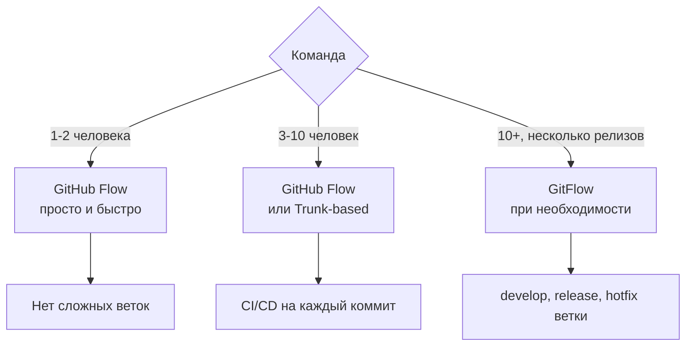

# Глава 11: Стратегии ветвления для команды

## Что вы узнаете

- основные стратегии ветвления: GitHub Flow, GitFlow, Trunk-based;
- когда какую стратегию выбрать;
- как организован Pull Request / Merge Request workflow;
- как защитить ветку `main` от случайных пушей.

---

## Зачем нужна стратегия ветвления

Один человек работает как хочет. Команда из пяти человек — уже нужны правила: в какую ветку пушить, когда деплоить, как делать ревью.



---

## GitHub Flow — рекомендуется для большинства

Простейшая стратегия. Одна главная ветка (`main`), всё остальное — короткоживущие feature-ветки.

```text
main: ──────────────────────────────────── (стабильный, всегда деплоится)
          |           |        |
feature/A ──────► PR ──┘       |
                               |
          feature/B ──────► PR ─┘
```

**Правила:**

1. `main` всегда стабилен и готов к деплою
2. Для любого изменения создаётся ветка от `main`
3. Ветка называется понятно: `feature/add-ssl`, `fix/nginx-502`
4. Делаем коммиты, пушим ветку
5. Открываем Pull Request (PR) в `main`
6. После ревью и прохождения CI — мержим в `main`
7. Деплоим `main`
8. Удаляем ветку

**Когда подходит:** большинство проектов, один релиз, CI/CD на каждый merge в main.

---

## GitFlow — когда нужно несколько релизов

GitFlow добавляет несколько постоянных веток:

```text
main:    ────────── v1.0 ─────────────── v1.1 ────── v2.0
                      ↑                    ↑
hotfix                └─── hotfix/1.0.1 ──┘
                      
develop: ────────────────────────────────────────────────
              |          |          |
feature/A ────┘          |          |
                feature/B ──────────┘
                                         |
                                  release/2.0 ──► main
```

**Ветки:**

| Ветка | Назначение |
|-------|-----------|
| `main` | Продакшн. Только теги релизов |
| `develop` | Интеграционная ветка |
| `feature/*` | Новая функциональность → в `develop` |
| `release/*` | Подготовка релиза → в `main` + `develop` |
| `hotfix/*` | Срочное исправление → в `main` + `develop` |

**Когда подходит:** несколько версий продукта одновременно, длинный цикл релизов, большие команды.

**Когда НЕ подходит:** стартап, небольшая команда, частые деплои, CI/CD. GitFlow усложняет без пользы.

---

## Trunk-based development

Все разработчики коммитят напрямую в одну ветку (`main` или `trunk`). Feature-флаги скрывают незавершённую функциональность.

```text
trunk: A → B → C → D → E → F (коммиты каждый день, несколько раз)
              ↑           ↑
           feature-flag  feature-flag включён в релизе
```

**Когда подходит:** высокочастотный деплой (несколько раз в день), зрелая команда с хорошим покрытием тестами, Google/Meta уровень практик.

**Когда НЕ подходит:** маленькая команда без сильного CI, проекты с длинными ревью.

---

## Pull Request / Merge Request workflow

Независимо от стратегии — PR/MR это точка ревью и автоматических проверок.

```text
Разработчик:
1. git switch -c feature/add-auth
2. ... работа, коммиты ...
3. git push -u origin feature/add-auth
4. Открыть PR на GitHub/GitLab
5. Написать описание: что сделано, как проверить, ссылка на задачу

CI/CD автоматически:
6. Запустить тесты
7. Запустить lint
8. Запустить security-сканирование
9. Задеплоить на staging (опционально)

Ревьюер:
10. Прочитать код
11. Оставить комментарии
12. Approve или Request changes

Разработчик:
13. Учесть комментарии, пушить новые коммиты
14. Squash commits если нужно

Merge:
15. Squash merge или regular merge в main
16. Удалить ветку
17. Автодеплой из main
```

---

## Защита ветки main

Никто не должен случайно запушить в `main` напрямую.

**GitHub: branch protection rules**

Settings → Branches → Add branch protection rule:
- Branch name pattern: `main`
- ✅ Require a pull request before merging
- ✅ Require approvals: 1 (или больше)
- ✅ Require status checks to pass (CI)
- ✅ Do not allow bypassing the above settings

Теперь `git push origin main` вернёт ошибку:

```bash
remote: error: GH006: Protected branch update failed for refs/heads/main.
remote: error: At least 1 approving review is required by reviewers with write access.
```

**На своём сервере (GitLab, Gitea):** аналогичные настройки в разделе Protected Branches.

---

## Именование тегов и релизов

Теги маркируют конкретные коммиты как «версия X.Y.Z»:

```bash
# Создать тег
git tag v1.2.0

# Тег с аннотацией (рекомендуется)
git tag -a v1.2.0 -m "Release 1.2.0: добавить SSL, исправить 502"

# Запушить теги на remote
git push origin --tags

# Один тег
git push origin v1.2.0

# Посмотреть теги
git tag
git tag -l "v1.*"
```

**Semantic Versioning** (`major.minor.patch`):

| Изменение | Версия |
|-----------|--------|
| Ломающее изменение API | 2.0.0 → 3.0.0 |
| Новая функциональность (обратно совместимо) | 2.0.0 → 2.1.0 |
| Исправление бага | 2.1.0 → 2.1.1 |

---

## Чек-лист для самопроверки

- [ ] Понимаю суть GitHub Flow: `main` стабильна, всё через PR
- [ ] Знаю когда GitFlow избыточен, а когда нужен
- [ ] Понимаю порядок действий при работе с PR/MR
- [ ] Знаю как защитить ветку main от прямых пушей
- [ ] Умею создавать теги и понимаю Semantic Versioning

## Попробуйте сами

1. На GitHub настройте branch protection для `main`: запретить прямые пуши, требовать 1 апрув. Попробуйте запушить напрямую — увидите ошибку.
2. Создайте feature-ветку, откройте Pull Request. Добавьте описание: что изменилось, как проверить. Смержите PR.
3. Создайте аннотированный тег `v0.1.0` на последнем коммите и запушьте его на GitHub. Убедитесь что он появился в разделе Releases/Tags.
