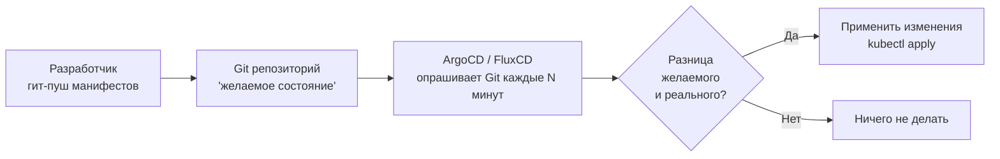

# Глава 12: Git в CI/CD — триггеры, теги, хуки

## Что вы узнаете

- как CI/CD системы реагируют на события в Git;
- как Git-хуки запускают проверки перед коммитом или пушем;
- что такое GitOps и как Git становится источником истины для инфраструктуры;
- как теги используются для управления релизами в CI/CD.

---

## Как CI/CD читает Git

CI/CD система (GitHub Actions, GitLab CI, Jenkins) подписывается на события Git:

```text
Событие в Git           CI/CD реакция
───────────────────────────────────────────────────────
push в main           → деплой в продакшн
push в любую ветку    → запустить тесты и lint
создать PR/MR         → тесты, ревью-окружение
создать тег v*.*.*    → собрать артефакт, релиз
merge PR в main       → деплой на staging
push тега v*          → деплой в продакшн (если тег)
```

### GitHub Actions: пример триггеров

```yaml
# .github/workflows/ci.yml
on:
  push:
    branches:
      - main
      - 'feature/**'    # любая ветка feature/...
  pull_request:
    branches:
      - main
  push:
    tags:
      - 'v*.*.*'        # только семантические теги релизов
```

### GitLab CI: пример

```yaml
# .gitlab-ci.yml
workflow:
  rules:
    - if: $CI_COMMIT_BRANCH == "main"
      variables:
        DEPLOY_ENV: production
    - if: $CI_COMMIT_TAG =~ /^v\d+\.\d+\.\d+$/
      variables:
        DEPLOY_ENV: production
    - if: $CI_PIPELINE_SOURCE == "merge_request_event"
      variables:
        DEPLOY_ENV: staging
```

---

## Переменные окружения от Git в CI

CI системы автоматически передают Git-переменные в пайплайн:

| Переменная (GitHub) | Переменная (GitLab) | Значение |
|--------------------|--------------------|-|
| `GITHUB_SHA` | `CI_COMMIT_SHA` | Хеш текущего коммита |
| `GITHUB_REF_NAME` | `CI_COMMIT_REF_NAME` | Имя ветки или тега |
| `GITHUB_ACTOR` | `GITLAB_USER_LOGIN` | Кто запустил пайплайн |

Это полезно для тегирования Docker образов:

```yaml
- name: Build Docker image
  run: |
    docker build -t myapp:${{ github.sha }} .
    docker build -t myapp:latest .
```

---

## Git-хуки — проверки на стороне разработчика

Git поддерживает хуки (hooks) — скрипты которые запускаются автоматически на определённые события.

```text
.git/hooks/
├── pre-commit        ← запускается перед каждым коммитом
├── commit-msg        ← проверяет формат сообщения
├── pre-push          ← запускается перед git push
├── post-merge        ← после git merge
└── post-checkout     ← после git checkout
```

### Создать хук вручную

```bash
# pre-commit: запустить lint перед коммитом
cat > .git/hooks/pre-commit << 'EOF'
#!/bin/bash
# Проверить YAML-файлы
if command -v yamllint &> /dev/null; then
    yamllint . && echo "yamllint: OK"
fi

# Проверить что нет секретов (грубая проверка)
if git diff --cached --name-only | xargs grep -l "password\|secret\|token" 2>/dev/null; then
    echo "ВНИМАНИЕ: возможно в коммите есть секреты!"
    exit 1
fi
EOF

chmod +x .git/hooks/pre-commit
```

Теперь при каждом `git commit` будет запускаться этот скрипт. Если он завершится с кодом не 0 — коммит прервётся.

### pre-commit фреймворк

Хуки в `.git/hooks/` не попадают в репозиторий (`.git/` не версионируется). Чтобы хуки были общими для всей команды — используют фреймворк `pre-commit`:

```bash
pip install pre-commit
```

```yaml
# .pre-commit-config.yaml (в корне репозитория)
repos:
  - repo: https://github.com/pre-commit/pre-commit-hooks
    rev: v4.5.0
    hooks:
      - id: trailing-whitespace    # убрать пробелы в конце строк
      - id: end-of-file-fixer      # добавить перевод строки в конец
      - id: check-yaml             # проверить синтаксис YAML
      - id: detect-private-key     # предупредить о приватных ключах

  - repo: https://github.com/Yelp/detect-secrets
    rev: v1.4.0
    hooks:
      - id: detect-secrets         # поиск секретов
```

```bash
# Установить хуки
pre-commit install

# Проверить все файлы вручную
pre-commit run --all-files
```

Теперь `.pre-commit-config.yaml` коммитится в репозиторий и команда получает одинаковые хуки.

---

## GitOps — Git как источник истины

GitOps — подход при котором состояние инфраструктуры описано в Git, а CI/CD автоматически применяет изменения.

```text
Традиционный деплой:
Разработчик → SSH на сервер → kubectl apply → изменения применены
                           ↑ нет аудита, нет отката через Git

GitOps:
Разработчик → PR с изменением манифестов → merge → ArgoCD/FluxCD применяет
                                                  ↑ всё в Git, полная история
```

**Как это работает с Git:**



Репозиторий Git — единственный источник истины. Хочешь изменить конфиг — делаешь PR. История изменений кластера = история коммитов.

---

## Теги для управления релизами

```bash
# Пометить стабильную версию
git tag -a v1.2.0 -m "Release 1.2.0"
git push origin v1.2.0

# CI/CD реагирует на тег и деплоит в продакшн
```

**Стандартный pipeline:**

```text
feature/* ──► PR ──► main ──► [тесты] ──► staging
                                    ↑
                              git tag v1.2.0 ──► [тесты] ──► production
```

**GitHub Actions: деплой по тегу**

```yaml
on:
  push:
    tags: ['v*']

jobs:
  deploy:
    runs-on: ubuntu-latest
    steps:
      - uses: actions/checkout@v4
      - name: Deploy version ${{ github.ref_name }}
        run: ./deploy.sh ${{ github.ref_name }}
```

---

## Полезные команды для CI/CD контекста

```bash
# Получить хеш текущего коммита
git rev-parse HEAD
git rev-parse --short HEAD  # короткая форма: abc1234

# Получить имя текущей ветки
git branch --show-current

# Получить последний тег
git describe --tags --abbrev=0

# Получить описание с тегом (нужно для версионирования)
git describe --tags
# v1.2.0-3-gabc1234
# ↑ последний тег, 3 коммита после него, хеш коммита

# Проверить что репозиторий чистый (нет незакоммиченных изменений)
git status --porcelain
# Если вывод пустой — чисто

# Клонировать только нужную ветку (shallow, для CI)
git clone --depth 1 --branch main git@github.com:user/repo.git
```

---

## Чек-лист для самопроверки

- [ ] Понимаю как CI/CD реагирует на push, PR и теги
- [ ] Знаю что такое git-хуки и как создать `pre-commit` хук
- [ ] Слышал о `pre-commit` фреймворке для командных хуков
- [ ] Понимаю принцип GitOps: Git как источник истины
- [ ] Умею создать тег и понимаю как CI использует теги для деплоя

## Попробуйте сами

1. Создайте `pre-commit` хук который проверяет что в коммите нет файлов `.env`. Протестируйте: попробуйте закоммитить файл `.env` — хук должен прервать коммит.
2. Установите `pre-commit` фреймворк и добавьте базовые хуки (`check-yaml`, `trailing-whitespace`). Запустите `pre-commit run --all-files`.
3. Изучите любой открытый репозиторий с GitHub Actions (`.github/workflows/`). Найдите: на какие ветки реагирует CI, какие шаги выполняются при PR и при merge в main.
