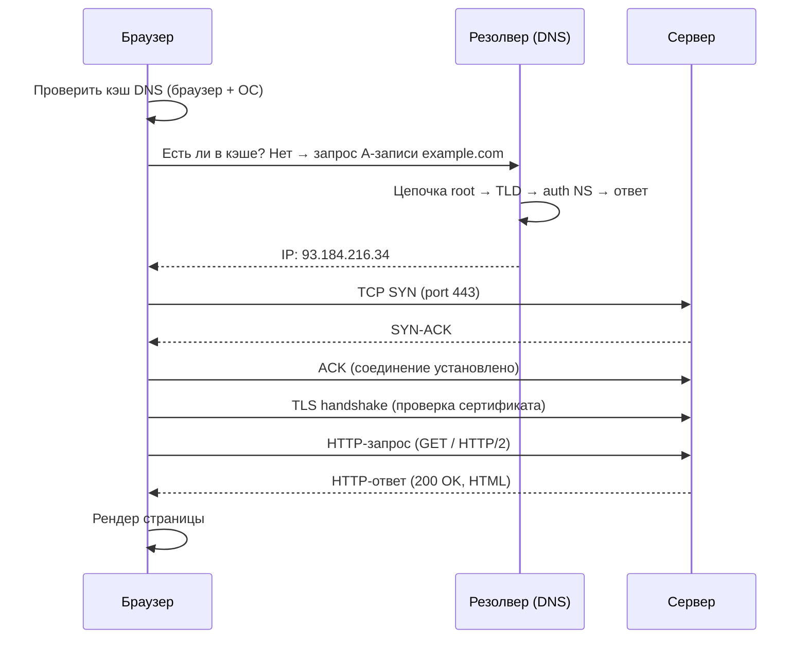
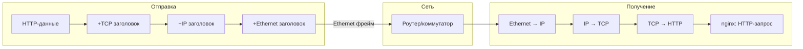

# Глава 0: Как данные идут по сети — OSI и TCP/IP на практике

```
Браузер                    Сеть                    Сервер
─────────────────────────────────────────────────────────
[HTTP запрос]              
    ↓ TCP сегмент
    ↓ IP пакет
    ↓ Ethernet фрейм
         ──────────► [Роутер] ──────────► [eth0 сервера]
                                               ↓
                                          [IP → TCP → HTTP]
                                               ↓
                                          [nginx слушает :80]
```

## Что вы узнаете

- что происходит в сети когда браузер открывает https://example.com;
- чем отличаются модели OSI и TCP/IP и почему DevOps важен именно TCP/IP;
- что такое инкапсуляция и как каждый уровень добавляет заголовок;
- как это знание помогает при диагностике.

Сеть — это не магия, а предсказуемый стек протоколов. На каждом уровне есть свой инструмент диагностики. Поймёшь уровни — перестанешь гадать.

---

## Что происходит при открытии сайта

Ты открываешь браузер, вводишь `https://example.com`, нажимаешь Enter. Что на самом деле происходит?



Каждый шаг — отдельный протокол, свой уровень модели, свой инструмент диагностики.

1. **Кэш DNS** — браузер сначала проверяет свой кэш, потом ОС (`/etc/hosts`), потом резолвер. Если имя уже резолвилось недавно — внешних запросов нет.
2. **DNS-запрос** — если в кэше пусто, браузер спрашивает у DNS-резолвера (обычно 8.8.8.8, 1.1.1.1 или сервер провайдера). Резолвер проходит цепочку root → TLD → авторитарный NS и возвращает IP.
3. **TCP handshake** — SYN → SYN-ACK → ACK. Три пакета устанавливают соединение. Без этого никакие данные не пойдут.
4. **TLS handshake** — если HTTPS, поверх TCP идёт согласование шифрования, обмен сертификатами, генерация сессионного ключа.
5. **HTTP-запрос** — браузер отправляет GET-запрос с заголовками (Host, User-Agent, Accept и т.д.).
6. **HTTP-ответ** — сервер возвращает статус (200 OK), заголовки, тело.
7. **Рендер** — браузер парсит HTML, загружает CSS/JS/картинки (каждый — новый HTTP-запрос, некоторые — новые TCP-соединения).

Каждый шаг может сломаться. Зная стек протоколов, ты скажешь «сломалось на шаге 3» а не «интернет не работает».

---

## Модели OSI и TCP/IP

Модель OSI — 7 уровней. Модель TCP/IP — 4. В реальной жизни ты будешь работать с TCP/IP. OSI полезна только для понимания концепции.

```
OSI (7 уровней)        TCP/IP (4 уровня)    Примеры протоколов
────────────────────────────────────────────────────────────
7. Прикладной      ┐
6. Представления   ├──► Прикладной          HTTP, HTTPS, DNS, SSH
5. Сеансовый       ┘
4. Транспортный    ────► Транспортный        TCP, UDP
3. Сетевой         ────► Интернет            IP, ICMP
2. Канальный       ┐
1. Физический      ├──► Канальный           Ethernet, Wi-Fi
```

Ценность деления — не в теории, а в диагностике. Когда `ping работает — curl не работает`, ты знаешь: L3 работает (IP), проблема на L7 (приложение). Не нужно лезть в кабели и проверять Ethernet.

Если бы модели не было, диагностика выглядела бы так: «сервер вроде доступен, я пингую, но сайт не открывается, может сеть сломалась?». С моделью: «L3 работает, L7 нет — смотрю HTTP, DNS, сертификаты».

### Таблица: уровень → что сломалось → инструмент

```
Что сломалось                    Уровень    Инструмент
────────────────────────────────────────────────────────
Хост недоступен вообще           L3 (IP)    ping, traceroute
Порт недоступен                  L4 (TCP)   nc, telnet, ss, nmap
Сервис отвечает неверно          L7 (App)   curl, dig, openssl
Имя не резолвится                L7 (DNS)   dig, nslookup
Сертификат невалиден             L6/L7      openssl s_client
```

Запомни эту таблицу. Она отвечает на 90% вопросов «что делать когда сеть не работает».

---

## Инкапсуляция

Данные путешествуют по сети не «как есть» — каждый уровень добавляет свой заголовок. Это называется инкапсуляция.

```
┌─────────────────────────────────────────────────────────┐
│ Данные HTTP:  GET / HTTP/1.1\r\nHost: example.com       │
├─────────────────────────────────────────────────────────┤
│ + TCP заголовок:  порт 54321 → порт 80                  │
├─────────────────────────────────────────────────────────┤
│ + IP заголовок:   src 192.168.1.5 → dst 93.184.216.34  │
├─────────────────────────────────────────────────────────┤
│ + Ethernet:       src MAC aa:bb:cc:dd:ee:ff             │
│                   dst MAC 00:11:22:33:44:55             │
└─────────────────────────────────────────────────────────┘
```

На стороне получателя — обратный процесс (деинкапсуляция): Ethernet → IP → TCP → HTTP.



Почему это важно знать? Потому что разные уровни видят разные заголовки.

- **ping** смотрит на ICMP (L3). Ему не важно что там за порт — он проверяет достижимость хоста.
- **curl** смотрит на HTTP (L7). Ему нужен работающий TCP (L4) и корректный ответ от приложения.
- **tcpdump** показывает весь фрейм — ты видишь Ethernet, IP, TCP, HTTP одновременно.

Если ты смотришь tcpdump и видишь SYN → SYN-ACK → ACK, проблема не в TCP. Ищи выше — в HTTP, TLS, DNS.

---

## Инструменты диагностики по уровням

```
Уровень     Инструменты                Что проверяем
────────────────────────────────────────────────────────
L3 (IP)     ping, traceroute, mtr      Достижимость хоста, потери, RTT
L4 (TCP)    nc, ss, nmap, telnet       Открыт ли порт, слушает ли сервис
L7 (App)    curl, dig, openssl         Корректность запроса/ответа
L7 (DNS)    dig, nslookup, resolvectl  Резолвится ли имя
L5-6        openssl s_client           Сертификат, TLS-рукопожатие
```

Каждый инструмент работает на своём уровне. Не пытайся диагностировать L7 проблему через ping — ты увидишь что хост жив, но не узнаешь что сервис упал.

---

## Типичные ошибки

- **Пинг работает → «сеть ок».** А curl не работает. ping проверяет L3 (ICMP), curl — L7 (HTTP). Между ними ещё 4 уровня. ICMP может ходить, а TCP-порт 443 может быть заблокирован файрволом. «ping работает» значит только «хост отвечает на ICMP», не более.
- **Путать IP-адрес и MAC-адрес.** IP-адрес маршрутизируется глобально — можно пинговать адрес на другом континенте. MAC-адрес работает только в локальной сети (до первого роутера). Если пакет идёт через роутер, MAC-адрес назначения каждый раз меняется. IP — нет.
- **Смотреть не на тот уровень.** Типичная история: сервис не отвечает → бегут проверять Ethernet-кабель, хотя проблема в том что nginx упал. Сначала определи уровень — потом лезь.

---

## Чек-лист для самопроверки

- [ ] Могу назвать 4 уровня TCP/IP и привести пример протокола на каждом
- [ ] Понимаю почему «ping работает» не означает «сервис работает»
- [ ] Знаю какой инструмент диагностирует каждый уровень

---

## Попробуйте сами

1. Откройте любой сайт в браузере. Запишите на бумаге все шаги которые происходят от нажатия Enter до отображения страницы. Сколько протоколов задействовано?

2. Запустите `ping google.com` — это L3. Запустите `curl -I https://google.com` — это L7. Оба работают? А теперь — что случится если заблокировать порт 443, но не заблокировать ICMP?

3. Запустите `tcpdump -n -i any port 53 &` и откройте любой сайт. Увидите DNS-запрос — это запрос с L7 который идёт по UDP на L4. Остановите tcpdump (`kill %1`).

```bash
# Если tcpdump не установлен:
sudo apt install -y tcpdump
```
