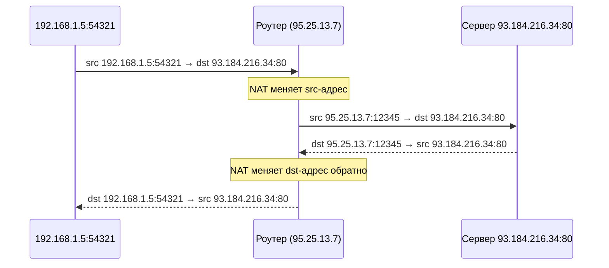

# Глава 1: IP-адресация, подсети и CIDR

## Что вы узнаете

- как читать IP-адрес и маску подсети;
- что означает нотация CIDR (192.168.1.0/24);
- как посчитать количество хостов в подсети;
- зачем нужны приватные адреса и что такое NAT.

После этой главы нотация `/24`, `/16`, `/32` не вызывает вопросов. Ты сможешь определить принадлежность адреса к сети и считать подсети без калькулятора.

---

## IP-адрес: 4 числа по 8 бит

IPv4-адрес — это 32 бита, разделённые на 4 октета по 8 бит. Каждый октет — число от 0 до 255.

```
192.168.1.100

Двоично:
11000000 . 10101000 . 00000001 . 01100100
└─ 192 ─┘ └─ 168 ─┘ └── 1 ──┘ └─ 100 ─┘
```

Пример перевода: 192 = 128 + 64 = `11000000`. 168 = 128 + 32 + 8 = `10101000`.

Тебе не нужно считать в двоичной системе каждый день. Но понимать структуру надо: 32 бита → маска определяет сколько бит — сеть, сколько — хост.

---

## Маска подсети

Маска подсети показывает: какая часть IP-адреса — это **сеть**, а какая — **конкретное устройство** в этой сети.

```
IP-адрес:   192.168.1.100
Маска:      255.255.255.0  =  /24

Двоично:
192.168.1.100  =  11000000.10101000.00000001.01100100
255.255.255.0  =  11111111.11111111.11111111.00000000
                  └─────────────── 24 бита ──────────┘└─ 8 бит ─┘
                        сетевая часть                  хост-часть

Сеть:       192.168.1.0
Broadcast:  192.168.1.255
Хосты:      192.168.1.1 – 192.168.1.254  (254 адреса)
```

`/24` = `255.255.255.0` = 24 единицы в маске. Первые 24 бита — сеть (не меняются у всех устройств в подсети), последние 8 бит — адрес устройства.

Из 256 адресов (2^8) два зарезервированы: самый первый — адрес **сети** (192.168.1.0), самый последний — **broadcast** (192.168.1.255). Реальных хостов — 254.

### Таблица часто используемых масок

```
CIDR    Маска               Кол-во хостов    Использование
────────────────────────────────────────────────────────────────
/8      255.0.0.0           16 777 214       крупные ISP
/16     255.255.0.0         65 534           корпоративные сети
/24     255.255.255.0       254              сегменты LAN
/25     255.255.255.128     126              половина /24
/27     255.255.255.224     30               небольшой сегмент
/30     255.255.255.252     2                point-to-point
/32     255.255.255.255     1 (один хост)    маршруты к хосту, loopback
```

**Формула:** число хостов = 2^(32 − prefix) − 2

Примеры:
- `/24`: 2^(32-24) − 2 = 256 − 2 = **254**
- `/16`: 2^(32-16) − 2 = 65536 − 2 = **65 534**
- `/30`: 2^(32-30) − 2 = 4 − 2 = **2** (ровно для линка между роутерами)

### Команды для проверки IP и маски

```bash
# Показать IP-адреса всех интерфейсов
ip addr show

# Пример вывода (обрезан):
# 2: eth0: <...> state UP
#     link/ether 52:54:00:ab:cd:ef brd ff:ff:ff:ff:ff:ff
#     inet 192.168.1.100/24 brd 192.168.1.255 scope global dynamic eth0
#     inet6 fe80::5054:ff:feab:cdef/64 scope link
#                       ↑ маска /24

# Только IPv4
ip -4 addr show
```

Утилита `ipcalc` показывает границы сети наглядно:

```bash
# Если не установлена:
sudo apt install -y ipcalc

ipcalc 192.168.1.100/24

# Address:   192.168.1.100        11000000.10101000.00000001.01100100
# Netmask:   255.255.255.0 = 24   11111111.11111111.11111111.00000000
# Network:   192.168.1.0/24       11000000.10101000.00000001.00000000
# HostMin:   192.168.1.1          11000000.10101000.00000001.00000001
# HostMax:   192.168.1.254        11000000.10101000.00000001.11111110
# Broadcast: 192.168.1.255        11000000.10101000.00000001.11111111
# Hosts/Net: 254                   Class C
```

---

## Приватные адреса

Не все IP-адреса доступны из интернета. Есть три блока приватных (RFC 1918) — для локальных сетей.

```
Диапазон                    CIDR          Применение
────────────────────────────────────────────────────────────
10.0.0.0 – 10.255.255.255    /8           корпоративные сети, Docker, K8s
172.16.0.0 – 172.31.255.255  /12          Docker по умолчанию (172.17.0.0/16)
192.168.0.0 – 192.168.255.255 /16         домашние роутеры, офисы
127.0.0.0 – 127.255.255.255   /8          loopback (127.0.0.1 = localhost)
```

Приватные адреса:
- не маршрутизируются в интернете (роутеры их просто отбрасывают);
- можно использовать внутри своей сети без регистрации;
- в разных организациях могут совпадать — это нормально, пока они не соединены напрямую.

Последняя строка — loopback. `127.0.0.1` (localhost) — это всегда твой собственный компьютер. Пакет не уходит в сеть вообще — он идёт через виртуальный интерфейс `lo` сразу на приём.

```bash
ping 127.0.0.1
# PING 127.0.0.1 (127.0.0.1) 56(84) bytes of data.
# 64 bytes from 127.0.0.1: icmp_seq=1 ttl=64 time=0.034 ms
#              ↑ время < 1 мс — пакет никуда не ходил
```

---

## NAT: как приватные адреса выходят в интернет

У тебя есть роутер с внешним IP (например, `95.25.13.7`). Внутри — десяток устройств с адресами `192.168.1.x`. Как пакет с приватным адресом попадает в интернет?



Роутер (или фаервол) подменяет `src-ip:port` на свой внешний адрес, запоминает соответствие в таблице NAT и при ответе подменяет обратно.

```bash
# В Linux NAT делает iptables (см. главу 9):
iptables -t nat -A POSTROUTING -o eth0 -j MASQUERADE
```

Для DevOps это важно: когда ты запускаешь Docker-контейнер, он получает приватный IP (например, `172.17.0.2`). Чтобы выйти в интернет, Docker использует NAT (masquerade). Именно поэтому `curl ifconfig.me` из контейнера показывает IP хоста, а не IP контейнера.

---

## IPv6 кратко

IPv4 закончился. Поэтому придумали IPv6 — адреса длиной 128 бит.

```
Формат:  2001:db8::1/64
         2001:0db8:0000:0000:0000:0000:0000:0001
         ↑ двойное двоеточие заменяет группу нулей

Loopback:  ::1
Link-local: fe80:: (не маршрутизируются, только в локальной сети)

Префикс /64 — стандартный размер подсети (2^64 хостов).
```

Большинство команд из этой книги работают с флагом `-4` (IPv4) или `-6` (IPv6):

```bash
# Только IPv4
ping -4 google.com

# Только IPv6
ping -6 google.com

# Смотреть IPv6-адреса
ip -6 addr show
```

---

## Типичные ошибки

- **`192.168.1.0/24` и `192.168.1.0/25` — разные сети.** Первая содержит адреса 1–254, вторая — 1–126. Хосты из них не видят друг друга без маршрутизации. DevOps часто забывает это при настройке Docker-сетей или при делении существующей подсети.
- **`127.0.0.1` ≠ `0.0.0.0`.** Сервис на `127.0.0.1:8080` доступен только с localhost. На `0.0.0.0:8080` — со всех интерфейсов (снаружи тоже). Это частая причина «порт открыт, но не достучаться».
- **`/32` — это один адрес**, не подсеть. Используется для маршрута к конкретному хосту (например, `ip route add 10.0.0.5/32 via 192.168.1.1`).
- **Маска /0** означает «весь интернет» — 0 бит сетевой части. Используется в маршруте по умолчанию (`default via 192.168.1.1` — это эквивалент `0.0.0.0/0 via 192.168.1.1`).

---

## Чек-лист для самопроверки

- [ ] Понимаю что означает `/24` в адресе `192.168.1.0/24`
- [ ] Знаю диапазоны приватных адресов наизусть
- [ ] Понимаю разницу между `0.0.0.0` и `127.0.0.1` в контексте bind-адреса сервиса
- [ ] Умею посчитать число хостов в подсети по CIDR

---

## Попробуйте сами

1. Выполните `ip addr show` на своей машине. Найдите все IP-адреса: какие приватные, какой loopback? Если есть Docker — найдите `docker0` интерфейс и его подсеть.

2. Установите `ipcalc` и запустите для адресов: `10.0.0.0/8`, `172.17.0.0/16`, `192.168.1.0/24`. Сколько хостов в каждой?

```bash
sudo apt install -y ipcalc
ipcalc 10.0.0.0/8
ipcalc 172.17.0.0/16
ipcalc 192.168.1.0/24
```

3. Запустите любой сервис на `127.0.0.1:8080`, затем на `0.0.0.0:8080` — почувствуйте разницу:

```bash
# Терминал 1 — слушаем только localhost
python3 -m http.server --bind 127.0.0.1 8080

# Терминал 2 — с этого же хоста работает
curl http://127.0.0.1:8080
# С другого хоста — нет (проверьте: curl http://<ваш-ip>:8080 — будет Connection refused)

# Остановите (Ctrl+C), запустите на всех интерфейсах:
python3 -m http.server --bind 0.0.0.0 8080

# Теперь curl с другого хоста работает
```
