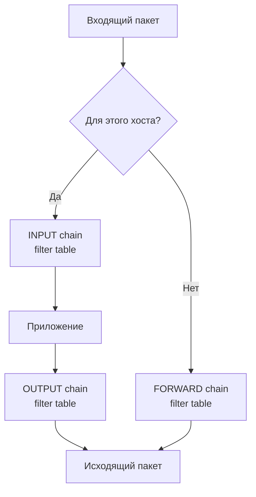

# Глава 9: iptables — правила, цепочки, NAT

> ☠️ **Осторожно:** ошибка может заблокировать SSH. Сохрани правила перед изменением: `iptables-save > /tmp/rules.bak`.

## Что вы узнаете

- как устроен iptables: таблицы, цепочки, правила;
- как добавлять, удалять и просматривать правила;
- как настроить базовый файрвол для сервера;
- что такое NAT и как его настроить.

**Цель главы:** читатель понимает iptables чтобы добавить правило, не сломать SSH.

---

## 9.1 Архитектура iptables

iptables — это интерфейс к Netfilter, подсистеме ядра Linux, которая перехватывает и обрабатывает сетевые пакеты. Всё, что проходит через ядро — будь то входящий, исходящий или транзитный пакет — можно проверить, изменить, пропустить или отбросить.

### Три уровня абстракции

```
┌─────────────────────────────────────────────────────┐
│                   iptables                           │
│          (пользовательский интерфейс)                │
├─────────────────────────────────────────────────────┤
│                   Netfilter                          │
│          (подсистема ядра Linux)                     │
├─────────────────────────────────────────────────────┤
│                   Сетевой стек                       │
│          (raw socket → IP → маршрутизация)           │
└─────────────────────────────────────────────────────┘
```

### Таблицы

iptables организует правила в **таблицы**. Каждая таблица отвечает за свой тип обработки:

| Таблица | Назначение |
|---------|-----------|
| **filter** | Фильтрация пакетов (ACCEPT/DROP/REJECT) — главная таблица |
| **nat** | Трансляция адресов (SNAT, DNAT, MASQUERADE) |
| **mangle** | Изменение заголовков пакетов (TOS, TTL, метки) |
| **raw** | Отключение отслеживания соединений (NOTRACK) |
| **security** | Метки SELinux (редко используется) |

В повседневной работе нужны только `filter` (по умолчанию) и `nat`.

### Цепочки (chains)

Внутри каждой таблицы — **цепочки**. Это последовательности правил, через которые проходят пакеты.

Стандартные цепочки таблицы **filter**:

```
┌─────────────────────────────────────────┐
│              Таблица filter              │
├─────────────────────────────────────────┤
│  INPUT  → пакеты, адресованные этому    │
│            хосту                        │
│                                         │
│  OUTPUT → пакеты, отправляемые с        │
│            этого хоста                  │
│                                         │
│  FORWARD → транзитные пакеты (не этому  │
│             хосту и не от него)         │
└─────────────────────────────────────────┘
```

### Путь пакета



Детальный путь пакета через все таблицы и цепочки:

```
Входящий пакет
     │
     ▼
┌─────────────┐     ┌──────────────────┐     ┌──────────────┐
│   raw       │     │     mangle       │     │     nat      │
│  PREROUTING │────>│   PREROUTING     │────>│  PREROUTING  │
└─────────────┘     └──────────────────┘     └──────┬───────┘
                                                     │
                ┌────────────────────────────────────┘
                │               Решение маршрутизации
                ▼
    ┌───────────────────────┐
    │  Пакет для этого хоста│          Нет
    └───────────────────────┘     ┌──────────────────┐
                │ Да              │   mangle         │
                ▼                 │   FORWARD        │
        ┌──────────────┐          └────────┬─────────┘
        │   mangle     │                   │
        │   INPUT      │                   ▼
        └──────┬───────┘          ┌──────────────────┐
               │                  │   filter         │
               ▼                  │   FORWARD        │
        ┌──────────────┐          └────────┬─────────┘
        │   filter     │                   │
        │   INPUT      │                   ▼
        └──────┬───────┘          ┌──────────────────┐
               │                  │   mangle         │
               ▼                  │   POSTROUTING    │
           Приложение             └────────┬─────────┘
               │                          │
               ▼                          ▼
        ┌──────────────┐          ┌──────────────────┐
        │   mangle     │          │     nat          │
        │   OUTPUT     │          │   POSTROUTING    │
        └──────┬───────┘          └────────┬─────────┘
               │                          │
               ▼                          ▼
        ┌──────────────┐          ┌──────────────────┐
        │   filter     │          │  Исходящий пакет │
        │   OUTPUT     │          └──────────────────┘
        └──────┬───────┘
               │
               ▼
        ┌──────────────┐
        │   mangle     │
        │   POSTROUTING│
        └──────┬───────┘
               │
               ▼
        ┌──────────────┐
        │   nat        │
        │   POSTROUTING│
        └──────────────┘
```

**Ключевое:** пакет проходит через разные цепочки в зависимости от того, кому он адресован. Именно это определяет, где писать правило:
- **INPUT** — для входящих на хост;
- **OUTPUT** — для исходящих с хоста;
- **FORWARD** — для транзитных (роутер/NAT).

---

## 9.2 Установка и проверка

```bash
sudo apt install iptables
```

Проверка, что iptables работает:

```bash
sudo iptables -L -n -v
```

```
Chain INPUT (policy ACCEPT 0 packets, 0 bytes)
 pkts bytes target     prot opt in     out     source               destination

Chain FORWARD (policy ACCEPT 0 packets, 0 bytes)
 pkts bytes target     prot opt in     out     source               destination

Chain OUTPUT (policy ACCEPT 0 packets, 0 bytes)
 pkts bytes target     prot opt in     out     source               destination
```

Если команды нет — устанавливайте. На современных Ubuntu iptables может быть установлен как пакет-прослойка над nftables (см. раздел 9.7), но интерфейс тот же.

---

## 9.3 Просмотр правил

### Базовый просмотр

```bash
# Все правила таблицы filter (по умолчанию)
sudo iptables -L -n -v
```

Флаги:
- `-L` — list (список правил);
- `-n` — не резолвить имена (IP вместо DNS);
- `-v` — verbose (счётчики пакетов и байт).

```
Chain INPUT (policy ACCEPT 0 packets, 0 bytes)
 pkts bytes target     prot opt in     out     source               destination
  100  5234 ACCEPT     tcp  --  eth0  *       0.0.0.0/0            0.0.0.0/0            tcp dpt:22
   50  2600 ACCEPT     tcp  --  eth0  *       0.0.0.0/0            0.0.0.0/0            tcp dpt:80
    0     0 DROP       all  --  eth0  *       0.0.0.0/0            0.0.0.0/0
```

Столбцы:
| Столбец | Что |
|---------|-----|
| `pkts` | Сколько пакетов совпало с правилом |
| `bytes` | Сколько байт прошло через правило |
| `target` | Действие (ACCEPT, DROP, REJECT, LOG) |
| `prot` | Протокол (tcp, udp, icmp, all) |
| `opt` | Опции (обычно пусто) |
| `in` | Входящий интерфейс |
| `out` | Исходящий интерфейс |
| `source` | IP-адрес источника |
| `destination` | IP-адрес назначения |

### Нумерация строк

```bash
sudo iptables -L -n -v --line-numbers
```

```
num  target     prot opt in     out     source               destination
1    ACCEPT     tcp  --  eth0  *       0.0.0.0/0            0.0.0.0/0            tcp dpt:22
2    ACCEPT     tcp  --  eth0  *       0.0.0.0/0            0.0.0.0/0            tcp dpt:80
3    DROP       all  --  eth0  *       0.0.0.0/0            0.0.0.0/0
```

Номера нужны, чтобы удалять или вставлять правила на конкретную позицию.

### Другие таблицы

```bash
# NAT-таблица
sudo iptables -t nat -L -n -v

# Mangle
sudo iptables -t mangle -L -n -v
```

### Сохранение и восстановление

```bash
# Сохранить текущие правила
sudo iptables-save > /etc/iptables/rules.v4

# Восстановить
sudo iptables-restore < /etc/iptables/rules.v4
```

Файл правил выглядит так:

```
# Generated by iptables-save v1.8.7
*filter
:INPUT ACCEPT [0:0]
:FORWARD ACCEPT [0:0]
:OUTPUT ACCEPT [0:0]
-A INPUT -i lo -j ACCEPT
-A INPUT -m conntrack --ctstate ESTABLISHED,RELATED -j ACCEPT
-A INPUT -p tcp -m tcp --dport 22 -j ACCEPT
-A INPUT -j DROP
COMMIT
```

Формат понятен: `*filter` — начало таблицы, `:INPUT ACCEPT` — политика по умолчанию, `-A INPUT ...` — правило, `COMMIT` — конец.

### Автозагрузка при старте

На Ubuntu:

```bash
# Установка пакета для автозагрузки
sudo apt install iptables-persistent

# Сохранить правила
sudo netfilter-persistent save

# Или вручную
sudo iptables-save > /etc/iptables/rules.v4
```

На старых системах можно добавить в `/etc/rc.local` или systemd-сервис. В современных дистрибутивах используется `netfilter-persistent`.

---

## 9.4 Основные операции

### Добавить правило в конец цепочки

```bash
sudo iptables -A INPUT -p tcp --dport 80 -j ACCEPT
```

- `-A INPUT` — append (добавить в конец цепочки INPUT);
- `-p tcp` — протокол TCP;
- `--dport 80` — порт назначения 80;
- `-j ACCEPT` — действие (accept — пропустить).

### Вставить правило в начало цепочки

```bash
sudo iptables -I INPUT 1 -p tcp --dport 443 -j ACCEPT
```

- `-I INPUT 1` — insert (вставить на позицию 1, перед всеми существующими);
- Правила проверяются сверху вниз — первое совпадение срабатывает.

### Удалить правило по номеру

```bash
sudo iptables -D INPUT 3
```

Удаляет третье правило в цепочке INPUT. Номера смотрите через `--line-numbers`.

### Удалить правило по описанию

```bash
sudo iptables -D INPUT -p tcp --dport 80 -j ACCEPT
```

Удаляет первое правило, совпадающее с описанием. Удобно, когда не знаете номер.

### Очистить цепочку

```bash
sudo iptables -F INPUT
```

Очищает все правила в цепочке INPUT. Политика (policy) остаётся.

> ☠️ **Осторожно:** `iptables -F` без цепочки — очищает ВСЕ цепочки ВСЕХ таблиц. Если политика INPUT — DROP, SSH оборвётся сразу после очистки, потому что не останется правил, разрешающих SSH.

### Сменить политику по умолчанию

```bash
# DROP — молча отбрасывать (рекомендуется)
sudo iptables -P INPUT DROP

# REJECT — отвечать ICMP-сообщением
sudo iptables -P INPUT REJECT

# ACCEPT — пропускать всё (только для отладки)
sudo iptables -P INPUT ACCEPT
```

**Разница между DROP и REJECT:**

| Действие | Что видит клиент |
|----------|-----------------|
| DROP | Нет ответа — таймаут (connection timed out) |
| REJECT | ICMP Port Unreachable — connection refused |

DROP — безопаснее (злоумышленник не знает, жив ли хост). REJECT — удобнее для диагностики (вы сразу видите, что порт заблокирован намеренно).

### Модули расширения

`-m conntrack`, `-m state`, `-m limit` — это **модули** iptables. Они добавляют дополнительные условия.

```bash
# conntrack — отслеживание соединений
sudo iptables -A INPUT -m conntrack --ctstate ESTABLISHED,RELATED -j ACCEPT

# limit — ограничение скорости (для логов)
sudo iptables -A INPUT -p icmp -m limit --limit 1/minute -j LOG

# multiport — несколько портов
sudo iptables -A INPUT -p tcp -m multiport --dports 22,80,443 -j ACCEPT
```

---

## 9.5 Базовый файрвол для сервера

Ниже — полный скрипт настройки файрвола для веб-сервера. Он:
- сохраняет текущие правила для отката;
- устанавливает политики DROP для входящих и транзитных пакетов;
- разрешает только необходимые порты;
- защищает от разрыва SSH-соединения.

```bash
#!/bin/bash
set -euo pipefail

# Сохраняем текущие правила для отката
iptables-save > /tmp/iptables.bak || { echo "Ошибка: не удалось сохранить правила"; exit 1; }

# Сбрасываем правила и пользовательские цепочки
iptables -F
iptables -X

# Политики по умолчанию: всё закрыто
iptables -P INPUT DROP
iptables -P FORWARD DROP
iptables -P OUTPUT ACCEPT

# Loopback — всегда доверенный
iptables -A INPUT -i lo -j ACCEPT

# Установленные соединения — пропускать
iptables -A INPUT -m conntrack --ctstate ESTABLISHED,RELATED -j ACCEPT

# SSH (обязательно до применения DROP)
iptables -A INPUT -p tcp --dport 22 -j ACCEPT

# HTTP/HTTPS
iptables -A INPUT -p tcp --dport 80 -j ACCEPT
iptables -A INPUT -p tcp --dport 443 -j ACCEPT

# ICMP (ping) — опционально
iptables -A INPUT -p icmp --icmp-type echo-request -j ACCEPT

# Логирование отклонённых пакетов (опционально)
iptables -A INPUT -j LOG --log-prefix "IPTABLES-DROP: " --log-level 4

echo "Файрвол применён."
echo "Откат: iptables-restore < /tmp/iptables.bak"
```

### Разбор скрипта

#### `set -euo pipefail`
Стандартный набор для bash:
- `-e` — выход при любой ошибке;
- `-u` — ошибка при использовании неопределённых переменных;
- `-o pipefail` — ошибка пайпа не маскируется.

#### `iptables -F; iptables -X`
- `-F` (flush) — удалить все правила из всех цепочек;
- `-X` (delete chain) — удалить пользовательские цепочки.

#### `iptables -P INPUT DROP`
Политика DROP — по умолчанию всё отбрасывать. Если не добавить разрешающие правила — соединения не пройдут.

#### `-i lo -j ACCEPT`
Loopback-интерфейс — внутренняя связь между процессами на одном хосте. Без этого правила не будут работать локальные соединения (например, nginx → php-fpm через 127.0.0.1:9000).

#### `-m conntrack --ctstate ESTABLISHED,RELATED -j ACCEPT`
**Самое важное правило.** Без него не пройдут ответные пакеты:
- вы открыли браузером сайт — пакет ушёл через OUTPUT;
- ответный пакет пришёл — но INPUT его не пустит, потому что это не SYN-запрос на 80 порт;
- `ESTABLISHED` пропускает все пакеты уже установленных соединений;
- `RELATED` — связанные (например, ICMP-ошибки или FTP-data).

#### `-j LOG`
Логирует дропнутые пакеты. Смотреть:

```bash
sudo journalctl -k -f | grep IPTABLES-DROP
```

### Применение

```bash
chmod +x firewall.sh
sudo ./firewall.sh
```

### Проверка

```bash
# Все правила
sudo iptables -L -n -v --line-numbers

# Проверка SSH (не разорвало ли?)
ssh localhost

# Проверка HTTP
curl -I http://localhost

# Проверка ICMP
ping -c 1 localhost
```

### Откат

Если что-то пошло не так и вы ещё не потеряли SSH:

```bash
sudo iptables-restore < /tmp/iptables.bak
```

Если SSH уже оборвался — перезагрузите сервер через консоль провайдера (IPMI, iDRAC, DRAC). При перезагрузке правила сбросятся (если нет автозагрузки).

---

## 9.6 NAT и MASQUERADE

NAT (Network Address Translation) — подмена IP-адресов в пакетах. Используется, когда:
- у вас один внешний IP, а серверов в локальной сети несколько (MASQUERADE);
- нужно пробросить порт с внешнего IP на внутренний сервер (DNAT).

### Включение IP-форвардинга

Без форвардинга ядро не будет передавать пакеты между интерфейсами:

```bash
# Временное включение (до перезагрузки)
echo 1 > /proc/sys/net/ipv4/ip_forward

# Постоянное
echo "net.ipv4.ip_forward = 1" >> /etc/sysctl.conf
sysctl -p
```

Проверка:

```bash
cat /proc/sys/net/ipv4/ip_forward
# 1 — включено, 0 — выключено
```

### MASQUERADE — выход в интернет для локальной сети

Типичная схема:

```
                         ┌──────────┐
                         │ Интернет │
                         └────┬─────┘
                              │ eth0 (внешний)
                         ┌────┴─────┐
                         │  Сервер  │
                         │  10.0.0.1│
                         └────┬─────┘
                              │ eth1 (внутренний)
                              │ 192.168.1.1
                    ┌─────────┼─────────┐
                    │         │         │
               ┌────┴───┐ ┌──┴────┐ ┌──┴────┐
               │ Клиент │ │Клиент │ │Клиент │
               │ .1.10  │ │.1.20  │ │.1.30  │
               └────────┘ └───────┘ └───────┘
```

```bash
sudo iptables -t nat -A POSTROUTING -s 192.168.1.0/24 -o eth0 -j MASQUERADE
```

- `-t nat` — таблица NAT;
- `-A POSTROUTING` — после принятия решения о маршрутизации;
- `-s 192.168.1.0/24` — источник (внутренняя сеть);
- `-o eth0` — выходной интерфейс (внешний);
- `-j MASQUERADE` — подменить source IP на IP интерфейса eth0.

**MASQUERADE vs SNAT:**

| Подход | Когда использовать |
|--------|-------------------|
| `MASQUERADE` | IP интерфейса может меняться (DHCP, PPPoE) |
| `-j SNAT --to-source 10.0.0.1` | IP статический (чуть быстрее) |

SNAT:

```bash
sudo iptables -t nat -A POSTROUTING -s 192.168.1.0/24 -o eth0 -j SNAT --to-source 10.0.0.1
```

### DNAT — проброс портов

Проброс внешнего порта 8080 на внутренний сервер 192.168.1.10:80:

```bash
sudo iptables -t nat -A PREROUTING -p tcp --dport 8080 -j DNAT --to-destination 192.168.1.10:80
```

```
Пользователь           Сервер            Внутренний сервер
(в интернете)       (10.0.0.1)          (192.168.1.10)
     │                    │                    │
     │ :8080              │                    │
     │───────────────────>│                    │
     │                    │ PREROUTING DNAT    │
     │                    │ :8080 → :80       │
     │                    │───────────────────>│
     │                    │                    │
     │                    │<───────────────────│
     │<───────────────────│                    │
```

**Важно:** DNAT сам по себе не возвращает пакет обратно. Ответ пойдёт через маршрутизацию — и если сервер (192.168.1.10) шлёт ответ напрямую, клиент его не примет (он ждёт пакет от 10.0.0.1, а не от 192.168.1.10).

Решение — либо:
1. Клиент использует шлюз по умолчанию (тогда ответ проходит через сервер и SNAT автоматически срабатывает);
2. Добавить SNAT для ответных пакетов.

### Полный пример NAT-шлюза

```bash
#!/bin/bash
set -euo pipefail

# Сохраняем для отката
iptables-save > /tmp/nat.bak

# Включаем форвардинг
sysctl -w net.ipv4.ip_forward=1

# Сброс
iptables -F; iptables -X
iptables -t nat -F; iptables -t nat -X

# Политики
iptables -P INPUT DROP
iptables -P FORWARD DROP
iptables -P OUTPUT ACCEPT

# Loopback
iptables -A INPUT -i lo -j ACCEPT

# Установленные
iptables -A INPUT -m conntrack --ctstate ESTABLISHED,RELATED -j ACCEPT
iptables -A FORWARD -m conntrack --ctstate ESTABLISHED,RELATED -j ACCEPT

# SSH
iptables -A INPUT -p tcp --dport 22 -j ACCEPT

# NAT — выход в интернет для локальной сети
iptables -t nat -A POSTROUTING -s 192.168.1.0/24 -o eth0 -j MASQUERADE

# FORWARD — разрешить трафик из локальной сети
iptables -A FORWARD -s 192.168.1.0/24 -j ACCEPT

# Проброс порта 8080 → 192.168.1.10:80
iptables -t nat -A PREROUTING -p tcp --dport 8080 -j DNAT --to-destination 192.168.1.10:80
iptables -A FORWARD -d 192.168.1.10 -p tcp --dport 80 -j ACCEPT

echo "NAT-шлюз настроен."
echo "Откат: iptables-restore < /tmp/nat.bak"
```

### Проверка NAT

```bash
# Счётчики NAT-правил
sudo iptables -t nat -L -n -v

# Счётчики форварда
sudo iptables -L FORWARD -n -v
```

### Отслеживание соединений (conntrack)

Ядро отслеживает все NAT-соединения в таблице conntrack:

```bash
# Показать активные NAT-соединения
sudo conntrack -L

# Только NAT
sudo conntrack -L -n | head -20

# Статистика
sudo conntrack -S
```

Пример вывода:

```
tcp      6 431997 ESTABLISHED src=192.168.1.10 dst=93.184.216.34 sport=54321 dport=80 src=93.184.216.34 dst=10.0.0.1 sport=80 dport=54321 [ASSURED] mark=0 use=1
```

Видно, что исходный адрес 192.168.1.10 заменён на 10.0.0.1 (MASQUERADE).

---

## 9.7 Расширенные правила

### Логирование

```bash
# Логировать дропнутые пакеты
sudo iptables -A INPUT -j LOG --log-prefix "IPTABLES-DROP: " --log-level 4

# Логировать только SYN-пакеты
sudo iptables -A INPUT -p tcp --syn -j LOG --log-prefix "SYN: "

# Ограничение по частоте (не более 1 сообщения в минуту)
sudo iptables -A INPUT -p tcp --dport 22 -m state --state NEW -m limit --limit 1/min -j LOG
```

Логи попадают в `dmesg` / `journalctl -k`:

```bash
sudo journalctl -k -f | grep IPTABLES
```

### Защита от сканирования портов

```bash
# SYN-флуд (ограничение новых соединений)
sudo iptables -A INPUT -p tcp --syn -m limit --limit 10/s -j ACCEPT
sudo iptables -A INPUT -p tcp --syn -j DROP

# Неотвеченные SYN (port scan)
sudo iptables -A INPUT -p tcp --tcp-flags ALL NONE -j DROP  # NULL scan
sudo iptables -A INPUT -p tcp --tcp-flags ALL ALL -j DROP   # XMAS scan
```

### Гео-блокировка (через ipset)

```bash
# Установка
sudo apt install ipset

# Создать список IP из плохих стран (например, с ipdeny.com)
wget -O /tmp/cn.zone http://www.ipdeny.com/ipblocks/data/countries/cn.zone
ipset create cn hash:net
cat /tmp/cn.zone | xargs -I{} ipset add cn {}

# Использовать в iptables
iptables -A INPUT -m set --match-set cn src -j DROP
```

---

## 9.8 nftables — преемник iptables

Начиная с Ubuntu 22.04, **nftables** — основа файрвола. iptables — это либо прослойка (compatibility layer), либо отдельный пакет, который не пересекается с nftables.

### Как проверить

```bash
# Используется nftables?
sudo nft list ruleset
```

Если команды нет:

```bash
sudo apt install nftables
```

### Ключевые отличия

| iptables | nftables |
|----------|----------|
| Отдельные утилиты для IPv4 и IPv6 | Единый синтаксис для IPv4/IPv6 |
| Таблицы жёстко заданы (filter, nat, mangle, raw) | Таблицы — произвольные пространства имён |
| Правила — строки | Дерево (семейства, таблицы, цепочки, правила) |
| Сложно читать `iptables-save` | Чистый JSON или структурированный формат |

### Пример nftables

```bash
sudo nft list ruleset
```

```
table inet filter {
    chain input {
        type filter hook input priority filter; policy drop;
        iif "lo" accept
        ct state established,related accept
        tcp dport 22 accept
        tcp dport {80, 443} accept
    }
    chain forward {
        type filter hook forward priority filter; policy drop;
    }
    chain output {
        type filter hook output priority filter; policy accept;
    }
}
```

Создать то же самое через nft:

```bash
#!/usr/sbin/nft -f

flush ruleset

table inet filter {
    chain input {
        type filter hook input priority filter; policy drop;
        iif "lo" accept
        ct state established,related accept
        tcp dport { 22, 80, 443 } accept
        icmp type echo-request accept
    }

    chain forward {
        type filter hook forward priority filter; policy drop;
    }

    chain output {
        type filter hook output priority filter; policy accept;
    }
}
```

Синтаксис лаконичнее:
- `tcp dport { 22, 80, 443 }` — сразу несколько портов (в iptables нужен `-m multiport`);
- `iif "lo"` — входной интерфейс (в iptables `-i lo`);
- `ct state established,related` — conntrack (в iptables `-m conntrack --ctstate`).

### iptables как прослойка

На Ubuntu 22.04+ команда `iptables` может быть симлинком на `xtables-nft-multi`:

```bash
ls -la $(which iptables)
# /usr/sbin/iptables -> /usr/sbin/xtables-nft-multi
```

Это означает, что `iptables` на самом деле создаёт правила в nftables. Команда `nft list ruleset` покажет эти правила.

### Стоит ли переходить

| Ситуация | Что использовать |
|----------|----------------|
| Ubuntu 20.04 и старше | iptables |
| Ubuntu 22.04+, новое развёртывание | nftables |
| Поддержка легаси (Ansible-роли, скрипты) | iptables (прослойка) |
| Новый проект | nftables |

Для этой главы мы используем iptables — он всё ещё стандарт де-факто и обратно совместим с nftables на современных системах.

---

## 9.9 Диагностика iptables

### Что делать, если порт не открывается

1. **Проверить, слушается ли порт:**

```bash
ss -tlnp | grep ':80'
```

Если `ss` не показывает порт — проблема не в iptables, а в сервисе.

2. **Проверить iptables:**

```bash
sudo iptables -L INPUT -n -v --line-numbers
```

Ищете строку с портом 80. Если её нет — правило не добавлено.

3. **Проверить политику:**

```bash
sudo iptables -L INPUT -n -v | head -1
# Chain INPUT (policy DROP)
```

Если DROP, а правила на порт нет — пакет упадёт.

4. **Проверить счётчики:**

Посмотрите `pkts` в выводе `iptables -L -n -v`. Если счётчик правила не растёт при подключении — пакет совпал с правилом выше.

```
num  pkts bytes target     prot opt in     out     source               destination
1   1000  52K  DROP       all  --  *      *       0.0.0.0/0            0.0.0.0/0
2      0     0 ACCEPT     tcp  --  *      *       0.0.0.0/0            0.0.0.0/0            tcp dpt:80
```

Правило 1 дропает ВСЁ (и порт 80 тоже). Правило 2 никогда не сработает. Порядок имеет значение.

5. **Проверить с другого хоста:**

```bash
nc -zv <IP> 80
```

Если таймаут — DROP. Если Connection refused — REJECT или порт не слушается.

### iptables-apply — безопасное применение

В некоторых дистрибутивах есть утилита `iptables-apply`, которая применяет правила и откатывает их, если SSH не восстановился:

```bash
sudo iptables-apply /etc/iptables/rules.v4
```

Если в течение 30 секунд вы не подтвердили, что всё работает — правила откатываются.

---

## 9.10 Docker и iptables

Docker активно использует iptables для изоляции контейнеров. Он:

1. Создаёт цепочки `DOCKER`, `DOCKER-USER`, `DOCKER-ISOLATION-STAGE-1` и т.д.
2. Добавляет правила FORWARD для контейнеров.
3. Настраивает NAT (проброс портов через `-p`).

### Проблема: свои правила и Docker

Если вы ставите политику `FORWARD DROP` — Docker сломается, потому что контейнеры используют FORWARD для связи.

**Решение:** разрешить FORWARD для Docker:

```bash
iptables -A FORWARD -i docker0 -j ACCEPT
iptables -A FORWARD -o docker0 -j ACCEPT
```

Или лучше — использовать `DOCKER-USER` для своих правил:

```bash
# Вместо iptables -A FORWARD ... используйте
iptables -I DOCKER-USER -i eth0 -p tcp --dport 8080 -j DROP
```

`DOCKER-USER` обрабатывается до остальных Docker-правил. Через него можно добавлять ограничения, которые Docker не перезатрёт.

### Проблема: Docker перезаписывает правила

Docker при перезапуске сбрасывает и пересоздаёт свои цепочки. Если вам нужно сохранить свои правила:

1. Используйте `DOCKER-USER` (Docker не трогает эту цепочку);
2. Или используйте nftables (Docker не трогает nftables, только iptables);
3. Или запускайте скрипт после каждого перезапуска Docker.

---

## Типичные ошибки

### 1. Забыли ESTABLISHED,RELATED

Самая частая ошибка. Без этого правила:

```bash
iptables -P INPUT DROP
iptables -A INPUT -p tcp --dport 22 -j ACCEPT
```

SSH-соединение установится (SYN → SYN-ACK → ACK пройдут), но все последующие пакеты в этом соединении будут дропнуты. Через несколько секунд SSH оборвётся.

**Всегда добавляйте:**

```bash
iptables -A INPUT -m conntrack --ctstate ESTABLISHED,RELATED -j ACCEPT
```

### 2. Забыли loopback

```bash
iptables -P INPUT DROP
iptables -A INPUT -p tcp --dport 80 -j ACCEPT
nginx -t && systemctl restart nginx
# nginx не стартует — не может подключиться к 127.0.0.1:9000 (php-fpm)
```

Межпроцессное взаимодействие часто идёт через localhost. Без разрешающего правила на lo оно сломается.

**Решение:**

```bash
iptables -A INPUT -i lo -j ACCEPT
iptables -A OUTPUT -o lo -j ACCEPT
```

### 3. `iptables -F` при DROP-политике

```bash
iptables -P INPUT DROP
iptables -F  # все правила удалены, политика DROP осталась → SSH разорван
```

**Правило:** никогда не делайте `iptables -F`, не убедившись, что политика ACCEPT. Лучше:

```bash
iptables -P INPUT ACCEPT
iptables -F
# затем меняйте политику
```

### 4. Неправильный порядок правил

```
1  DROP all     ← дропает всё
2  ACCEPT tcp dpt:80  ← никогда не сработает
```

Правила проверяются сверху вниз, первое совпадение срабатывает. Специфичные правила должны быть выше общих.

### 5. Docker и политика FORWARD DROP

```bash
iptables -P FORWARD DROP
docker run -p 80:80 nginx  # не работает
```

Docker использует FORWARD для маршрутизации трафика к контейнерам. Решение — разрешить FORWARD для docker0 или использовать DOCKER-USER.

### 6. Думать, что `iptables-save` уже сохраняет на диск

`iptables-save` выводит на stdout. Если не перенаправить в файл — правила не сохранятся:

```bash
iptables-save  # просто вывод на экран, не сохранение!
iptables-save > /etc/iptables/rules.v4  # вот теперь сохранили
```

### 7. iptables не работает после перезагрузки

По умолчанию iptables не знает о правилах после перезагрузки — они живут только в памяти. Нужен либо `iptables-persistent`, либо скрипт в автозагрузке.

---

## Чек-лист

- [ ] `iptables-save > /tmp/rules.bak` — резервная копия перед изменениями;
- [ ] `iptables -A INPUT -m conntrack --ctstate ESTABLISHED,RELATED -j ACCEPT` — разрешить установленные соединения;
- [ ] `iptables -A INPUT -i lo -j ACCEPT` — разрешить loopback;
- [ ] `iptables -P INPUT DROP && iptables -P FORWARD DROP` — политики по умолчанию.

---

## Попробуйте сами

**Задание 1. Базовый файрвол**

Напишите и примените скрипт файрвола, который:
- разрешает SSH (22) и HTTPS (443);
- разрешает loopback и установленные соединения;
- ставит DROP на INPUT и FORWARD.

Проверьте:
- работает ли `curl https://localhost`;
- работает ли `ping -c 1 localhost`;
- работает ли SSH (не разорвало ли вас).

**Задание 2. NAT для локальной сети**

Настройте сервер как NAT-шлюз для подсети 192.168.1.0/24:
- включите ip_forward;
- добавьте MASQUERADE на внешний интерфейс;
- разрешите FORWARD для локальной сети.

Проверьте через `conntrack -L` — видны ли трансляции?

**Задание 3. Анализ логов iptables**

Добавьте логирование на дропнутые пакеты:

```bash
sudo iptables -A INPUT -j LOG --log-prefix "IPTABLES-DROP: " --log-level 4
```

Запустите `sudo journalctl -k -f | grep IPTABLES-DROP` в одном терминале, а в другом сделайте `nc -zv <IP-адрес> 12345` (на несуществующий порт).

- Видно ли дроп в логах?
- Как часто приходят сообщения?
- Что произойдёт, если не добавить `-m limit --limit 1/min`?
