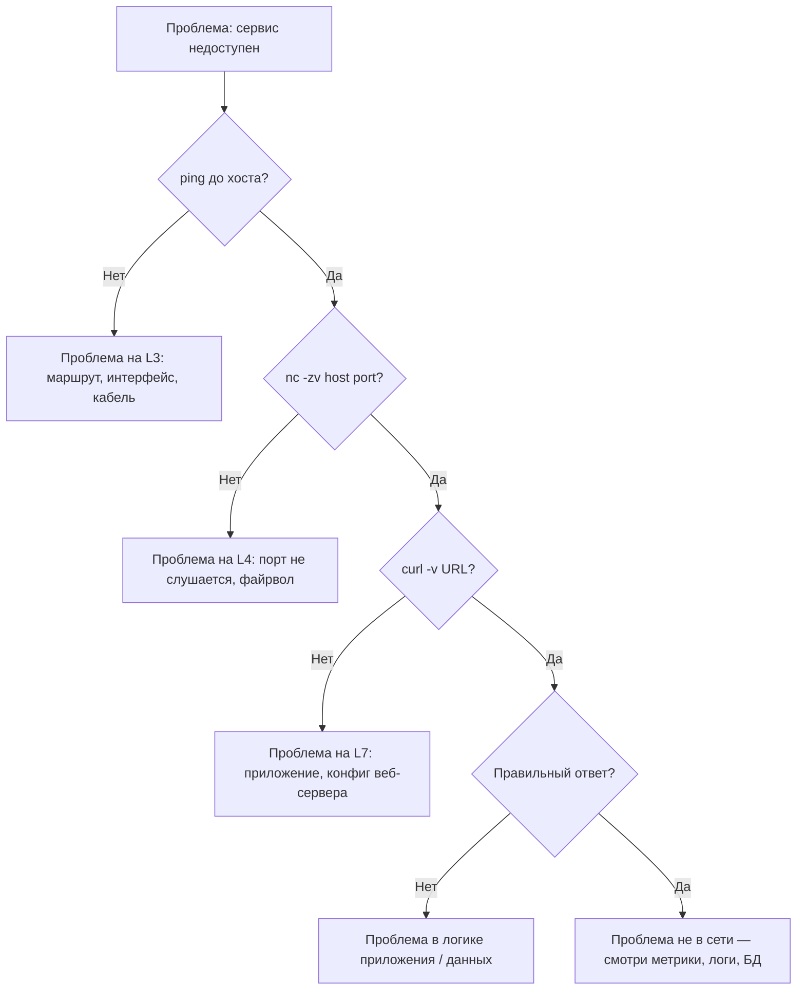

# Глава 12: Алгоритм диагностики сетевого инцидента

## Что вы узнаете

- Системный подход к поиску сетевых проблем — не гадать, а проверять
- Типичные сценарии и их диагноз: refused, timeout, DNS, SSL, Docker
- Как не паниковать при «сеть сломалась» — алгоритм вместо хаоса

**Цель главы:** у читателя есть чёткий чеклист действий при любой сетевой проблеме.

---

## 1. Принцип диагностики — снизу вверх (L3 → L4 → L7)

Большинство сетевых проблем решаются системно: начинаем с физики/L3 и поднимаемся до приложения. Если пакет не доходит — бесполезно проверять конфиг nginx.



**Правило:** никогда не перескакивай уровень. Если L3 не работает — L4 и L7 гарантированно не работают.

---

## 2. Сценарий 1: Connection refused

**Симптом:** `nc -zv host 80` → `Connection refused`. Порт не принимает соединения.

**Алгоритм:**

```bash
# 1. Кто должен слушать порт?
sudo ss -tlnp | grep :80

# Если процесса нет:
# 2. Запущен ли сервис?
systemctl status nginx

# 3. Логи — что пошло не так?
journalctl -u nginx --no-pager -n 30

# 4. Порты в конфиге совпадают?
grep listen /etc/nginx/nginx.conf
grep listen /etc/nginx/sites-enabled/default

# 5. Не занят ли порт другим процессом?
sudo ss -tlnp | awk '{print $4}' | grep ":80"
```

**Типичные причины:**

| Причина | Что проверить |
|---------|--------------|
| Сервис не запущен | `systemctl status` |
| Сервис слушает localhost (127.0.0.1) | `ss -tlnp \| grep :80` — смотри IP в bind |
| Порты не совпадают (конфиг vs ожидание) | `grep listen /etc/nginx/*` |
| Порт занят другим процессом | `sudo ss -tlnp \| grep :80` — колонка Process |
| После перезапуска — порт не освободился | `sudo systemctl restart nginx; ss -tlnp \| grep :80` |

> ☠️ **Осторожно:** `Connection refused` с одного хоста, но работает с другого — проверь файрвол на источнике (исходящие правила), а не на цели.

---

## 3. Сценарий 2: Connection timed out

**Симптом:** `nc -zv host 80` → `Connection timed out`. Пакеты не доходят или не возвращаются.

**Алгоритм:**

```bash
# 1. L3: проверка связности
ping -c 3 host

# 2. L3: маршрут до цели
ip route get 8.8.8.8
ip route get host

# 3. L3: где обрыв?
traceroute -n host
# Если звёздочки (***) на одном хопе — обрыв там

# 4. L4: файрвол на хосте
sudo iptables -L -n -v
sudo nft list ruleset 2>/dev/null

# 5. L4: файрвол на пути (Security Group / UFW)
sudo ufw status
# AWS: проверь Security Group в консоли
# GCP: VPC Firewall Rules

# 6. Есть ли Default Gateway?
ip route | grep default
```

**Матрица: ping есть / nc нет:**

| ping | nc | Вероятная причина |
|------|----|-------------------|
| OK | Timeout | Файрвол на хосте блокирует порт |
| OK | Timeout | Security Group не разрешает входящий порт |
| Loss | Timeout | Обрыв на сетевом уровне (кабель, маршрутизатор) |
| High latency | Timeout | MTU проблемы / фрагментация |

```bash
# Проверка MTU
ping -M do -s 1472 host  # Максимальный non-fragmented пакет
# Если не проходит — надо уменьшить MTU на интерфейсе
```

> ☠️ **Осторожно:** `timed out` и `connection refused` — разные симптомы. Refused = порт не слушается (быстрый ответ RST). Timed out = пакет ушёл в никуда (никакого ответа). Не путай.

---

## 4. Сценарий 3: DNS resolution failed

**Симптом:** `curl https://example.com` → `Could not resolve host`. Имя не резолвится.

**Алгоритм:**

```bash
# 1. Какой резолвер используется?
cat /etc/resolv.conf

# 2. Проверить systemd-resolved
resolvectl status

# 3. Резолвится ли имя через системный DNS?
dig example.com

# 4. Резолвится ли через публичный DNS?
dig @8.8.8.8 example.com

# Сравниваем:
# - dig @8.8.8.8 работает, dig без @ — нет → проблема в локальном резолвере
# - оба не работают → проблема с сетью (см. сценарий 2)

# 5. Работает ли вообще DNS-сервер?
ping -c 1 8.8.8.8

# 6. Есть ли запись в /etc/hosts? (приоритет выше DNS)
grep example.com /etc/hosts
```

**Расшифровка ответов dig:**

| Статус | Значение | Что делать |
|--------|----------|------------|
| `NOERROR` | Запись найдена | Проблема не в DNS |
| `NXDOMAIN` | Записи нет | Проверь имя или DNS-зону |
| `SERVFAIL` | DNS-сервер не может ответить | Проблема на DNS-сервере |
| `REFUSED` | DNS-сервер отказал | Настройки ACL / firewall |

```bash
# Очистка кэша DNS
sudo resolvectl flush-caches

# Если resolv.conf пустой или неверный:
# Для systemd-resolved:
sudo resolvectl dns eth0 8.8.8.8
# Или в /etc/systemd/resolved.conf:
# DNS=8.8.8.8
# FallbackDNS=1.1.1.1
```

---

## 5. Сценарий 4: SSL certificate error

**Симптом:** `curl https://example.com` → `SSL certificate problem`. Браузер ругается на сертификат.

**Алгоритм:**

```bash
# 1. Проверить сертификат — дата истечения
echo | openssl s_client -connect example.com:443 2>/dev/null | \
  openssl x509 -noout -dates

# 2. Полная цепочка
echo | openssl s_client -connect example.com:443 -showcerts 2>/dev/null

# 3. Совпадает ли hostname?
echo | openssl s_client -connect example.com:443 2>/dev/null | \
  openssl x509 -noout -subject -ext subjectAltName

# 4. Если используем Let's Encrypt
sudo certbot certificates
sudo certbot renew --dry-run

# 5. Проверить полную цепочку на сервере (nginx)
openssl verify -CAfile /etc/ssl/certs/ca-certificates.crt \
  /etc/letsencrypt/live/example.com/fullchain.pem

# 6. Не отозван ли сертификат? (OCSP)
echo | openssl s_client -connect example.com:443 -status 2>/dev/null | \
  grep -A 10 "OCSP response"
```

**Типичные сценарии:**

| Ошибка | Причина |
|--------|---------|
| `certificate has expired` | Сертификат просрочен — `certbot renew` |
| `self-signed certificate` | Сертификат не подписан CA — тестовый стенд |
| `Hostname mismatch` | CN/SAN не соответствует домену |
| `unable to get local issuer certificate` | Не хватает промежуточных сертификатов |
| `certificate revoked` | Сертификат отозван — срочно заменить |

> ☠️ **Осторожно:** `fullchain.pem` (сертификат + цепочка) — всегда используй именно его в nginx, не `cert.pem`. Иначе браузер не построит цепочку доверия.

```bash
# nginx — правильный путь
# ssl_certificate     /etc/letsencrypt/live/example.com/fullchain.pem;
# ssl_certificate_key /etc/letsencrypt/live/example.com/privkey.pem;
```

---

## 6. Сценарий 5: Контейнер не видит другой контейнер

**Симптом:** контейнер не может достучаться до соседнего по имени или IP.

**Алгоритм:**

```bash
# 1. В каких сетях контейнеры?
docker network ls
docker inspect <container1> | jq '.[].NetworkSettings.Networks'
docker inspect <container2> | jq '.[].NetworkSettings.Networks'

# 2. Они в одной сети?
docker network inspect <network_name>

# 3. Проверить DNS (docker DNS)
docker exec <container1> nslookup <container2_name>
# Если nslookup не установлен:
docker exec <container1> cat /etc/hosts
docker exec <container1> cat /etc/resolv.conf

# 4. Проверить связность по IP (core L3)
docker exec <container1> ping -c 2 <container2_ip>

# 5. Проверить порт (L4)
docker exec <container1> nc -zv <container2_name> 80

# 6. Если всё в одной сети — проверить сам сервис внутри контейнера
docker exec <container2> ss -tlnp | grep :80
```

**Типичные причины:**

| Симптом | Причина |
|---------|---------|
| Разные сети | `docker-compose` с разными сетями |
| Неправильный порт | containerPort vs service port путаница |
| Имя не резолвится | Устаревший docker-compose v1 (docker-compose vs docker compose) |
| Файрвол внутри контейнера | Да, некоторые образы ставят ufw/iptables |
| `--network host` | Режим host — контейнер видит localhost хоста, не другие контейнеры |

**docker-compose — типичная настройка:**

```yaml
services:
  app:
    image: myapp
    networks:
      - frontend
  db:
    image: postgres
    networks:
      - frontend
      - backend

networks:
  frontend:
  backend:
```

> ☠️ **Осторожно:** Если контейнеры в docker-compose не указывают `networks` явно — они попадают в сеть по умолчанию, где DNS по имени работает. Как только добавляешь хотя бы одну явную сеть — автомагическая исчезает, и контейнеры в разных явных сетях не видят друг друга.

---

## 7. Полезные команды быстрой диагностики

```bash
# Какой процесс слушает порт?
sudo ss -tlnp | grep :8080

# Альтернатива lsof (если нет ss)
sudo lsof -i :8080

# Куда идёт трафик до хоста?
ip route get 8.8.8.8

# Открытые TCP-соединения (не слушающие, а активные)
sudo ss -tnp dst :443

# DNS резолв одной строкой
dig +short example.com | tail -1

# Список всех слушающих портов с процессами
ss -tlnp | awk '{print $4}' | grep ":"

# Проверка времени ответа HTTP
curl -w "\n---\nTCP: %{time_connect}s, SSL: %{time_appconnect}s, Total: %{time_total}s\n" -o /dev/null -s https://example.com

# Трассировка с потерей пакетов (нужен mtr)
mtr --report -c 10 8.8.8.8

# Быстрый тест пропускной способности (нужен iperf3)
# Сервер: iperf3 -s
# Клиент: iperf3 -c <server_ip>
```

```bash
# Установка недостающих утилит
sudo apt install -y mtr iperf3 dnsutils netcat-openbsd
```

---

## Типичные ошибки

> ☠️ **Ошибка 1: начать с перезапуска, не разобравшись**

Симптом: «Давай перезапустим nginx — поможет». Причина не найдена, через 5 минут ошибка повторяется.

**Правило:** сначала диагностика (`ss`, `journalctl`, `curl`), потом действие.

---

> ☠️ **Ошибка 2: игнорировать ping**

Симптом: сразу лезут в `curl` и логи nginx. А ping до хоста не идёт. Трата времени: приложение тут ни при чём.

**Правило:** всегда начинай с L3: `ping -c 1 host`. Если пинг не идёт — остальное не имеет смысла.

---

> ☠️ **Ошибка 3: проверять не тот хост**

Симптом: смотрят логи на `web-01`, а проблема на `web-02`. Или проверяют `localhost`, а трафик идёт через внешний IP.

**Правило:** убедись что проверяешь именно тот хост, который фигурирует в жалобе. `hostname`, `ip addr`, `ip route`.

---

> ☠️ **Ошибка 4: путать timed out и refused**

Симптом: `Connection timed out` трактуется как «сервер не работает», но на самом деле файрвол блокирует порт.

**Правило:** refused = сервер ответил RST (порт закрыт). Timed out = нет ответа вообще (пакет заблокирован).

---

## Чек-лист

- [ ] Определить симптом: refused / timed out / DNS error / SSL error ?
- [ ] L3: проверить `ping`, `ip route get`, `traceroute`
- [ ] L4: проверить `ss -tlnp | grep :PORT`, `nc -zv host port`, `iptables -L`
- [ ] L7: проверить `curl -v`, `dig`, `openssl s_client`
- [ ] Проверить, что проверяешь правильный хост и порт
- [ ] Проверить логи: `journalctl -u service`, `docker logs container`
- [ ] Не перезапускать вслепую — сначала понять причину
- [ ] Зафиксировать результат: что изменилось и почему заработало

---

## Попробуйте сами

### Задание 1: Диагностика отказавшего порта

Дан сценарий:

```bash
# Пользователь жалуется: nginx не отвечает на порту 80
# На сервере:
systemctl status nginx
# ● nginx.service - A high performance web server
#    Loaded: loaded
#    Active: active (running)

sudo ss -tlnp | grep :80
# Вывод пустой

sudo ss -tlnp | grep :8080
# LISTEN 0 128 0.0.0.0:8080 0.0.0.0:* users:(("nginx",pid=1234,fd=6))
```

**Вопрос:** почему `curl http://server:80` не работает? Что делать?

---

### Задание 2: DNS — где проблема?

```bash
# На сервере:
ping -c 1 8.8.8.8
# 64 bytes from 8.8.8.8: icmp_seq=1 ttl=118 time=12.3 ms

ping -c 1 myapp.internal
# ping: myapp.internal: Temporary failure in name resolution

dig myapp.internal
# ;; connection timed out; no servers could be reached

dig @8.8.8.8 myapp.internal
# myapp.internal. 60 IN A 10.0.1.42
```

**Вопрос:** на каком уровне проблема? Что смотреть?

---

### Задание 3: Полный цикл диагностики

Есть два сервера в одной VPC (AWS):

- `app-server` — nginx на порту 443 (HTTPS)
- `db-server` — PostgreSQL на порту 5432

Симптом: `app-server` не может подключиться к `db-server:5432`.

```bash
# С app-server:
ping -c 2 db-server
# 64 bytes from 10.0.2.50: icmp_seq=1 ttl=64 time=0.5 ms

nc -zv db-server 5432
# nc: connect to db-server port 5432 (tcp) timed out

sudo ss -tlnp | grep :5432
# Вывод пустой (с db-server не ssh, это app-server)

ip route get db-server
# 10.0.2.0/24 dev eth0 src 10.0.1.10
```

**Вопрос по шагам:**

1. Почему `ping` работает, а `nc` — нет?
2. Что нужно проверить на `db-server`?
3. Что нужно проверить в AWS Security Group?
4. PostgreSQL слушает `localhost` или `0.0.0.0`? Как проверить?
5. Напиши последовательность команд для полной диагностики.

---

