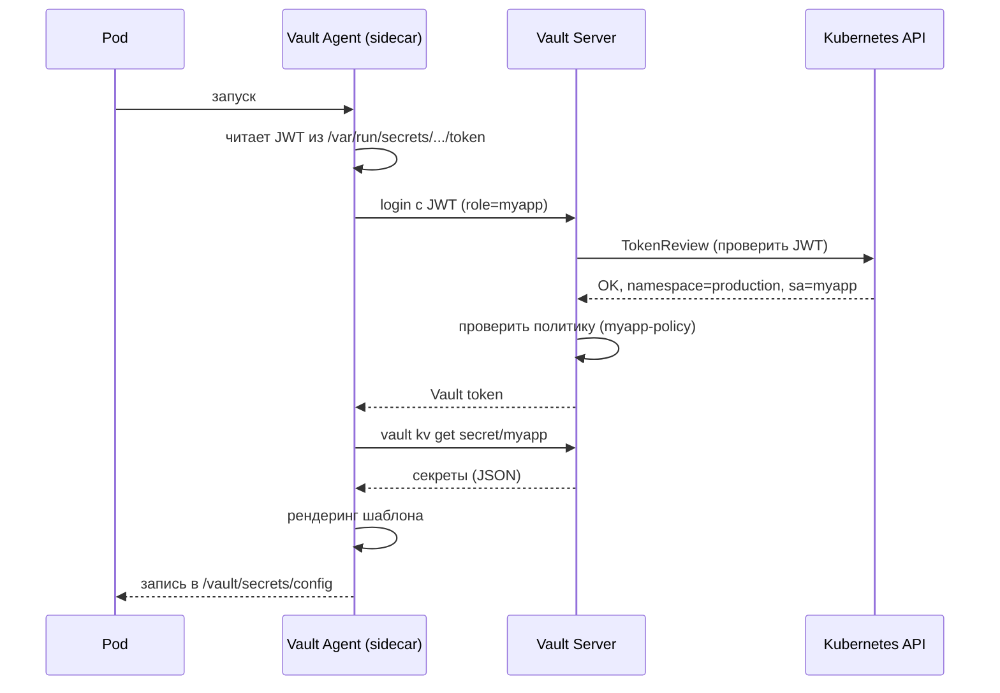

# Глава 10: Интеграция с Kubernetes

## Что вы узнаете

- Kubernetes Auth Method: как поды авторизуются в Vault через ServiceAccount JWT.
- Vault Agent Injector: автоматическая инъекция секретов в поды через sidecar.
- Vault Secrets Operator (VSO): нативный K8s способ синхронизации секретов.
- Политики для K8s namespace и ServiceAccount.

---

### Схема 4 — Kubernetes Auth flow



---

## 1. Kubernetes Auth Method

Kubernetes Auth Method позволяет подам аутентифицироваться в Vault через ServiceAccount JWT. Vault проверяет JWT через Kubernetes TokenReview API — никто не передаёт пароли или токены напрямую разработчиками.

### 1.1. Как это работает

```ascii
       ┌─────────────────────────────────────┐
       │         Kubernetes Cluster           │
       │                                      │
       │  ┌──────────┐    JWT (sa token)      │
       │  │   Pod     │─────────────────────┐  │
       │  │  myapp    │                     │  │
       │  │  sa:myapp │                     ▼  │
       │  └──────────┘               ┌────────┐│
       │                             │  Vault  ││
       │                             │ :8200   ││
       │                             └───┬────┘│
       │                                 │     │
       │          TokenReview            │     │
       │          (проверяет JWT)        │     │
       │          ┌──────────────────────┘     │
       │          │                            │
       │          ▼                            │
       │   ┌──────────────┐                    │
       │   │ K8s API Server│                   │
       │   └──────────────┘                    │
       └──────────────────────────────────────┘
```

### 1.2. Включение Kubernetes Auth

```bash
# Включаем auth method для Kubernetes
vault auth enable kubernetes
```

### 1.3. Настройка конфигурации

```bash
# Конфигурация подключения к Kubernetes API
vault write auth/kubernetes/config \
  kubernetes_host="https://kubernetes.default.svc:443" \
  kubernetes_ca_cert=@/var/run/secrets/kubernetes.io/serviceaccount/ca.crt \
  token_reviewer_jwt=@/var/run/secrets/kubernetes.io/serviceaccount/token
```

| Параметр | Описание |
|----------|----------|
| `kubernetes_host` | Внутренний адрес Kubernetes API |
| `kubernetes_ca_cert` | CA-сертификат кластера (для проверки TLS) |
| `token_reviewer_jwt` | JWT сервисного аккаунта Vault для вызова TokenReview |
| `issuer` | Опционально: issuer JWT (если отличается от `kubernetes/serviceaccount`) |

### 1.4. Создание роли

Роль связывает Kubernetes ServiceAccount с политикой Vault:

```bash
vault write auth/kubernetes/role/myapp \
  bound_service_account_names=myapp \
  bound_service_account_namespaces=production \
  policies=myapp-policy \
  ttl=1h
```

| Параметр | Описание |
|----------|----------|
| `bound_service_account_names` | ServiceAccount, которым разрешён login (wildcard: `*`) |
| `bound_service_account_namespaces` | namespace, из которых разрешён login |
| `policies` | Политики Vault, привязанные к роли |
| `ttl` | Время жизни полученного Vault token |
| `max_ttl` | Максимальное время жизни (не может быть продлён) |
| `audience` | Опционально: audience для JWT-validation |

```bash
# Роль с несколькими ServiceAccount
vault write auth/kubernetes/role/myapp \
  bound_service_account_names=myapp \
  bound_service_account_namespaces=production,staging \
  policies=myapp-policy \
  ttl=1h
```

### 1.5. Login из пода

```bash
# Внутри пода — читаем JWT ServiceAccount
JWT=$(cat /var/run/secrets/kubernetes.io/serviceaccount/token)

# Login в Vault
vault write auth/kubernetes/login role=myapp jwt=$JWT
```

Ответ:

```
Key                  Value
---                  -----
token                hvs.CA...
token_accessor       ...
token_duration       1h
token_renewable      true
token_policies       ["default" "myapp-policy"]
identity_policies    []
policies             ["default" "myapp-policy"]
metadata             map[role:myapp service_account:myapp service_account_namespace:production]
```

> **Dev vs Production:** в dev можно использовать `bound_service_account_names=*` и `bound_service_account_namespaces=*` для упрощения тестирования. В production — конкретные имена SA и namespace. Без этого любой под в любом namespace сможет получить Vault token.

---

## 2. Vault Agent Injector

Vault Agent Injector — mutating admission webhook, который автоматически добавляет Vault Agent sidecar в поды на основе аннотаций.

### 2.1. Установка

```bash
# Установка Vault Injector через Helm
helm repo add hashicorp https://helm.releases.hashicorp.com
helm repo update

# Установка только Injector (без Vault сервера)
helm install vault hashicorp/vault \
  --set "server.enabled=false" \
  --set "injector.enabled=true" \
  --set "injector.externalVaultAddr=http://vault.vault.svc:8200"
```

| Параметр Helm | Описание |
|---------------|----------|
| `server.enabled=false` | Не устанавливаем Vault сервер (уже есть) |
| `injector.enabled=true` | Включаем Injector |
| `injector.externalVaultAddr` | Адрес существующего Vault |
| `injector.logLevel` | Уровень логирования (`info`, `debug`) |
| `injector.image.repository` | Образ Injector (кастомная сборка) |

### 2.2. Аннотации для пода

```yaml
apiVersion: apps/v1
kind: Deployment
metadata:
  name: myapp
  namespace: production
spec:
  replicas: 2
  selector:
    matchLabels:
      app: myapp
  template:
    metadata:
      labels:
        app: myapp
      annotations:
        vault.hashicorp.com/agent-inject: "true"
        vault.hashicorp.com/role: "myapp"
        vault.hashicorp.com/agent-inject-secret-database.env: "secret/data/production/myapp/database"
        vault.hashicorp.com/agent-inject-template-database.env: |
          {{ with secret "secret/data/production/myapp/database" -}}
          DB_HOST={{ .Data.data.host }}
          DB_PASS={{ .Data.data.password }}
          {{- end }}
        vault.hashicorp.com/agent-inject-secret-api-key.txt: "secret/data/production/myapp/apikey"
        vault.hashicorp.com/agent-inject-template-api-key.txt: |
          {{ with secret "secret/data/production/myapp/apikey" -}}
          API_KEY={{ .Data.data.key }}
          {{- end }}
    spec:
      serviceAccountName: myapp
      containers:
        - name: myapp
          image: myapp:latest
          volumeMounts:
            - name: secrets
              mountPath: /vault/secrets
              readOnly: true
      volumes:
        - name: secrets
          emptyDir: {}
```

### 2.3. Полный список аннотаций

| Аннотация | Описание | По умолчанию |
|-----------|----------|--------------|
| `vault.hashicorp.com/agent-inject` | Включить инъекцию Agent | `false` |
| `vault.hashicorp.com/role` | Имя роли для K8s Auth | — |
| `vault.hashicorp.com/agent-inject-secret-<name>` | Путь к секрету в Vault | — |
| `vault.hashicorp.com/agent-inject-template-<name>` | Consul Template для секрета | — |
| `vault.hashicorp.com/agent-pre-populate` | Чтение секретов до старта приложения | `true` |
| `vault.hashicorp.com/agent-pre-populate-only` | Только init-контейнер (без sidecar) | `false` |
| `vault.hashicorp.com/secret-volume-path` | Путь монтирования секретов | `/vault/secrets` |
| `vault.hashicorp.com/agent-limits-cpu` | Лимиты CPU для Agent | `250m` |
| `vault.hashicorp.com/agent-requests-cpu` | Requests CPU | `50m` |
| `vault.hashicorp.com/agent-limits-mem` | Лимиты памяти | `100Mi` |
| `vault.hashicorp.com/agent-requests-mem` | Requests memory | `25Mi` |

### 2.4. Что происходит при создании пода

```ascii
         1. Создание Pod
         (с аннотациями)
              │
              ▼
   ┌──────────────────────┐
   │  Mutating Webhook    │
   │  Vault Agent Injector│
   └──────────┬───────────┘
              │
              │  2. Добавить init-контейнер
              │     (vault-agent-injector)
              │  3. Добавить sidecar
              │     (vault-agent)
              │  4. Создать emptyDir
              │     для секретов
              ▼
   ┌─────────────────────────────────────┐
   │              Pod                     │
   │  ┌─────────────────────┐            │
   │  │ Init Container      │            │
   │  │ vault-agent-init    │            │
   │  │ - login (JWT → token)│           │
   │  │ - read secrets      │            │
   │  │ - render templates  │            │
   │  └─────────┬───────────┘            │
   │            │                         │
   │  ┌─────────▼───────────┐            │
   │  │ Sidecar             │  ┌──────┐  │
   │  │ vault-agent         │  │ myapp│  │
   │  │ - renew token       │  │      │  │
   │  │ - watch changes     │  │      │  │
   │  └─────────┬───────────┘  └──┬───┘  │
   │            │                  │      │
   │            │   /vault/secrets │      │
   │            └──────────────────┘      │
   │               emptyDir               │
   └──────────────────────────────────────┘
```

### 2.5. Agent Injector без sidecar (только init-контейнер)

Если приложение не требует обновления секретов в runtime, можно использовать `agent-pre-populate-only`:

```yaml
annotations:
  vault.hashicorp.com/agent-inject: "true"
  vault.hashicorp.com/agent-pre-populate-only: "true"
  vault.hashicorp.com/role: "myapp"
```

В этом случае Agent запускается как init-контейнер, записывает секреты в emptyDir и завершается. sidecar-контейнер не создаётся.

> **Dev vs Production:** в dev можно оставить sidecar Agent для просмотра логов и отладки. В production, если секреты меняются редко, используйте `agent-pre-populate-only=true` — это снижает потребление ресурсов.

---

## 3. Политика для K8s

### 3.1. Базовая политика

```hcl
# myapp-policy.hcl
path "secret/data/production/myapp/*" {
  capabilities = ["read"]
}

path "secret/metadata/production/myapp/*" {
  capabilities = ["list"]
}
```

### 3.2. Политика с несколькими окружениями

```hcl
# multi-env-policy.hcl
# Доступ только к своему namespace
path "secret/data/{{identity.entity.aliases.auth_kubernetes_ce0b.metadata.service_account_namespace}}/myapp/*" {
  capabilities = ["read"]
}
```

Но проще — создавать отдельную политику для каждого namespace:

```hcl
# production-policy.hcl
path "secret/data/production/myapp/*" {
  capabilities = ["read", "list"]
}
path "secret/metadata/production/myapp/*" {
  capabilities = ["list"]
}
```

```hcl
# staging-policy.hcl
path "secret/data/staging/myapp/*" {
  capabilities = ["read", "list"]
}
path "secret/metadata/staging/myapp/*" {
  capabilities = ["list"]
}
```

### 3.3. Привязка политики к K8s SA

```bash
# Создаём политику
vault policy write myapp-policy myapp-policy.hcl

# Создаём роль для K8s Auth
vault write auth/kubernetes/role/myapp \
  bound_service_account_names=myapp \
  bound_service_account_namespaces=production \
  policies=myapp-policy \
  ttl=1h
```

### 3.4. Проверка доступа

```bash
# Внутри пода — проверить, что политика работает
vault token capabilities secret/data/production/myapp/database
# read, list

vault token capabilities secret/data/staging/myapp/database
# deny — доступа нет
```

### 3.5. Принцип наименьших привилегий

```hcl
# Минимальная политика для подов
path "secret/data/production/myapp/database" {
  capabilities = ["read"]
}

# Только metadata для listing
path "secret/metadata/production/myapp/*" {
  capabilities = ["list"]
}

# Запрещаем всё остальное
path "*" {
  capabilities = ["deny"]
}
```

> ☠️ **Осторожно:** не используйте `path "*" { capabilities = ["admin"] }` для подов. Если злоумышленник получит доступ к pod, он получит полный доступ к Vault. Всегда ограничивайте политики конкретными путями и capabilities.

---

## 4. Vault Secrets Operator (VSO)

### 4.1. Что такое VSO

Vault Secrets Operator — Kubernetes operator, который синхронизирует секреты из Vault в нативные K8s Secrets. В отличие от Vault Agent Injector, VSO не требует аннотаций на каждом поде и не использует sidecar.

```ascii
Сравнение подходов:

┌────────────────────────────────────────────────────────────────┐
│  Vault Agent Injector                   Vault Secrets Operator │
│                                                                 │
│  ┌─────┐   sidecar   ┌──────┐       ┌─────┐   operator  ┌───┐│
│  │ Vault│◄──────────►│ Agent│      │ Vault│◄───────────►│VSO││
│  └─────┘            └──┬───┘      └─────┘              └─┬─┘│
│                        │                                 │   │
│                  ┌─────▼─────┐                   ┌──────▼──┐│
│                  │  /vault/  │                   │ K8s      ││
│                  │  secrets  │                   │ Secret   ││
│                  └───────────┘                   └──────────┘│
│                                                                 │
│  Плюсы:                                          Плюсы:        │
│  - Секреты не в etcd                             - Совместим    │
│  - Автообновление                                с любым прил. │
│                                                   - CRD-конфиг │
│  Минусы:                                         Минусы:       │
│  - Только поды с аннотациями                     - Секреты     │
│  - Нужен sidecar                                 в etcd (etcd  │
│                                                   encrypted)   │
└────────────────────────────────────────────────────────────────┘
```

### 4.2. Установка VSO

```bash
# Установка через Helm
helm repo add hashicorp https://helm.releases.hashicorp.com
helm install vault-secrets-operator hashicorp/vault-secrets-operator \
  --set "defaultVaultConnection.address=http://vault.vault.svc:8200"
```

### 4.3. VaultAuth — подключение к Vault

```yaml
apiVersion: secrets.hashicorp.com/v1beta1
kind: VaultAuth
metadata:
  name: static-auth
  namespace: production
spec:
  method: kubernetes
  mount: kubernetes
  kubernetes:
    role: myapp
    serviceAccount: myapp
```

### 4.4. VaultStaticSecret — синхронизация static secret

```yaml
apiVersion: secrets.hashicorp.com/v1beta1
kind: VaultStaticSecret
metadata:
  name: myapp-database
  namespace: production
spec:
  vaultAuthRef: static-auth
  mount: secret
  type: kv-v2
  path: production/myapp/database
  refreshAfter: 1h
  destination:
    name: myapp-database
    create: true
    labels:
      app: myapp
    annotations:
      managed-by: vault-secrets-operator
```

После применения VaultStaticSecret, VSO создаёт K8s Secret:

```yaml
apiVersion: v1
kind: Secret
metadata:
  name: myapp-database
  namespace: production
type: Opaque
data:
  password: <base64>
  host: <base64>
  username: <base64>
```

### 4.5. Использование Dynamic Secrets (VaultDynamicSecret)

```yaml
apiVersion: secrets.hashicorp.com/v1beta1
kind: VaultDynamicSecret
metadata:
  name: myapp-db-creds
  namespace: production
spec:
  vaultAuthRef: static-auth
  mount: database
  path: creds/myapp-readonly
  refreshAfter: 5m
  destination:
    name: myapp-db-creds
    create: true
```

> ☠️ **Осторожно:** при использовании VSO секреты хранятся в etcd в зашифрованном виде (если включено шифрование etcd). Это менее безопасно, чем Vault Agent Injector, где секреты — только в памяти контейнера. В production с высокими требованиями к безопасности используйте Injector.

### 4.6. Сравнение методов

| Аспект | Agent Injector | VSO |
|--------|---------------|-----|
| Секреты в etcd | Нет (только emptyDir) | Да (K8s Secret) |
| Автообновление | Да (watch) | Да (по таймеру) |
| Совместимость | Только файлы | Любые приложения |
| Сложность | Аннотации | CRD + RBAC |
| Dynamic Secrets | Да (через шаблон) | Да (VaultDynamicSecret) |
| Resources | Sidecar 50m CPU | Operator общий |
| Обновление приложения | SIGHUP | Нужен reloader |

---

## Типичные ошибки

- ❌ **`bound_service_account_namespaces` не совпадает с namespace пода** — если под запущен в `staging`, а роль настроена на `production`, Vault отклонит login. Проверяйте: `kubectl get pod -n <namespace> -o yaml | grep namespace`.

- ❌ **Аннотации указаны не в `spec.template.metadata.annotations`** — Injector смотрит аннотации на шаблоне пода, а не на Deployment. Если указать на Deployment, Injector их не увидит, sidecar не добавится.

- ❌ **Injector не установлен** — без running мутирующего вебхука аннотации `vault.hashicorp.com/*` игнорируются. Проверьте: `kubectl get mutatingwebhookconfigurations`.

- ❌ **ServiceAccount не привязан к роли Vault** — под может иметь правильный JWT, но если SA не указан в `bound_service_account_names`, Vault откажет. Создайте SA в K8s и укажите его в обоих местах.

- ❌ **VSO: VaultStaticSecret создаётся до VaultAuth** — оператор не сможет аутентифицироваться. Убедитесь, что VaultAuth существует и `vaultAuthRef` указывает правильно.

- ❌ **Секреты не обновляются после изменения в Vault** — Injector обновляет файлы при изменении (watch), VSO — по таймеру `refreshAfter`. Для Injector убедитесь, что sidecar работает; для VSO — что `refreshAfter` не слишком большой.

- ❌ **Не настроен `agent-pre-populate-only` и ресурсы sidecar** — Agent по умолчанию запрашивает 50m CPU / 25Mi memory. Если в кластере мало ресурсов, под может не запланироваться.

---

## Чек-лист

- [ ] Kubernetes Auth Method включён и настроен: `kubernetes_host`, `kubernetes_ca_cert`, `token_reviewer_jwt`. Роль создана с `bound_service_account_names` и `bound_service_account_namespaces`, совпадающими с реальными SA и namespace подов.
- [ ] Политика Vault для пода минимальна: read только на конкретный путь, без `*`, без `admin`. Проверено через `vault token capabilities`.
- [ ] Vault Agent Injector установлен (или VSO). Поды с аннотациями `vault.hashicorp.com/agent-inject="true"` получают sidecar и могут читать секреты из `/vault/secrets/`.
- [ ] Для production используются конкретные имена ServiceAccount и namespace в ролях Vault (не `*`), включён TLS между Vault и Kubernetes API.

---

## Попробуйте сами

1. **Настройте Kubernetes Auth Method.** Включите `auth/kubernetes`, настройте конфигурацию с адресом K8s API, CA-сертификатом и JWT. Создайте роль `myapp` с `bound_service_account_names=myapp`, `bound_service_account_namespaces=default`, политикой `myapp-policy` (read на `secret/data/myapp/*`). Зайдите в под с SA `myapp`, выполните `vault write auth/kubernetes/login role=myapp jwt=$(cat /var/run/secrets/kubernetes.io/serviceaccount/token)` и получите Vault token.

2. **Установите Vault Agent Injector и протестируйте инъекцию.** Установите injector через Helm с `externalVaultAddr`. Создайте Deployment с аннотациями: `agent-inject=true`, роль `myapp`, один секрет `database.env` из `secret/data/myapp/database`. Проверьте, что pod запускается с двумя контейнерами (myapp + vault-agent) и файл `/vault/secrets/database.env` содержит корректные данные из Vault. Попробуйте `agent-pre-populate-only=true` — убедитесь, что sidecar-контейнера нет.

3. **Синхронизируйте секреты через Vault Secrets Operator.** Установите VSO через Helm. Создайте VaultAuth (метод kubernetes, ваша роль). Создайте VaultStaticSecret (путь `myapp/database`, mount `secret`, refresh 30s, destination `myapp-database`). Убедитесь, что K8s Secret `myapp-database` создался с правильными данными. Измените секрет в Vault, дождитесь refresh — проверьте, что K8s Secret обновился.
