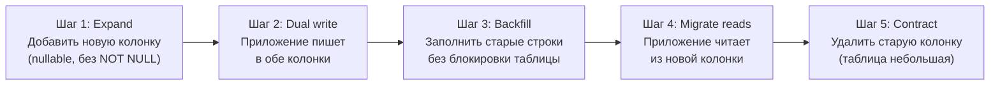

# Глава 11: Миграции без даунтайма — expand/contract

**Что вы узнаете:**
- почему некоторые `ALTER TABLE` блокируют таблицу, а другие — нет;
- паттерн expand/contract для безопасных миграций;
- как добавить колонку с `NOT NULL` без блокировки;
- как переименовать колонку без слома работающего кода;
- инструменты для проверки миграций: `squawk`, `strong_migrations`, `django-zero-downtime-migrations`.

**Цель:** читатель знает какие DDL-операции опасны и умеет выполнить любое изменение схемы без даунтайма. Миграция — не событие с остановкой сервиса, а ряд обратимых шагов.

---

## Схема 5: Expand/Contract



---

## Почему DDL блокирует таблицу

PostgreSQL использует блокировки для DDL-операций. Некоторые блокировки конфликтуют с обычными запросами. Если `ALTER TABLE` требует эксклюзивной блокировки (AccessExclusiveLock) — все запросы к таблице встают в очередь.

```text
DDL-операции и их блокировки:

Безопасно (не блокирует запись/чтение):
✓ CREATE INDEX CONCURRENTLY          — только READ
✓ DROP INDEX CONCURRENTLY            — только READ
✓ ADD COLUMN (nullable, PG 11+)      — только READ (мгновенно, метаданные)
✓ ADD COLUMN с константным DEFAULT   — только READ (PG 11+, метаданные)
✓ CREATE TABLE                       — не блокирует существующие таблицы
✓ ALTER TABLE ... ADD CONSTRAINT ... NOT VALID  — только READ
✓ DROP TABLE                         — только READ (но теряешь данные)
✓ DROP CONSTRAINT                    — только READ

Опасно (блокирует таблицу — AccessExclusiveLock):
✗ ADD COLUMN NOT NULL без DEFAULT    — переписывает все строки
✗ ALTER COLUMN TYPE                  — переписывает все строки
✗ ADD CONSTRAINT (без NOT VALID)     — проверяет все строки
✗ CREATE INDEX (без CONCURRENTLY)    — блокирует запись
✗ DROP COLUMN                        — блокирует (PG < 16)
✗ SET NOT NULL                       — сканирует таблицу на NULL
✗ ALTER COLUMN ... SET DEFAULT (volatile) — блокирует
```

### Почему ADD COLUMN NOT NULL блокирует

```sql
-- PostgreSQL должен проверить что ни одна строка не содержит NULL
-- Для этого — AccessExclusiveLock

-- До PG 11: ALTER TABLE ... ADD COLUMN ... DEFAULT 'value' тоже блокировал
-- (переписывал все строки, добавляя значение DEFAULT)

-- PG 11+: константный DEFAULT (не volatile) хранится в метаданных
-- Строки не переписываются до первого чтения (on-access set)
```

```sql
-- volatile DEFAULT — переписывает строки, блокирует таблицу
ALTER TABLE users ADD COLUMN score integer DEFAULT random();

-- константный DEFAULT — PG 11+, мгновенно, не блокирует
ALTER TABLE users ADD COLUMN score integer DEFAULT 0;
-- BLOCKING! Под капотом: PostgreSQL 11+ хранит значение DEFAULT в pg_attribute
-- и подставляет его при чтении, пока строка не будет перезаписана
```

> ☠️ **Осторожно:** `ALTER TABLE users ADD COLUMN status VARCHAR(20) NOT NULL DEFAULT 'active'` на таблице 50 млн строк — до PG 11 это блокировка на минуты. В PG 11+ с константным DEFAULT — мгновенно. Но `DEFAULT random()` — снова блокировка.

---

## Expand/Contract: ADD COLUMN NOT NULL

Сценарий: нужно добавить колонку `status` в таблицу `users` (10 млн строк) с `NOT NULL` и дефолтом `'active'`.

### Шаг 1: Добавить nullable колонку

```sql
-- Мгновенно, не блокирует (PG 11+)
ALTER TABLE users ADD COLUMN status VARCHAR(20);
```

В PostgreSQL 11+ `ADD COLUMN` (без `NOT NULL`, без volatile DEFAULT) — операция только с метаданными. Сами строки не трогаются. Блокировка — AccessShareLock (не конфликтует с SELECT/INSERT/UPDATE/DELETE).

### Шаг 2: Установить дефолтное значение

```sql
-- Тоже только метаданные, не блокирует
ALTER TABLE users ALTER COLUMN status SET DEFAULT 'active';
```

Дефолтное значение после этого шага применяется только для новых INSERT. Существующие строки всё ещё `NULL`.

### Шаг 3: Заполнить существующие строки батчами

```sql
-- НЕ ДЕЛАТЬ: UPDATE users SET status = 'active' WHERE status IS NULL;
-- Это блокирует таблицу? Нет, UPDATE = RowExclusiveLock
-- Но UPDATE 10 млн строк в одной транзакции = долгая блокировка строк
-- + нагрузка на WAL, bloat, lag на репликах

-- ДЕЛАТЬ: батчевый UPDATE с паузами

DO $$
DECLARE
  batch_size INT := 10000;
  updated INT;
BEGIN
  LOOP
    UPDATE users SET status = 'active'
    WHERE id IN (
      SELECT id FROM users
      WHERE status IS NULL
      ORDER BY id
      LIMIT batch_size
      FOR UPDATE SKIP LOCKED
    );

    GET DIAGNOSTICS updated = ROW_COUNT;
    RAISE NOTICE 'Updated % rows', updated;

    EXIT WHEN updated = 0;

    -- Пауза между батчами — снижает нагрузку на WAL и реплики
    PERFORM pg_sleep(0.01);
  END LOOP;
END $$;
```

Ключевые элементы:
- `LIMIT batch_size` — обновляем порциями, не все сразу.
- `ORDER BY id` — предсказуемый порядок, избегаем deadlocks.
- `FOR UPDATE SKIP LOCKED` — не ждём строки заблокированные другими транзакциями.
- `pg_sleep(0.01)` — 10ms пауза между батчами. Без паузы — WAL растёт, реплики отстают.

> `FOR UPDATE SKIP LOCKED` — PostgreSQL 9.5+. Если версия старше — убрать `SKIP LOCKED`, но быть готовым к ожиданиям блокировок.

### Шаг 4: Добавить NOT NULL constraint

```sql
-- PostgreSQL проверит что NULL не осталось
-- Если батчи отработали корректно — быстро
ALTER TABLE users ALTER COLUMN status SET NOT NULL;
```

`ALTER COLUMN ... SET NOT NULL` сканирует таблицу на наличие NULL. Если батчи заполнили все строки — сканирование завершится быстро. Если есть `NULL` — ошибка:

```
ERROR:  column "status" contains null values
```

В этом случае — проверить батчи: могли ли новые строки вставиться с NULL между батчами и `SET NOT NULL`.

```sql
-- Проверить перед SET NOT NULL
SELECT count(*) FROM users WHERE status IS NULL;
```

### Полный сценарий

```sql
-- 1. Expand
ALTER TABLE users ADD COLUMN status VARCHAR(20);

-- 2. Default для новых вставок
ALTER TABLE users ALTER COLUMN status SET DEFAULT 'active';

-- 3. Backfill батчами
-- (PL/pgSQL блок выше)

-- 4. Contract
ALTER TABLE users ALTER COLUMN status SET NOT NULL;
```

Весь процесс — без даунтайма. Таблица доступна для чтения и записи на всех шагах.

---

## Expand/Contract: переименовать колонку

Сценарий: нужно переименовать колонку `name` → `full_name`. Нельзя просто `ALTER TABLE ... RENAME COLUMN` — старый код всё ещё работает и обращается к `name`.

### Плохой подход

```sql
-- Сломает работающий код в production
ALTER TABLE users RENAME COLUMN name TO full_name;
-- Все SELECT name, INSERT INTO users (name, ...) — падают с ошибкой
-- До деплоя нового кода — 500 ошибки
```

### Правильный подход: expand/contract

#### Шаг 1: Expand — добавить новую колонку

```sql
ALTER TABLE users ADD COLUMN full_name VARCHAR(255);
```

#### Шаг 2: Синхронизировать данные через триггер

Триггер будет поддерживать обе колонки синхронизированными при INSERT и UPDATE.

```sql
CREATE OR REPLACE FUNCTION sync_full_name() RETURNS TRIGGER AS $$
BEGIN
  -- Если name изменился — синхронизируем full_name
  IF TG_OP = 'INSERT' OR (TG_OP = 'UPDATE' AND NEW.name IS DISTINCT FROM OLD.name) THEN
    NEW.full_name := NEW.name;
  END IF;
  -- Если full_name изменился — синхронизируем name
  IF TG_OP = 'UPDATE' AND NEW.full_name IS DISTINCT FROM OLD.full_name THEN
    NEW.name := NEW.full_name;
  END IF;
  RETURN NEW;
END;
$$ LANGUAGE plpgsql;

CREATE TRIGGER trg_sync_full_name
  BEFORE INSERT OR UPDATE ON users
  FOR EACH ROW
  EXECUTE FUNCTION sync_full_name();
```

#### Шаг 3: Backfill существующих данных

```sql
-- Однократный UPDATE (батчами, если таблица большая)
UPDATE users SET full_name = name WHERE full_name IS NULL;
```

#### Шаг 4: Деплой нового кода

Новый код читает и пишет `full_name`. Старый код всё ещё работает с `name` — триггер синхронизирует.

```text
Временная диаграмма:
  T0: Expand — добавили full_name, создали триггер
  T1: Backfill — заполнили full_name из name
  T2: Деплой нового кода (читает full_name)
  T3: Деплой нового кода (пишет full_name)
  T4: Проверка — старый код больше не использует name?
  T5: Contract — удалить триггер, удалить колонку name
```

#### Шаг 5: Contract — удалить старую колонку

```sql
-- Удалить триггер
DROP TRIGGER IF EXISTS trg_sync_full_name ON users;

-- Удалить старую колонку (через 1-2 дня после деплоя)
ALTER TABLE users DROP COLUMN name;
```

> ☠️ **Осторожно:** `DROP COLUMN` блокирует таблицу. В PostgreSQL 16 `DROP COLUMN` — только метаданные (строка не переписывается). Но в более старых версиях — блокировка. Всегда проверять в документации вашей версии.

### Когда можно убрать колонку

```text
Contract (удаление старой колонки) делаем через 1-2 дня после деплоя нового кода.

Почему не сразу:
- Старый код может быть ещё не выкачен на все поды
- Кэши могут содержать старые запросы
- CI/CD может откатить деплой

Правило: колонка удаляется когда 100% уверены что старый код не обращается к ней.
В production — минимум 24 часа между деплоем и contract.
```

---

## Expand/Contract: изменить тип колонки

Сценарий: колонка `price` — `VARCHAR(20)`, нужно изменить на `NUMERIC(12,2)`.

```sql
-- Плохо (блокирует таблицу, переписывает все строки):
ALTER TABLE products ALTER COLUMN price TYPE NUMERIC(12,2);

-- Хорошо (expand/contract):
-- 1. Expand: добавить новую колонку
ALTER TABLE products ADD COLUMN price_numeric NUMERIC(12,2);

-- 2. Dual write: триггер синхронизирует обе колонки
CREATE OR REPLACE FUNCTION sync_price() RETURNS TRIGGER AS $$
BEGIN
  NEW.price_numeric := NEW.price::NUMERIC(12,2);
  RETURN NEW;
END;
$$ LANGUAGE plpgsql;

CREATE TRIGGER trg_sync_price
  BEFORE INSERT OR UPDATE ON products
  FOR EACH ROW
  EXECUTE FUNCTION sync_price();

-- 3. Backfill: преобразовать существующие значения
UPDATE products
SET price_numeric = price::NUMERIC(12,2)
WHERE price_numeric IS NULL;
-- (батчами для больших таблиц)

-- 4. Деплой нового кода (читает price_numeric)

-- 5. Contract: удалить старую колонку
DROP TRIGGER trg_sync_price ON products;
ALTER TABLE products DROP COLUMN price;
```

---

## ADD CONSTRAINT без блокировки

Добавить внешний ключ или CHECK constraint — можно без блокировки.

```sql
-- Плохо (блокирует): проверяет все строки при создании
ALTER TABLE orders ADD CONSTRAINT fk_user
  FOREIGN KEY (user_id) REFERENCES users(id);

-- Хорошо: создать NOT VALID → валидировать отдельно
ALTER TABLE orders ADD CONSTRAINT fk_user
  FOREIGN KEY (user_id) REFERENCES users(id)
  NOT VALID;              -- не проверяет существующие строки

-- Валидация — не блокирует запись, только READ-блокировка
ALTER TABLE orders VALIDATE CONSTRAINT fk_user;
```

`VALIDATE CONSTRAINT` требует `ShareUpdateExclusiveLock` — не конфликтует с SELECT/INSERT/UPDATE/DELETE. Можно выполнять на живом production.

---

## Инструменты для безопасных миграций

### strong_migrations (Ruby / Rails)

Гем для Rails, который проверяет миграции на опасные операции.

```ruby
# Gemfile
gem 'strong_migrations'
```

```ruby
# Пример: опасная миграция — strong_migrations выдаст ошибку
class AddStatusToUsers < ActiveRecord::Migration[7.1]
  def change
    # Ошибка: strong_migrations блокирует
    add_column :users, :status, :string, null: false, default: 'active'
  end
end

# Результат:
# StrongMigrations::Error: Adding a column with a default value
# blocks reads and writes to the table. Use `add_column` without default,
# then `change_column_default` separately.
```

Что проверяет:

```text
✗ ADD COLUMN NOT NULL без DEFAULT
✗ ADD COLUMN с volatile DEFAULT
✗ ALTER COLUMN TYPE (меняет тип)
✗ CREATE INDEX (без CONCURRENTLY)
✗ ADD FOREIGN KEY (без NOT VALID)
✗ RENAME COLUMN (в production)
✗ DROP COLUMN
✓ CREATE INDEX CONCURRENTLY
✓ ADD COLUMN nullable
✓ ADD CONSTRAINT NOT VALID
```

### squawk (PostgreSQL migration linter)

Линтер для SQL-миграций. Анализирует `ALTER TABLE` команды и предупреждает об опасных.

```bash
# Установка через brew
brew install sbdchd/sbdchd/squawk

# Или через pip
pip install squawk

# Проверка миграции
squawk migration.sql
```

```sql
-- migration.sql
ALTER TABLE users ADD COLUMN status VARCHAR(20) NOT NULL DEFAULT 'active';
```

```text
$ squawk migration.sql

migration.sql:1:1: warning: adding a column with a non-constant default
  is not safe (ALTER TABLE ... ADD COLUMN ... NOT NULL DEFAULT ...)

migration.sql:1:1: warning: adding a column with NOT NULL is not safe
  (ALTER TABLE ... ADD COLUMN ... NOT NULL)

migration.sql:1:1: warning: adding a column with DEFAULT will lock the table
  in PostgreSQL < 11
```

squawk можно интегрировать в CI:

```yaml
# .github/workflows/lint-migrations.yml
name: Lint migrations
on: [pull_request]
jobs:
  lint:
    runs-on: ubuntu-latest
    steps:
      - uses: actions/checkout@v4
      - uses: sbdchd/squawk-action@v1
        with:
          pattern: "migrations/*.sql"
```

### django-zero-downtime-migrations

Для Django — аналог strong_migrations.

```python
# settings.py
INSTALLED_APPS = [
    'django_zero_downtime_migrations',
    # ...
]

ZERO_DOWNTIME_MIGRATIONS_RAISE_FOR_ATOMIC = False
```

Предотвращает опасные миграции и подсказывает безопасную альтернативу.

```python
# Плохо:
class Migration(migrations.Migration):
    operations = [
        migrations.AddField(
            model_name='user',
            name='status',
            field=models.CharField(default='active', max_length=20),
            preserve_default=False,
        ),
    ]

# Хорошо (expand/contract):
class Migration(migrations.Migration):
    operations = [
        migrations.AddField(
            model_name='user',
            name='status',
            field=models.CharField(null=True, max_length=20),
        ),
    ]
# Отдельно: батчевый UPDATE, потом ALTER COLUMN SET NOT NULL
```

---

## Когда expand/contract не нужен

```text
Expand/contract — это overhead. Не всегда обязателен.

Когда можно делать "просто ALTER TABLE":
- Таблица < 10 000 строк — операция займёт миллисекунды
- В окно обслуживания (maintenance window)
- На не-production окружении
- Приложение не критично к даунтайму (внутренний инструмент)

Когда expand/contract обязателен:
- Таблица > 1 млн строк
- Production под нагрузкой 24/7
- Без maintenance window
- Критичный сервис (платежи, заказы, auth)
```

---

## Типичные ошибки

- **`ALTER TABLE users ADD COLUMN score INTEGER DEFAULT 0 NOT NULL` на таблице 50 млн строк** — в PostgreSQL старше 11 это блокировка на несколько минут. В PG 11+ с константным DEFAULT — мгновенно (default хранится в метаданных, не переписывает строки). Но `NOT NULL` всё равно сканирует таблицу.
- **Батчевый UPDATE без `pg_sleep`** — перегружает PostgreSQL, WAL растёт, реплики отстают. Всегда пауза 10-50ms между батчами.
- **Удалить старую колонку сразу после переименования** — старый код ещё может работать и обращаться к ней. Contract — через 1-2 дня после полного деплоя.
- **Не проверить `SELECT count(*) WHERE new_col IS NULL` перед `SET NOT NULL`** — если остались NULL, ALTER упадёт с ошибкой. Придётся снова backfill.
- **Добавить триггер без проверки производительности** — триггер `BEFORE INSERT OR UPDATE` выполняется для каждой строки. На таблице с 1000 INSERT/сек это нагрузка. Тестировать на staging с копией нагрузки.
- **Верить что squawk/strong_migrations поймают всё** — инструменты помогают, но не заменяют понимание. squawk проверит синтаксис, но не гарантирует что миграция безопасна в вашем контексте.

---

## Чек-лист для самопроверки

- [ ] Знаю какие DDL-операции опасны и почему (AccessExclusiveLock)
- [ ] Умею добавить `NOT NULL` колонку в большую таблицу без блокировки
- [ ] Понимаю шаги expand/contract: добавить → dual write → backfill → переключить → удалить
- [ ] Умею переименовать колонку без даунтайма (через триггер + dual write)
- [ ] Знаю как добавить внешний ключ без блокировки через `NOT VALID` + `VALIDATE CONSTRAINT`
- [ ] Умею использовать `squawk` для проверки SQL-миграций
- [ ] Понимаю когда expand/contract обязателен, а когда можно просто `ALTER TABLE`

---

## Попробуйте сами

1. Создайте таблицу с 1 млн строк (`INSERT INTO users SELECT generate_series(1, 1000000), 'user_' || generate_series`). Попробуйте `ALTER TABLE ADD COLUMN status VARCHAR(20) NOT NULL DEFAULT 'active'` — замерьте время. В PostgreSQL 11+ это быстро. Теперь попробуйте `DEFAULT random()::text` — медленно (volatile default переписывает строки).

2. Выполните expand/contract миграцию: добавьте nullable колонку, заполните батчами по 10000 строк с `pg_sleep(0.01)`, добавьте `NOT NULL`. Убедитесь что таблица не блокировалась — откройте второе соединение и выполняйте `SELECT count(*)` во время backfill.

3. Установите `squawk` (`brew install squawk` или `pip install squawk`). Напишите файл `migration.sql` с опасной миграцией (`ALTER TABLE ... ADD COLUMN NOT NULL DEFAULT volatile_expr`). Запустите `squawk migration.sql` — увидите предупреждения.

4. Переименуйте колонку: создайте таблицу `users` с колонкой `name`, заполните 1000 строк. Выполните expand/contract: `ADD COLUMN full_name`, создайте триггер синхронизации, backfill, удалите триггер и колонку `name`. Убедитесь что данные сохранились.
