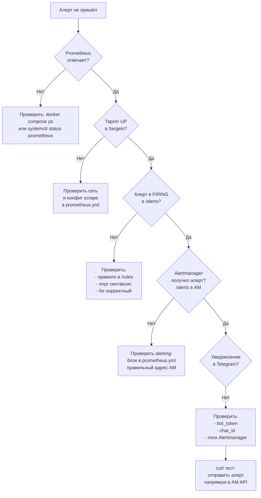

# Глава 12: Диагностика — что делать когда мониторинг сломан

## Что вы узнаете

- пошаговый алгоритм диагностики: «алерт не пришёл — что делать»;
- как читать метрики самого Prometheus для самодиагностики;
- как проверить Alertmanager через прямой API-запрос;
- паттерн Watchdog (dead man's switch) для мониторинга мониторинга;
- как проверить systemd-сервисы стека на хосте без Docker;
- типовые поломки и их устранение.

**Цель:** когда «мониторинг молчит» — вы не паникуете, а идёте по алгоритму. За 5 минут находите где сломалось.

---

## Алгоритм: алерт не пришёл

Когда вы ждали алерт (сервер упал, CPU 100%, кончился диск), а в Telegram тишина — не паникуйте. Пройдите по этому алгоритму:



Пошаговая инструкция:

**Шаг 1: Prometheus отвечает?**

```bash
# Если Docker
docker compose ps

# Если systemd
systemctl status prometheus

# HTTP проверка
curl -s http://localhost:9090/-/healthy
# Должен ответить: "Prometheus is Healthy."
```

**Шаг 2: Таргеты UP?**

Откройте `http://localhost:9090/targets`. Все ли таргеты зелёные? Если таргет DOWN — проверьте:

- запущен ли exporter;
- правильный ли порт в `prometheus.yml`;
- есть ли сетевой доступ (контейнеры в одной Docker-сети).

**Шаг 3: Алерт в состоянии FIRING?**

Откройте `http://localhost:9090/alerts`. Правило активное? Если алерт в PENDING — ждите `for`. Если алерта нет вообще — проверьте:

- правильность `expr` (запрос возвращает данные?);
- файл с правилами подключен в `rule_files`;
- после редактирования сделали `curl -X POST http://localhost:9090/-/reload`.

```bash
# Проверить что правило загружено
curl -s http://localhost:9090/api/v1/rules | jq '.data.groups[].rules[].name'
```

**Шаг 4: Alertmanager получил алерт?**

`http://localhost:9093/#/alerts` — видите ли алерт в списке? Если нет:

```bash
# Проверить блок alerting в prometheus.yml
# alerting.alertmanagers.static_configs.targets должен быть
# ['alertmanager:9093'] для Docker или ['localhost:9093'] для systemd
```

**Шаг 5: Уведомление ушло?**

Смотрите логи Alertmanager:

```bash
docker compose logs alertmanager --tail 50 | grep -i "telegram\|notify\|error"
```

Ошибки:

- `"error sending telegram message"` — токен неверный или бот заблокирован;
- `"chat not found"` — chat_id неверный (проверьте отрицательные числа для групп);
- `"receiver not found"` — имя receiver не совпадает с именем в route.

---

## Самодиагностика Prometheus: self-metrics

Prometheus экспортирует метрики о самом себе. Они доступны в его собственном `/metrics` и в PromQL. Это ваша приборная панель для мониторинга мониторинга.

```promql
# === ИНФОРМАЦИЯ ===

# Версия Prometheus
prometheus_build_info{channel="stable"}

# Время работы
time() - prometheus_tsdb_lowest_timestamp_seconds
# Сколько секунд данных хранится (должно быть ~retention)


# === ЗАГРУЗКА ===

# Количество активных time series
prometheus_tsdb_head_series
# Норма: < 1 млн. Тревога: > 2 млн (риск OOM)

# Скорость поступления новых точек
rate(prometheus_tsdb_head_samples_appended_total[5m])
# Рост без причины = новая метрика с высокой кардинальностью

# Размер TSDB на диске
prometheus_tsdb_storage_blocks_bytes
# В байтах. Сравните с du -sh /prometheus


# === ОШИБКИ ===

# Ошибки вычисления правил
rate(prometheus_rule_evaluation_failures_total[5m])
# Если > 0 — rule файл содержит синтаксическую ошибку

# Ошибки scrape
rate(prometheus_target_scrapes_exceeded_sample_limit_total[5m])
# Если > 0 — слишком много метрик от одного таргета

# Ошибки remote write
rate(prometheus_remote_storage_failed_samples_total[5m])
# Если > 0 — VictoriaMetrics недоступен


# === ОЧЕРЕДЬ REMOTE WRITE ===

# Отставание remote write от реального времени
time() - prometheus_remote_storage_queue_highest_sent_timestamp_seconds
# Если > 60s — очередь растёт, нужно увеличить max_shards
```

```bash
# Быстрая проверка здоровья Prometheus
curl -s http://localhost:9090/-/ready    # "Prometheus is Ready."
curl -s http://localhost:9090/-/healthy  # "Prometheus is Healthy."

# Метрики Prometheus (первые строки)
curl -s http://localhost:9090/metrics | grep "^prometheus_"
```

### Когда смотреть self-metrics

- **После рестарта** — `prometheus_tsdb_head_series` должно стабилизироваться через 5-10 минут.
- **При добавлении новых scrape configs** — если `prometheus_tsdb_head_series` резко вырос, новый job экспортирует слишком много метрик или labels с высокой кардинальностью.
- **При жалобах что «графики не строятся»** — проверьте `prometheus_rule_evaluation_failures_total` и `prometheus_target_scrapes_exceeded_sample_limit_total`.

---

## Диагностика Alertmanager

### Тест через прямой API

Самый надёжный способ проверить — отправить тестовый алерт напрямую в Alertmanager, минуя Prometheus:

```bash
curl -X POST http://localhost:9093/api/v2/alerts \
  -H "Content-Type: application/json" \
  -d '[{
    "labels": {
      "alertname": "TestAlert",
      "severity": "warning",
      "job": "test"
    },
    "annotations": {
      "summary": "Тестовый алерт — проверка связи",
      "description": "Если вы видите это сообщение, Alertmanager работает"
    },
    "startsAt": "'$(date -u +%Y-%m-%dT%H:%M:%SZ)'",
    "endsAt": "'$(date -u -d '+5 minutes' +%Y-%m-%dT%H:%M:%SZ)'"
  }]'
```

Если алерт пришёл в Telegram — Alertmanager работает. Проблема на стороне Prometheus (правило, routing, конфиг). Если не пришёл — проблема в Alertmanager или Telegram.

```bash
# Проверка что Alertmanager отвечает
curl -s http://localhost:9093/-/healthy
# Должен ответить: "OK"

# Статус Alertmanager
curl -s http://localhost:9093/api/v2/status | jq .
# cluster.status, version, uptime
```

### Логи Alertmanager

```bash
# Все логи за последнюю минуту
docker compose logs alertmanager --since=1m

# Только ошибки
docker compose logs alertmanager 2>&1 | grep -i "error\|fail\|warn"

# Смотреть в реальном времени
docker compose logs -f alertmanager
```

Типичные строки в логах:

- `"All dispatchers running"` — всё нормально.
- `"Notify for alerts failed"` — receiver не отвечает (неверный токен Telegram).
- `"Unable to create gossip mesh"` — проблемы кластеризации (не критично для одного экземпляра).

### Проверка конфигурации Alertmanager

```bash
# Валидация конфига через amtool (встроенная утилита)
docker exec alertmanager amtool check-config /etc/alertmanager/alertmanager.yml

# Или через HTTP API
curl -s http://localhost:9093/api/v2/status | jq '.config'
```

---

## Watchdog: dead man's switch для мониторинга

Если Prometheus упал, вы не получите ни одного алерта. Даже алерт «ServiceDown» не сработает — потому что Prometheus не может его вычислить. Нужен внешний мониторинг мониторинга.

**Watchdog** — алерт который всегда активен:

```yaml
# prometheus/rules/alerts.yml
groups:
  - name: watchdog
    interval: 30s
    rules:
      - alert: Watchdog
        expr: vector(1)
        labels:
          severity: none
        annotations:
          summary: "Мониторинг работает"
```

`vector(1)` всегда возвращает 1, поэтому алерт всегда в состоянии FIRING. Пока Watchdog активен — Prometheus жив и вычисляет правила. Если Prometheus упал — Watchdog исчезает из Alertmanager.

Как использовать Watchdog:

```text
Сценарий 1: healthchecks.io
- Watchdog отправляется на healthchecks.io через webhook
- healthchecks.io ожидает сигнал раз в 5 минут
- Если сигнал пропал — healthchecks.io шлёт SMS

Сценарий 2: отдельный Telegram-чат
- Watchdog → receiver: telegram-watchdog → отдельный чат
- Вы проверяете чат раз в день: если Watchdog нет — смотрите почему Prometheus упал
- Норма: Watchdog всегда в FIRING, в чат приходит только когда он пропал

Сценарий 3: uptime-мониторинг
- Внешняя система (uptimerobot, pingdom) проверяет HTTP://your-server:9090/-/healthy
- Если Prometheus не отвечает — внешняя система шлёт алерт
```

```yaml
# Alertmanager: Watchdog в blackhole (не слать уведомления)
route:
  receiver: telegram-general
  routes:
    - matchers:
        - alertname = Watchdog
      receiver: blackhole   # не беспокоить

receivers:
  - name: blackhole
```

---

## Systemd: диагностика когда Prometheus на хосте

Если вы установили компоненты через systemd (без Docker), диагностика выглядит иначе:

```bash
# Статус сервисов
systemctl status prometheus
systemctl status grafana-server
systemctl status alertmanager
systemctl status node_exporter

# Логи через journalctl
journalctl -u prometheus --since "10 minutes ago" --no-pager
journalctl -u alertmanager -f

# Проверка что порты слушаются
ss -tlnp | grep -E "9090|3000|9093|9100"

# Перезапуск
sudo systemctl restart prometheus

# После изменения конфига — reload
sudo systemctl reload prometheus   # или kill -HUP
```

### Типичные проблемы systemd

```bash
# Сервис не стартует после reboot — забыли enable
sudo systemctl enable prometheus

# Ошибка permission denied — пользователь prometheus не имеет доступа к файлу
# Проверить владельца: chown -R prometheus:prometheus /opt/prometheus

# Port already in use — другой процесс занял порт
sudo ss -tlnp | grep 9090
```

---

## План быстрой диагностики (cheat sheet)

Когда мониторинг молчит, а сервер падает — делайте по порядку:

```text
1. Prometheus жив?
   curl -s http://localhost:9090/-/healthy

2. Prometheus видит цели?
   http://localhost:9090/targets → все UP?

3. Данные поступают?
   http://localhost:9090/graph → node_load1

4. Алерты вычисляются?
   http://localhost:9090/alerts → есть FIRING?

5. Alertmanager жив?
   curl -s http://localhost:9093/-/healthy

6. Alertmanager получает алерты?
   http://localhost:9093/#/alerts

7. Тест уведомления?
   curl -X POST http://localhost:9093/api/v2/alerts -d '...'

8. Grafana отвечает?
   http://localhost:3000

9. Grafana data source жив?
   Connections → Data Sources → Prometheus → Save & Test

10. Watchdog активен?
    http://localhost:9090/graph → prometheus_build_info
```

---

## Типичные ошибки

- **Не проверять `/targets` после добавления нового таргета** — добавили новый exporter, Prometheus его не видит, думаете что мониторинг работает. Всегда проверяйте Status → Targets после изменений.
- **Не тестировать алерты заранее** — Telegram bot token протух, chat_id изменился после переустановки группы — узнаёте об этом только во время реального инцидента. Тестируйте через прямой API-запрос раз в месяц.
- **Не мониторить сам мониторинг** — Prometheus упал, никто не знает. Watchdog решает эту проблему за 5 минут настройки.
- **Смотреть не туда** — алерт есть в Prometheus (FIRING), но не в Telegram. Лезете в Prometheus config, хотя проблема в Alertmanager или Telegram токене. Алгоритм выше помогает не тратить время.
- **`docker logs prometheus` вместо журнала** — если контейнер перезапущен, `docker logs` покажет только последнюю сессию. Используйте `journalctl` на хосте или `--since` для временного окна.

---

## Чек-лист для самопроверки

- [ ] Знаю алгоритм диагностики «алерт не пришёл»: 5 шагов
- [ ] Умею проверять метрики Prometheus о самом себе (`prometheus_tsdb_head_series`)
- [ ] Умею тестировать Alertmanager через прямой API-запрос (`curl -X POST /api/v2/alerts`)
- [ ] Настроил Watchdog алерт
- [ ] Знаю где смотреть логи каждого компонента (docker compose logs, journalctl)
- [ ] Проверил что могу найти ошибку в Telegram токене по логам Alertmanager
- [ ] Знаю как проверить состояние systemd-сервисов если стек не на Docker

---

## Попробуйте сами

1. Намеренно сломайте Telegram bot token (поменяйте на неверный в конфиге Alertmanager). Перезагрузите Alertmanager. Дождитесь FIRING алерта (например, HighCPU с порогом 5%). Алерт есть в Prometheus (/alerts), есть в Alertmanager (/alerts), но в Telegram не пришёл. Пройдите по алгоритму диагностики — где сломалось? Почините токен.

2. Отправьте тестовый алерт напрямую в Alertmanager через curl. Пришло в Telegram? Если да — Alertmanager и Telegram работают, проблема в Prometheus (правило, routing, конфиг).

3. Остановите Prometheus:
   ```bash
   docker compose stop prometheus
   ```
   Подождите 5 минут. Проверьте Watchdog — он должен исчезнуть из Alertmanager. Запустите Prometheus обратно:
   ```bash
   docker compose start prometheus
   ```
   Watchdog появился снова?

4. Проверьте self-metrics Prometheus:
   ```promql
   # Сколько time series?
   prometheus_tsdb_head_series
   
   # Есть ли ошибки вычислений?
   rate(prometheus_rule_evaluation_failures_total[5m])
   
   # Какой размер данных?
   prometheus_tsdb_storage_blocks_bytes
   ```

5. Имитируйте проблему: добавьте несуществующий таргет в prometheus.yml (`- targets: ['does-not-exist:9999']`). Перезагрузите конфиг. Найдите его в Targets — статус DOWN. Посмотрите текст ошибки — что говорит Prometheus? Теперь удалите таргет.

6. Если у вас systemd-установка: проверьте состояние всех сервисов стека одной командой:
   ```bash
   for s in prometheus grafana-server alertmanager node_exporter; do
     echo "$s: $(systemctl is-active $s)"
   done
   ```
