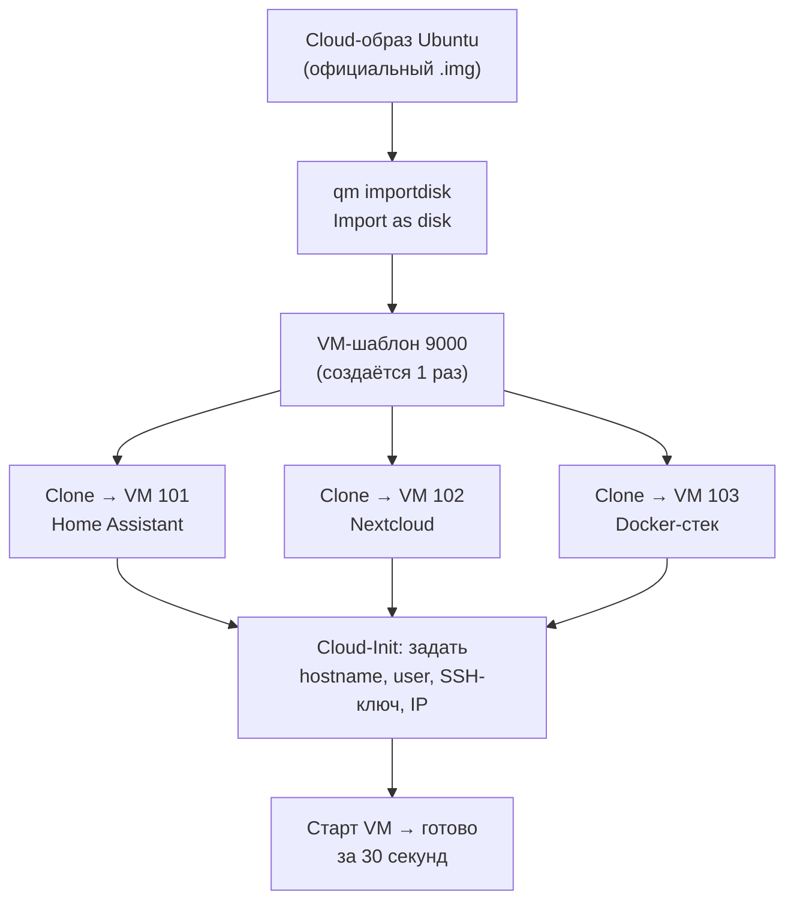
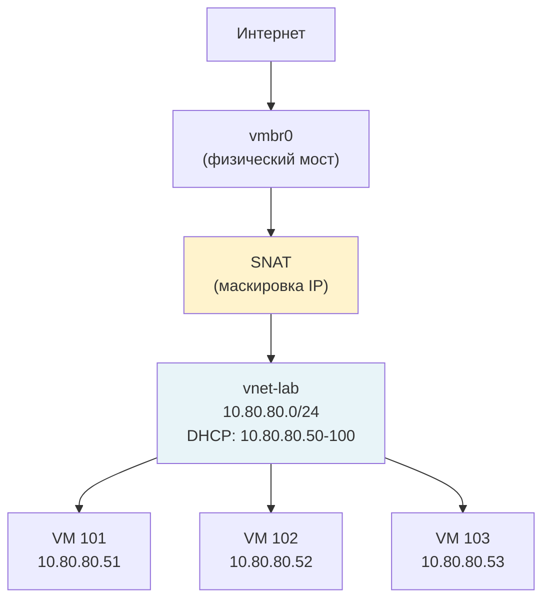
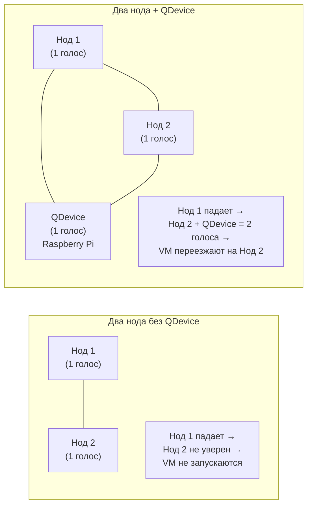
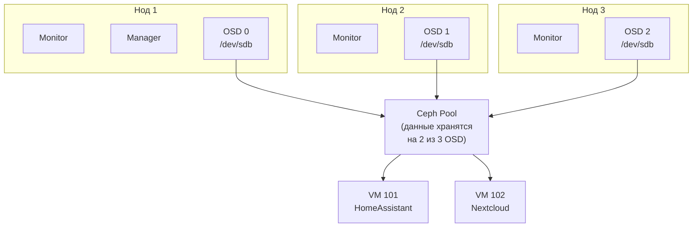
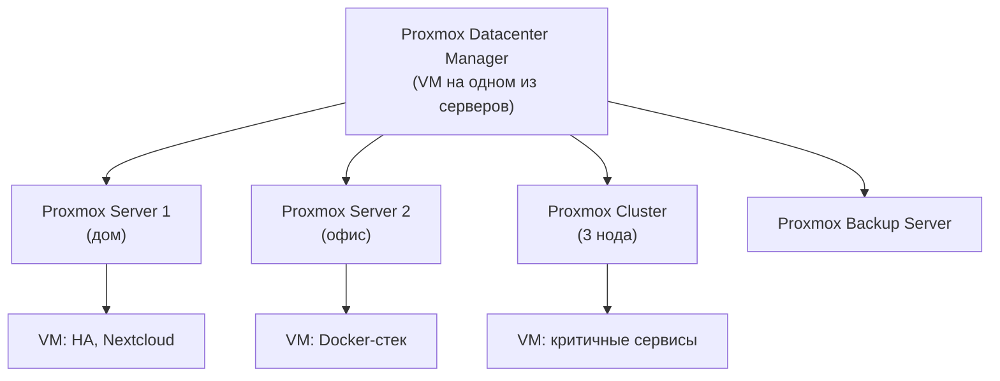

# Инструкция для ИИ-агента: Дополнение к книге 32 — Proxmox VE (главы 21–25)

> **Роль агента:** Ты — технический писатель и системный администратор с практическим опытом работы с Proxmox VE. Пишешь продолжение уже существующей книги. Все новые главы должны быть неотличимы по стилю от глав 0–20.

> **Это дополнение к Модулю 32, книга части 4 "Прочее".**
> Читатель прошёл главы 0–20 и уже: установил Proxmox, запустил LXC и VM, настроил бэкапы, подключил Tailscale, понимает кластеризацию на уровне 3-нодного кластера.

---

## Контекст

В ходе анализа книги 32 в сравнении с реальными Proxmox-туториалами выявлены темы, которые не вошли в основную книгу, но являются важными для практической работы:

1. **Cloud-Init** — автоматизация создания VM без ручной установки ISO
2. **SDN (Software Defined Networking)** — виртуальные сети внутри Proxmox
3. **Кластер с двумя нодами и QDevice** — практичная альтернатива трёхнодному кластеру
4. **Ceph** — встроенное распределённое хранилище для HA-кластера
5. **Proxmox Datacenter Manager** — управление несколькими серверами/кластерами из одной точки

Каждая тема оформляется как отдельная глава по той же схеме что главы 0–20.

---

## Что за материал

**Каталог:** `32-proxmox-ve` — добавить файлы `chapter-21.md` … `chapter-25.md`

**Объём каждой главы:** 8–14 страниц (в пределах существующего формата)

**Важное ограничение по графикам:**
Начиная с этих глав книга использует Mermaid-диаграммы. Читалка поддерживает их нативно (блоки \`\`\`mermaid). **Диаграммы дополняют текст, но не заменяют его.** Правило: любая диаграмма сопровождается абзацем до неё («что сейчас нарисуем») и абзацем после («что видим на схеме»). Диаграмма без пояснительного текста — запрещена.

---

## Стиль (совпадает с главами 0–20)

- Каждая глава начинается с блока **«Что вы узнаете»** (3–4 пункта конкретных умений)
- Заканчивается **«Чек-листом для самопроверки»** (4–5 чекбоксов `[ ]`)
- В каждой главе раздел **«Типичные ошибки»**: проявление → причина → решение
- Сравнения в формате «раньше так → теперь лучше вот так»
- Реальные примеры: VM для Home Assistant, Nextcloud, Docker-стек — не абстрактные `myvm`
- Каждая команда объясняется словами, не только синтаксисом
- Простой язык: не «осуществляется монтирование», а «монтируется»

---

## Структура дополнительных глав

---

### Глава 21: Cloud-Init — автоматическое создание VM без ISO

**Что вы узнаете:**
- что такое Cloud-Init и почему он быстрее ручной установки;
- как скачать официальный cloud-образ Ubuntu/Debian и превратить его в шаблон;
- как клонировать шаблон, задать имя хоста, пользователя, SSH-ключ и IP прямо из Proxmox UI;
- как создать собственный cloud-init образ из существующей VM.

**Контекст для читателя:**
До этого читатель создавал VM через ISO-установку: загрузить ISO, пройти мастер установки, подождать. На двадцатую машину это уже утомляет. Cloud-Init решает это: берёшь готовый образ, клонируешь, задаёшь параметры — VM готова за 30 секунд.

**Содержание:**

**21.1 Что такое Cloud-Init**
Объяснить: cloud-init — это механизм первоначальной настройки системы при первом запуске. Производители дистрибутивов публикуют специальные образы (cloud images) с предустановленным cloud-init. Proxmox поддерживает это нативно.

Сравнение:
```
Без Cloud-Init:
скачать ISO → создать VM → пройти установщик → задать пользователя → настроить сеть
≈ 15 минут на одну VM

С Cloud-Init:
скачать cloud-образ → создать шаблон (1 раз) → клонировать → задать параметры в UI
≈ 30 секунд на каждую следующую VM
```

**21.2 Создание шаблона из cloud-образа**

Шаги через shell Proxmox:
1. Скачать образ (wget URL в `/var/lib/vz/template/iso/`)
2. Создать пустую VM: `qm create 9000 --name ubuntu-2404-cloud --memory 2048 --cores 2 --net0 virtio,bridge=vmbr0`
3. Импортировать образ как диск: `qm importdisk 9000 ubuntu-24.04-server-cloudimg-amd64.img local-lvm`
4. Подключить диск и настроить параметры загрузки: `qm set 9000 --scsihw virtio-scsi-pci --scsi0 local-lvm:vm-9000-disk-0`, `qm set 9000 --boot c --bootdisk scsi0`
5. Добавить Cloud-Init диск: `qm set 9000 --ide2 local-lvm:cloudinit`
6. Включить QEMU Guest Agent: `qm set 9000 --agent 1`
7. Конвертировать в шаблон: `qm template 9000`

Каждая команда сопровождается объяснением что она делает.

**Mermaid-диаграмма — процесс создания VM через Cloud-Init шаблон:**



*Описание: один шаблон — источник для любого количества VM. Параметры каждого экземпляра задаются через Cloud-Init без ручной установки.*

**21.3 Настройка Cloud-Init параметров в UI**
Показать вкладку Cloud-Init в веб-интерфейсе: пользователь, пароль, SSH-ключи, DNS, IP (статический или DHCP). Объяснить каждое поле.

**21.4 Клонирование шаблона и запуск VM**
Через UI и через CLI: `qm clone 9000 101 --name homeassistant --full`. Задать параметры Cloud-Init. Запустить. Убедиться что VM получила IP.

**21.5 Создание кастомного Cloud-Init образа**
Когда нужен свой образ (например, с предустановленными пакетами):
1. Взять существующую VM (или склонировать шаблон)
2. Установить нужные пакеты, настроить всё под себя
3. Установить `cloud-init`, `qemu-guest-agent`
4. Настроить datasource (добавить `NoCloud` и `ConfigDrive` в cloud-init конфиг)
5. Удалить файл конфига Netplan, мешающий Cloud-Init управлять сетью
6. Очистить: `cloud-init clean`, удалить SSH host keys, очистить логи
7. Выключить VM, добавить Cloud-Init диск через UI
8. Конвертировать в шаблон

**21.6 Скрипт-автоматизация**
Показать готовый bash-скрипт (10–15 строк) который делает всё из 21.2 за одну команду. Это то, чем пользуются на практике.

**Типичные ошибки:**
- `command not found: qm` — выполнять команды надо в shell самого Proxmox, не в контейнере
- VM стартует но не получает IP — не добавлен Cloud-Init диск (`--ide2 local-lvm:cloudinit`)
- Cloud-Init не применяет настройки — параметр не нажали Apply в UI после изменения
- Не работает сеть после клонирования — в образе остался старый Netplan конфиг

**Чек-лист для самопроверки:**
- [ ] Скачал cloud-образ Ubuntu и создал шаблон VM через CLI
- [ ] Склонировал шаблон, задал hostname и SSH-ключ через вкладку Cloud-Init
- [ ] VM запустилась и получила корректный IP без ручной установки
- [ ] Умею изменять параметры Cloud-Init и перезапускать VM с новыми настройками
- [ ] Понимаю разницу между cloud-образом и обычным ISO

---

### Глава 22: SDN — виртуальные сети внутри Proxmox

**Что вы узнаете:**
- что такое SDN и зачем он нужен, если уже есть vmbr и VLANы;
- как создать изолированную внутреннюю сеть с DHCP через Simple зону;
- как подключить VM к SDN-сети не затрагивая физическую инфраструктуру;
- когда использовать VLAN-зону и в чём её отличие от Simple.

**Контекст для читателя:**
В главе 9 мы настраивали сети через мосты (vmbr) и VLAN-теги. Это работает. Но есть задачи где нужно больше: изолировать VM так, чтобы они видели только друг друга, или раздать VM IP-адреса по DHCP без настройки физического роутера. Для этого в Proxmox 8.1+ появился SDN.

**Содержание:**

**22.1 Что такое SDN и когда он нужен**
SDN (Software Defined Networking) — встроенный в Proxmox «виртуальный коммутатор с мозгами». Позволяет создавать изолированные сети, DHCP-серверы, маршрутизацию — не трогая физическое сетевое оборудование.

Практические сценарии:
- Development-окружение: VM видят только друг друга, в интернет не выходят
- Мультиарендность: VM одного «клиента» изолированы от VM другого
- Тестирование: быстро создать и удалить изолированную сеть

**22.2 Подготовка: установка зависимостей**
`apt install dnsmasq frr` и настройка. Отключить dnsmasq-системный экземпляр. Объяснить почему это нужно (DHCP и маршрутизация для SDN-зон).

**22.3 Simple-зона — изолированная сеть с DHCP**

Пошагово через UI (Датацентр → SDN → Зоны → Добавить → Simple):
1. Создать зону `internal`
2. Создать виртуальную сеть (Vnet): `vnet-lab`
3. Создать подсеть: `10.80.80.0/24`, gateway `10.80.80.1`, DHCP range `10.80.80.50–10.80.80.100`, включить SNAT
4. Нажать Apply в SDN

Затем: подключить VM к `vnet-lab` вместо `vmbr0`. Показать что VM получила IP из DHCP и выходит в интернет через SNAT.

**Mermaid-диаграмма — архитектура Simple SDN-зоны:**



*Описание: VM получают IP от встроенного DHCP-сервера SDN. В интернет выходят через SNAT — снаружи виден только IP самого Proxmox-хоста. Между собой VM видят друг друга напрямую.*

**22.4 VLAN-зона — SDN поверх физических VLAN**
Когда физический свич уже настроен с VLAN: создать VLAN-зону, привязать к bridge, создать Vnet с нужным тегом. Объяснить отличие от ручного `tag=` из главы 9: SDN добавляет DHCP, IPM-учёт адресов, единое управление.

**22.5 IPM — учёт IP-адресов**
Показать вкладку IPM в SDN: какие IP-адреса выданы, кому. Полезно когда VM много и нужно понимать кто куда подключён.

**22.6 Что НЕ разобрано в этой главе**
Честно обозначить: Q-in-Q, VXLAN, Fabric — это темы для продвинутого кластерного окружения провайдерского уровня. В домашнем Proxmox они не нужны. Ссылка на официальную документацию для тех кому интересно.

**Типичные ошибки:**
- SDN не применяется — забыли нажать кнопку Apply после изменений
- VM не получает IP — не установлен `dnsmasq` или не выключен системный экземпляр
- VM не выходит в интернет из SDN-сети — не включён SNAT при создании подсети
- Раздел SDN не отображается в UI — версия Proxmox ниже 8.1

**Чек-лист для самопроверки:**
- [ ] Установил зависимости (dnsmasq, frr) и отключил системный dnsmasq
- [ ] Создал Simple SDN-зону с подсетью и DHCP-диапазоном
- [ ] Подключил VM к SDN-сети и убедился что она получила IP
- [ ] VM из SDN-сети выходит в интернет через SNAT
- [ ] Посмотрел IPM — вижу кому какой IP выдан

---

### Глава 23: Кластер из двух нодов + QDevice

**Что вы узнаете:**
- почему кластер из двух нодов без QDevice не обеспечивает автоматический failover;
- что такое QDevice и как Raspberry Pi становится арбитром кластера;
- как настроить двухнодный кластер + QDevice с нуля;
- в чём ограничения этой схемы и когда она подходит.

**Контекст для читателя:**
В главе 15 рассматривался трёхнодный кластер. Три сервера — это надёжно, но дорого и громоздко для дома. Многие хотят два сервера с автоматическим failover. Голый двухнодный кластер этого не даёт — нет кворума. Решение: QDevice, маленький арбитр, который не хранит VM, но участвует в голосовании.

**Содержание:**

**23.1 Проблема кворума при двух нодах**
Объяснить через аналогию: два человека принимают решение «большинством голосов» — при разногласии никто не побеждает, ничего не происходит. Кластер застывает. QDevice — третий голос без права запускать VM.

**Mermaid-диаграмма — сравнение кластеров:**



*Описание: без QDevice ни один нод не может быть уверен что именно он должен взять управление. С QDevice большинство (2 из 3 голосов) однозначно определяет победителя.*

**23.2 Что такое QDevice**
QDevice — любая небольшая машина (Raspberry Pi, старый ноутбук, VPS, маленькая VM) с пакетом `corosync-qnetd`. Она не хранит данные VM, не запускает виртуальные машины. Только голосует.

**23.3 Настройка QDevice на Raspberry Pi**
1. Установить пакет на RPi: `apt install corosync-qnetd`
2. Убедиться что SSH с root доступен (нужен для инициализации)
3. На первом ноде Proxmox: `pvecm qdevice setup <IP-адрес-RPi>`
4. Ввести root-пароль RPi
5. Проверить: `pvecm status` — должен отображаться QDevice с голосом

Показать вывод `pvecm status` до и после добавления QDevice.

**23.4 Настройка репликации для HA**
Без shared storage нужна репликация дисков. Показать:
- почему нужен отдельный диск под ZFS (не LVM-thin) для репликации
- `qm disk move` — перенести диск VM на ZFS-пул
- Datacenter → Replication → Добавить правило

Честно сказать об ограничении: репликация происходит раз в N минут. При падении нода данные актуальны на момент последней синхронизации. Это подходит для некритичных сервисов дома.

**23.5 High Availability с двумя нодами**
Datacenter → HA → Resources → Добавить VM. Показать параметры: max-restart, max-relocate, state. Протестировать: отключить кабель одного нода → через 5 минут VM должна запуститься на другом.

**23.6 Когда эта схема подходит, а когда нет**
Подходит: домашний сервер, маленький офис, некритичные сервисы.
Не подходит: база данных с активной записью, финансовые транзакции — потеря данных за последние N минут неприемлема.

**Типичные ошибки:**
- QDevice setup падает с ошибкой аутентификации — root-логин в SSH на RPi не разрешён; добавить `PermitRootLogin yes` в sshd_config RPi
- После добавления QDevice кластер не имеет кворума — убедиться что RPi доступен по сети с обоих нодов
- Репликация не настраивается — диск VM находится на LVM-thin; нужно перенести на ZFS

**Чек-лист для самопроверки:**
- [ ] Понимаю зачем нужен QDevice при двух нодах
- [ ] Настроил QDevice на Raspberry Pi командой `pvecm qdevice setup`
- [ ] Вывод `pvecm status` показывает три участника кластера с кворумом
- [ ] Настроил репликацию для хотя бы одной VM
- [ ] Отключил сетевой кабель одного нода и убедился что VM переехала

---

### Глава 24: Ceph — встроенное отказоустойчивое хранилище

**Что вы узнаете:**
- что такое Ceph и зачем он нужен рядом с Proxmox;
- из каких компонентов состоит Ceph-кластер: Monitor, Manager, OSD, Pool;
- как создать Ceph внутри Proxmox-кластера через веб-интерфейс;
- когда Ceph решает проблему, а когда это избыточно.

**Контекст для читателя:**
В главе 23 мы делали репликацию дисков раз в несколько минут — и честно сказали что это нехорошо для критичных сервисов. Ceph решает корневую проблему: диски VM хранятся не на одном ноде, а распределённо между несколькими. Если нод падает — данные доступны мгновенно с других нодов. Никакой репликации «раз в минуту» — данные актуальны в реальном времени.

**Содержание:**

**24.1 Что такое Ceph и как он работает**

Ceph — распределённая файловая система. Данные разбиваются на блоки (chunks) и хранятся с репликацией на нескольких OSD-дисках. Proxmox умеет создавать и управлять Ceph-кластером прямо из своего веб-интерфейса.

**Mermaid-диаграмма — архитектура Ceph в Proxmox-кластере:**



*Описание: каждый блок данных хранится минимум на двух OSD-дисках (по умолчанию size=2). Если нод с OSD 0 падает — данные VM читаются с OSD 1 или OSD 2 на других нодах. VM продолжает работать.*

**24.2 Требования к Ceph**
Честно написать:
- Минимум 3 нода (для кворума мониторов)
- Отдельный диск под OSD на каждом ноде (не системный)
- Желательно: отдельная сеть 10 Гбит для Ceph-трафика (иначе забивает основную сеть)
- Минимум 3 OSD для надёжности (можно 1, но это не отказоустойчиво)

**24.3 Установка Ceph через веб-интерфейс**
Шаг за шагом:
1. Нод → Ceph → Установить Ceph (выбрать репозиторий Squid, no-subscription)
2. Повторить на всех нодах
3. Нод 1 → Ceph → Конфигурация → указать public network (сеть Ceph)
4. Нод 1 → Ceph → Monitor → Создать (на ноде 1)
5. Нод 2, Нод 3 → Ceph → Monitor → Создать
6. Nод 1, 2, 3 → Ceph → Manager → Создать (по одному на нод)
7. Нод 1 → Ceph → OSD → Создать (выбрать диск)
8. Повторить OSD на нодах 2 и 3
9. Нод 1 → Ceph → Pools → Создать (имя, size=2, min_size=1)
10. Галочка «Add as Storage» при создании пула

**24.4 Перенос VM на Ceph-пул**
`VM → Hardware → Диск → Disk Action → Move Storage → выбрать Ceph-пул`. VM работает, диск переезжает в фоне. После переноса — Live Migration работает без даунтайма.

**24.5 Проверка: что происходит при падении нода**
Практика: отключить сетевой кабель на одном ноде. Убедиться что VM на других нодах продолжают работать. Через HA — VM с упавшего нода автоматически переедут.

**24.6 CephFS — общая файловая система**
Кратко: CephFS поверх Ceph пула позволяет хранить ISO-образы, бэкапы, шаблоны контейнеров в общем хранилище, доступном всем нодам. Создать MDS → Создать CephFS → Добавить как Storage. Это удобнее чем NFS-шара.

**24.7 Когда Ceph НЕ нужен**
Честно: для одного нода, для дома без критичных сервисов, если нет свободных дисков — Ceph избыточен. Ceph — это инструмент для серьёзной отказоустойчивости, а не для добавления сложности.

**Типичные ошибки:**
- `HEALTH_WARN: clock skew detected` — часы на нодах рассинхронизированы; настроить NTP
- OSD не создаётся — диск не пуст; выполнить Wipe Disk в Proxmox
- Медленная работа VM на Ceph — Ceph-трафик идёт через ту же сеть что VM; настроить отдельный сетевой интерфейс для Ceph

**Чек-лист для самопроверки:**
- [ ] Установил Ceph на всех нодах кластера
- [ ] Создал мониторы (по одному на нод) и убедился что кворум есть
- [ ] Создал OSD на каждом ноде из отдельного диска
- [ ] Создал Ceph Pool и добавил его как Storage в Proxmox
- [ ] Перенёс диск тестовой VM на Ceph и убедился что VM работает
- [ ] Понимаю разницу между Ceph и репликацией из главы 23

---

### Глава 25: Proxmox Datacenter Manager — управляем несколькими серверами

**Что вы узнаете:**
- что такое Proxmox Datacenter Manager и чем он отличается от обычного Proxmox UI;
- как установить PDM как VM внутри Proxmox;
- как подключить несколько Proxmox-серверов и кластеров в одном интерфейсе;
- как мигрировать VM между разными Proxmox-серверами через PDM.

**Контекст для читателя:**
Если у вас несколько Proxmox-серверов (дом + офис, два кластера), управлять ими по очереди неудобно. Proxmox Datacenter Manager (PDM) — это отдельная VM с веб-интерфейсом, в котором все серверы видны сразу. Централизованные обновления, миграция между серверами, единое управление пользователями.

**Содержание:**

**25.1 Что такое PDM и зачем он нужен**

PDM — не замена Proxmox UI, а дополнение. Он не управляет ресурсами напрямую, но даёт единую точку входа когда серверов много.

**Mermaid-диаграмма — место PDM в инфраструктуре:**



*Описание: PDM видит все подключённые серверы и кластеры. Можно смотреть состояние VM, запускать обновления, мигрировать VM между серверами — из одного интерфейса.*

**25.2 Установка PDM**
PDM устанавливается как отдельная система (ISO доступен на proxmox.com). Удобнее всего — как VM внутри одного из Proxmox-серверов.
- Скачать ISO через Download URL прямо в Proxmox Storage
- Создать VM: 2 ядра, 4 ГБ RAM, 15 ГБ диск
- Установить (тот же процесс что и Proxmox VE)
- Открыть `https://<IP>:8443`

**25.3 Подключение Proxmox-серверов**
Remotes → Add → Proxmox Virtual Environment → указать IP:8006, ввести root-пароль. PDM автоматически создаёт API-токен на удалённом сервере.

Важный нюанс: если ранее PDM уже подключался — на Proxmox остался старый токен (Datacenter → Permissions → API Tokens → удалить `auto-generated`).

**25.4 Возможности PDM на практике**
- **Dashboard:** все VM и контейнеры со всех серверов, потребление ресурсов
- **Views:** кастомные виды (например, «только production VM»)
- **Updates:** централизованно обновить все Proxmox-узлы не заходя на каждый
- **Firewall:** видеть правила со всех серверов
- **Access Control:** добавить LDAP/AD один раз — работает на всех серверах

**25.5 Миграция VM между серверами**
Выбрать VM → Migrate → указать целевой сервер → указать Storage и Network mapping. Это перенос между разными Proxmox-инсталляциями (не кластер), поэтому VM перезапустится. Показать нюанс: ID VM на целевом сервере не должен быть занят.

**25.6 Что PDM не умеет (пока)**
Честно: PDM v1.0 — нельзя создавать VM через PDM, нельзя изменять конфигурацию VM. Только просмотр и некоторые действия. Продукт молодой, возможности будут расти.

**Типичные ошибки:**
- Ошибка 401 при подключении сервера — Enterprise-репозиторий включён на PDM; отключить и добавить no-subscription
- `VM already exists` при миграции — на целевом сервере занят тот же VM ID; изменить ID при миграции
- PDM не видит второй нод кластера — при подключении кластера указывать IP одного нода, остальные PDM обнаружит сам

**Чек-лист для самопроверки:**
- [ ] Установил PDM как VM, открыл веб-интерфейс на порту 8443
- [ ] Подключил минимум два Proxmox-сервера в Remotes
- [ ] Dashboard показывает VM со всех подключённых серверов
- [ ] Успешно запустил централизованное обновление через Updates
- [ ] Понимаю что PDM дополняет Proxmox UI, а не заменяет его

---

## Общие требования к иллюстрациям

**Правило:** диаграмма — это визуальное подкрепление текста, а не замена ему. Структура всегда:
1. Абзац-вводка: «Вот как это устроено схематично:» (1–2 предложения)
2. Блок `\`\`\`mermaid`
3. Абзац-расшифровка под диаграммой: «На схеме видно...» (2–3 предложения с объяснением что показано)

**Типы диаграмм по главам:**
- Глава 21: `flowchart TD` — процесс создания VM через шаблон
- Глава 22: `flowchart TD` — архитектура SDN-зоны с SNAT
- Глава 23: `flowchart LR` — сравнение кластеров (с QDevice и без)
- Глава 24: `flowchart TD` — распределение данных по OSD
- Глава 25: `flowchart TD` — место PDM в инфраструктуре

**Не делать с диаграммами:**
- Диаграмма без поясняющего текста — запрещена
- «Как видно на схеме выше» — только если диаграмма буквально над этим абзацем
- Перегруженные диаграммы с 10+ узлами — лучше две простые чем одна сложная

---

## Особые требования (наследуются из основной книги)

### Шаблон каждой главы
```
1. «Что вы узнаете» (3–4 конкретных умения)
2. Контекст: почему эта тема нужна, как связана с предыдущими главами
3. Основной материал по разделам (21.1, 21.2 ...)
4. Раздел «Типичные ошибки»
5. «Чек-лист для самопроверки» (4–5 пунктов с [ ])
```

### Про тон
Читатель прошёл 20 глав — он уже не новичок. Не объяснять что такое VM или LXC — только ссылаться назад. Темп можно чуть ускорить, но шаги всё равно объяснять.

### Про команды
Каждая нетривиальная команда получает комментарий. Особенно: `qm create/importdisk/set`, `pvecm qdevice setup`, `qm disk move`. Формат: команда → следующая строка объяснение что она делает.

### Про ошибки
Раздел «Типичные ошибки» в каждой главе обязателен. Формат: **симптом** → причина → команда/действие для исправления. Минимум 3 ошибки на главу.

### Не делать
- Не копировать блоки из официальной документации без адаптации
- Не давать команды без объяснения
- Не углубляться в VXLAN, Q-in-Q, Ceph erasure coding — только простой путь
- Не писать «это просто» — для кого-то это первый Ceph-кластер
- Не рисовать диаграмму без текстового сопровождения

---

## Источники и справочные материалы

- Proxmox Cloud-Init: https://pve.proxmox.com/wiki/Cloud-Init_Support
- Proxmox SDN: https://pve.proxmox.com/wiki/SDN
- Proxmox QDevice: https://pve.proxmox.com/wiki/Cluster_Manager#_corosync_external_vote_support
- Proxmox Ceph: https://pve.proxmox.com/wiki/Deploy_Hyper-Converged_Ceph_Cluster
- Proxmox Datacenter Manager: https://www.proxmox.com/en/products/proxmox-datacenter-manager
- Существующие главы 0–20 в `docs/books/32-proxmox-ve/` — для согласованности стиля
