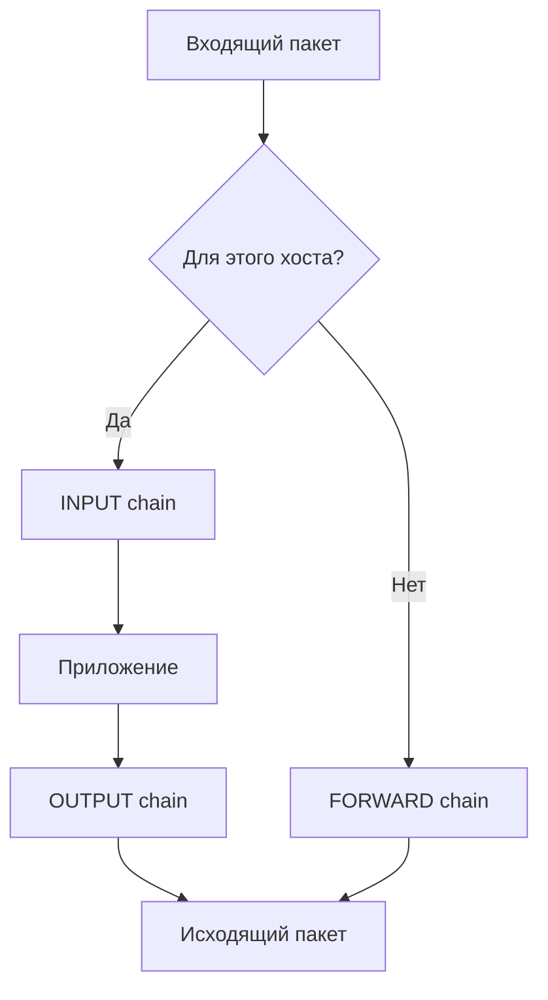
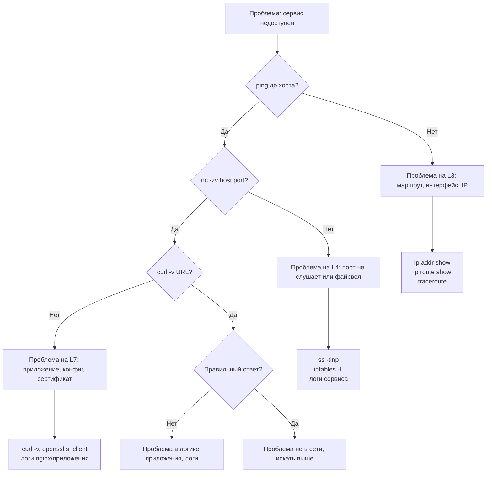

# Инструкция для ИИ-агента: Модуль 35 — Сети для DevOps

> **Роль агента:** Ты — технический писатель и DevOps/сетевой инженер с практическим опытом. Ты пишешь обучающий материал: конкретно, без академизма, с реальными командами и выводами. Объясняешь не только «как», но и «зачем». Честно указываешь на ограничения и типичные ловушки.

> **Это Модуль 35, книга части 4 "Прочее".**
> Предварительные требования: книга 01 (Linux), книга 03 (Docker), книга 34 (Git).
> Читатель уверенно работает в терминале, разворачивает сервисы в Docker, но сеть для него — «чёрный ящик».

---

## Контекст проекта

Читатель — DevOps-инженер или разработчик которому сеть мешает работать:

- Видит `Connection refused` / `timeout` и не знает с чего начать.
- Не понимает что такое подсеть 192.168.1.0/24 и почему /24, а не /32.
- Добавил порт в сервис — но с другого хоста не достучаться. Не знает почему.
- Слышал про iptables, но никогда не трогал — страшно.
- DNS «иногда не работает» — не знает как проверять.
- В Docker-сети контейнеры не видят друг друга — не понимает почему.
- В K8s видит Service/ClusterIP/NodePort/Ingress — не знает разницу.

**Что он хочет после книги:**
Самостоятельно диагностировать сетевые проблемы. Читать IP-адреса и маски. Разобраться что происходит с пакетом от браузера до сервиса. Настроить базовый фаервол. Понять Docker и K8s networking настолько чтобы не паниковать при инцидентах.

---

## Что за книга

**Название:** "Сети для DevOps: TCP/IP, DNS, HTTP и диагностика от ping до tcpdump"

**Каталог:** `35-networks-devops`

**Место в курсе:** Книга 35, часть 4 "Прочее". Читается после книги 34 (Git), перед книгой 4 (CI/CD) и книгой 10 (Kubernetes Basics).

**Объём:** 130–160 страниц.

**Формат файлов:** каждая глава — `chapter-XX.md`, приложения — `appendix-a.md`, `appendix-b.md`, `appendix-c.md`. Оглавление — `book.md`.

**Версии ПО:** примеры рассчитаны на Ubuntu 22.04/24.04. Где есть различия с другими дистрибутивами — указывать явно.

**Стиль:**
- Простой язык без академизма.
- Каждая глава: «Что вы узнаете» → тело → «Типичные ошибки» → «Чек-лист» → «Попробуйте сами».
- Команды — с реальными выводами (обрезанными до сути, не полными).
- Mermaid-диаграммы для flows, ASCII-схемы для топологий и стеков.
- Маркировка опасных команд: `> ☠️ **Осторожно:**`.
- Указывать когда команда требует прав root/sudo.

---

## Правило маркировки опасных команд

```markdown
> ☠️ **Осторожно:** [что именно сломается/удалится и почему нельзя отменить]
```

Применять к:
- `iptables -F` — сбросить все правила (может оборвать SSH)
- `ip link set eth0 down` — отключить интерфейс (потеря доступа к серверу)
- `nmap` на чужих сетях без разрешения — уголовная ответственность
- `tc qdisc del` — удалить QoS-правила

---

## Антипаттерны подачи

**Плохо:** давать теорию OSI на 3 страницы без практики.
**Хорошо:** объяснить уровни через конкретный пример: что происходит когда браузер открывает https://example.com.

**Плохо:** "просто введите команду `ip addr show`".
**Хорошо:** объяснить каждую строку вывода с примером реального сервера.

**Плохо:** показать iptables без объяснения что будет при ошибке.
**Хорошо:** всегда показывать сохранение правил перед изменением и способ откатиться.

**Плохо:** "DNS работает по UDP на порту 53".
**Хорошо:** показать это живым tcpdump-дампом.

---

## Правило: визуализация — не опционально

**Вставлять схемы, таблицы, Mermaid-диаграммы и графики везде где они поясняют материал лучше текста.**

Конкретные требования:

- **Mermaid `flowchart` / `sequenceDiagram`** — для алгоритмов диагностики, последовательностей (TCP handshake, DNS-запрос), деревьев принятия решений.
- **ASCII-схемы** — для топологий сети, расположения компонентов на хосте, стеков протоколов. Каждый ASCII-блок должен быть узнаваем без чтения подписи.
- **Таблицы** — для сравнения: инструментов (старый vs новый), протоколов (TCP vs UDP), кодов (HTTP 4xx), типов (Docker-сети, K8s Service), флагов команд.
- **Графики на базе реальных данных** — временные ряды RTT из ping, распределение TIME_WAIT из `ss -s`, потери на хопах из `mtr`.
- **Одна большая диаграмма** по теме эффективнее двух страниц текста. Не бояться занимать место.
- **У каждой схемы — подпись:** где разместить (`Разместить: секция "X" в главе Y`).

Диаграммы перечисленные в секции «Обязательные схемы» — минимум. Агент должен добавлять свои где видит что схема улучшит понимание.

---

## Обработка ошибок при выполнении команд

**Правило:** каждая команда в книге должна сопровождаться указанием что делать если:
- Команда не найдена — `apt install -y <package>` или `brew install` (macOS)
- Нет прав (Permission denied) — нужен `sudo`
- Вывод отличается от ожидаемого (другая версия утилиты, другой дистрибутив)
- Команда не работает на macOS (например `ip` — только Linux)

Формат:
```markdown
# Если команда не найдена:
sudo apt install -y <package>
```

В случаях когда команда может дать разный вывод на разных системах — дать оба варианта и пояснить разницу. Пример: systemd-resolved на Ubuntu 22.04+ vs `/etc/resolv.conf` вручную на Debian.

---

## Таблица объёмов глав

| Глава | Тема | Страниц |
|-------|------|---------|
| 0 | Как данные идут по сети — OSI и TCP/IP на практике | 8–10 |
| 1 | IP-адресация, подсети, CIDR | 8–10 |
| 2 | Сетевые интерфейсы Linux — ip addr, route, link | 8–10 |
| 3 | TCP vs UDP — порты, сокеты, состояния соединений | 8–10 |
| 4 | DNS — от запроса до ответа | 10–12 |
| 5 | HTTP — запросы, заголовки, коды ответов | 10–12 |
| 6 | HTTPS и TLS — сертификаты, openssl, проверка | 8–10 |
| 7 | Диагностика — ping, traceroute, mtr, ss, tcpdump, Wireshark | 14–16 |
| 8 | nmap — сканирование и инвентаризация | 6–8 |
| 9 | iptables — правила, цепочки, NAT | 12–14 |
| 10 | Docker networking — bridge, host, overlay, network namespaces | 10–12 |
| 11 | Kubernetes networking — CNI, Service, Ingress | 10–12 |
| 12 | Алгоритм диагностики сетевого инцидента | 6–8 |
| Приложения A–C | | 10–12 |

Общий объём: 155–195 страниц.

---

## Обязательные схемы

**Схема 1 — Путь пакета от браузера до сервера** (Глава 0):

```text
Браузер                    Сеть                    Сервер
─────────────────────────────────────────────────────────
[HTTP запрос]              
    ↓ TCP сегмент
    ↓ IP пакет
    ↓ Ethernet фрейм
         ──────────► [Роутер] ──────────► [eth0 сервера]
                                               ↓
                                          [IP → TCP → HTTP]
                                               ↓
                                          [nginx слушает :80]
```
Разместить: начало главы 0.

**Схема 2 — Стек протоколов TCP/IP vs OSI** (Глава 0):

```text
OSI (7 уровней)        TCP/IP (4 уровня)    Примеры протоколов
────────────────────────────────────────────────────────────
7. Прикладной      ┐
6. Представления   ├──► Прикладной          HTTP, HTTPS, DNS, SSH
5. Сеансовый       ┘
4. Транспортный    ────► Транспортный        TCP, UDP
3. Сетевой         ────► Интернет            IP, ICMP
2. Канальный       ┐
1. Физический      ├──► Канальный           Ethernet, Wi-Fi
```
Разместить: секция "Модели OSI и TCP/IP" в главе 0.

**Схема 3 — Разбор IP-адреса и маски** (Глава 1):

```text
IP-адрес:   192.168.1.100
Маска:      255.255.255.0  =  /24

Двоично:
192.168.1.100  =  11000000.10101000.00000001.01100100
255.255.255.0  =  11111111.11111111.11111111.00000000
                  └─────────────── 24 бита ──────────┘└─ 8 бит ─┘
                        сетевая часть                  хост-часть

Сеть:       192.168.1.0
Broadcast:  192.168.1.255
Хосты:      192.168.1.1 – 192.168.1.254  (254 адреса)
```
Разместить: начало секции "Маска подсети" в главе 1.

**Схема 4 — TCP handshake** (Глава 3):

```text
Клиент                          Сервер
   │                               │
   │──── SYN (seq=x) ────────────► │
   │                               │
   │◄─── SYN-ACK (seq=y, ack=x+1) ─│
   │                               │
   │──── ACK (ack=y+1) ───────────► │
   │                               │
   │        [соединение открыто]    │
   │                               │
   │──── FIN ────────────────────► │
   │◄─── ACK ──────────────────── │
   │◄─── FIN ──────────────────── │
   │──── ACK ────────────────────► │
```
Разместить: секция "Установка и завершение соединения" в главе 3.

**Схема 5 — DNS-запрос** (Глава 4):

```text
Браузер         Резолвер          Root NS       TLD NS         Auth NS
  │                │                 │              │               │
  │─ api.example.com? ─►│            │              │               │
  │               │─ api.example.com? ─►│           │               │
  │               │     │◄─ .com NS ──┘             │               │
  │               │─────────────── api.example.com? ─►│             │
  │               │               │  │◄─ example.com NS ─────────── │
  │               │───────────────────────── api.example.com? ──────►│
  │               │◄──────────────────────── 93.184.216.34 ──────────┘
  │◄─ 93.184.216.34 ──┘
```
Разместить: начало главы 4.

**Схема 6 — Docker bridge network** (Глава 10):

```text
Хост
┌─────────────────────────────────────────────────────┐
│                                                     │
│  docker0 (172.17.0.1)      br-abc123 (172.18.0.1)  │
│      │                           │                  │
│   ┌──┴──────┐               ┌────┴────┐             │
│   │ eth0    │               │ eth0    │             │
│   │ c1      │               │ c2   c3 │             │
│   │172.17.  │               │172.18.  │             │
│   │0.2      │               │0.2  0.3 │             │
│   └─────────┘               └─────────┘             │
│                                                     │
│  eth0 хоста (192.168.1.10) ──► внешняя сеть        │
└─────────────────────────────────────────────────────┘
```
Разместить: начало главы 10.

---

## Структура книги — детальное ТЗ по главам

---

### Глава 0: Как данные идут по сети — OSI и TCP/IP на практике

**Что вы узнаете:**
- что происходит в сети когда браузер открывает https://example.com;
- чем отличаются модели OSI и TCP/IP и почему DevOps важен именно TCP/IP;
- что такое инкапсуляция и как каждый уровень добавляет заголовок;
- как это знание помогает при диагностике.

**Цель:** показать что «сеть» — это не магия, а предсказуемый стек протоколов, и на каждом уровне есть инструмент диагностики.

**Темы:**

Разместить Схему 1 (путь пакета) в самом начале главы, до любого текста.

Раздел "Что происходит при открытии сайта":
Прописать полный путь: браузер проверяет кэш DNS → запрос к резолверу → получает IP → открывает TCP-соединение (три шага handshake) → отправляет HTTP-запрос → получает ответ → рендерит страницу. Не углубляться — каждый шаг получит свою главу.

Раздел "Модели OSI и TCP/IP":
Разместить Схему 2. Не объяснять все 7 уровней подробно. Объяснить только чем полезно деление: когда видишь `ping работает — curl не работает`, ты знаешь что проблема на уровне 7 (приложение), а не на уровне 3 (IP). Это и есть ценность модели.

Таблица: уровень → что сломалось → инструмент диагностики:
```text
Что сломалось                    Уровень    Инструмент
────────────────────────────────────────────────────────
Хост недоступен вообще           L3 (IP)    ping, traceroute
Порт недоступен                  L4 (TCP)   nc, telnet, ss, nmap
Сервис отвечает неверно          L7 (App)   curl, dig, openssl
Имя не резолвится                L7 (DNS)   dig, nslookup
Сертификат невалиден             L6/L7      openssl s_client
```

Раздел "Инкапсуляция":
Объяснить что каждый уровень оборачивает данные своим заголовком. Показать простым текстом:
```text
Данные HTTP:  GET / HTTP/1.1\r\nHost: example.com
+ TCP заголовок:  порт источника 54321, порт назначения 80
+ IP заголовок:   src 192.168.1.5, dst 93.184.216.34
+ Ethernet:       src MAC, dst MAC
```

**Типичные ошибки:**
- Попытка диагностировать L7-проблему инструментами L3: ping работает — значит «сеть ок», а curl всё равно не работает. ping и curl работают на разных уровнях.
- Путать IP-адрес и MAC-адрес: IP маршрутизируется глобально, MAC работает только в локальной сети.

**Чек-лист для самопроверки:**
- [ ] Могу назвать 4 уровня TCP/IP и привести пример протокола на каждом
- [ ] Понимаю почему «ping работает» не означает «сервис работает»
- [ ] Знаю какой инструмент диагностирует каждый уровень

**Попробуйте сами:**
1. Откройте любой сайт в браузере. Запишите на бумаге все шаги которые происходят от нажатия Enter до отображения страницы. Сколько протоколов задействовано?
2. Запустите `ping google.com` — это L3. Запустите `curl -I https://google.com` — это L7. Оба работают? А теперь — что случится если заблокировать порт 443, но не заблокировать ICMP?
3. Запустите `tcpdump -n -i any port 53 &` и откройте любой сайт. Увидите DNS-запрос — это запрос с L7 который идёт по UDP на L4. Остановите tcpdump (`kill %1`).

---

### Глава 1: IP-адресация, подсети и CIDR

**Что вы узнаете:**
- как читать IP-адрес и маску подсети;
- что означает нотация CIDR (192.168.1.0/24);
- как посчитать количество хостов в подсети;
- зачем нужны приватные адреса и что такое NAT.

**Цель:** после этой главы нотация /24, /16, /32 не вызывает вопросов. Читатель умеет определить принадлежность адреса к сети и считает подсети без калькулятора.

**Темы:**

Раздел "IP-адрес: 4 числа по 8 бит":
Объяснить что IPv4-адрес — это 32 бита. Четыре октета от 0 до 255. Привести пример перевода: 192 = 11000000. Не требовать знания двоичной арифметики — просто понимание структуры.

Раздел "Маска подсети":
Разместить Схему 3 (разбор адреса и маски). Объяснить сетевую и хост-части. Показать что `/24` = `255.255.255.0` = 24 единицы в маске. Таблица часто используемых масок:
```text
CIDR    Маска               Кол-во хостов    Использование
/8      255.0.0.0           16 777 214       крупные ISP
/16     255.255.0.0         65 534           корпоративные сети
/24     255.255.255.0       254              сегменты LAN
/25     255.255.255.128     126              половина /24
/27     255.255.255.224     30               небольшой сегмент
/30     255.255.255.252     2                point-to-point
/32     255.255.255.255     1 (один хост)    маршруты к хосту, loopback
```

Формула: число хостов = 2^(32-prefix) − 2 (минус сеть и broadcast).

Раздел "Приватные адреса":
```text
Диапазон             CIDR          Применение
10.0.0.0 – 10.255.255.255    /8     корпоративные сети, Docker, K8s
172.16.0.0 – 172.31.255.255  /12    Docker по умолчанию (172.17.0.0/16)
192.168.0.0 – 192.168.255.255 /16   домашние роутеры, офисы
127.0.0.0 – 127.255.255.255   /8    loopback (127.0.0.1 = localhost)
```

Раздел "NAT: как приватные адреса выходят в интернет":
Объяснить на примере: роутер с внешним IP меняет src-адрес пакетов. Контейнеры в Docker используют NAT (masquerade). Это объясняет почему `curl ifconfig.me` из контейнера показывает IP хоста.

Раздел "IPv6 кратко":
Одним абзацем: формат `2001:db8::1/64`, loopback `::1`, link-local `fe80::`. Не углубляться — отдельная тема. Указать что большинство команд из книги работают с флагом `-6` или `-4`.

Команды:
```bash
# Показать IP-адреса интерфейсов
ip addr show

# Показать только IPv4
ip -4 addr show

# Проверить к какой сети принадлежит адрес (ipcalc)
ipcalc 192.168.1.100/24
# Network:   192.168.1.0/24
# HostMin:   192.168.1.1
# HostMax:   192.168.1.254
# Hosts/Net: 254

# Установить ipcalc если нет
sudo apt install ipcalc
```

**Типичные ошибки:**
- `192.168.1.0/24` и `192.168.1.0/25` — разные сети, хосты из них не видят друг друга без маршрутизации. DevOps часто забывает это при настройке Docker-сетей.
- `127.0.0.1` ≠ `0.0.0.0`: сервис на `127.0.0.1:8080` доступен только с localhost, на `0.0.0.0:8080` — со всех интерфейсов. Это частая причина "порт открыт но не доступен".
- `/32` это один адрес — маршрут к конкретному хосту, не подсеть.

**Чек-лист для самопроверки:**
- [ ] Понимаю что означает `/24` в адресе 192.168.1.0/24
- [ ] Знаю диапазоны приватных адресов наизусть
- [ ] Понимаю разницу между 0.0.0.0 и 127.0.0.1 в контексте bind-адреса сервиса
- [ ] Умею посчитать число хостов в подсети по CIDR

**Попробуйте сами:**
1. Выполните `ip addr show` на своей машине. Найдите все IP-адреса: какие приватные, какой loopback? Если есть Docker — найдите `docker0` интерфейс.
2. Установите `ipcalc` и запустите для адресов: `10.0.0.0/8`, `172.17.0.0/16`, `192.168.1.0/24`. Сколько хостов в каждой?
3. Запустите любой сервис на `127.0.0.1:8080` (например `python3 -m http.server --bind 127.0.0.1 8080`). Попробуйте достучаться с другого хоста. Теперь перезапустите на `0.0.0.0:8080` — разница очевидна.

---

### Глава 2: Сетевые интерфейсы Linux — ip addr, ip route, ip link

**Что вы узнаете:**
- как просматривать и управлять сетевыми интерфейсами через `ip`;
- как читать таблицу маршрутизации;
- что такое loopback, физический и виртуальный интерфейс;
- как временно и постоянно настроить IP-адрес.

**Цель:** читатель видит `ip addr show` и понимает каждую строку. Знает где смотреть маршруты и что делать если не туда идёт трафик.

**Темы:**

Раздел "Команда ip — замена ifconfig/route":
Объяснить что `ifconfig` и `route` устарели (deprecated). Современный инструмент — `ip` из пакета `iproute2`. Краткая таблица замены:
```text
Старая команда          Новая команда
ifconfig                ip addr show
ifconfig eth0 up        ip link set eth0 up
route -n                ip route show
netstat -rn             ip route show
arp -n                  ip neigh show
```

Раздел "ip addr show — разбор вывода":
Привести полный пример вывода и объяснить КАЖДОЕ поле:
```text
2: eth0: <BROADCAST,MULTICAST,UP,LOWER_UP> mtu 1500 qdisc mq state UP
    link/ether 52:54:00:ab:cd:ef brd ff:ff:ff:ff:ff:ff
    inet 192.168.1.100/24 brd 192.168.1.255 scope global dynamic eth0
       valid_lft 86399sec preferred_lft 86399sec
    inet6 fe80::5054:ff:feab:cdef/64 scope link
```
Объяснить: `2:` — номер интерфейса, `<BROADCAST,MULTICAST,UP,LOWER_UP>` — флаги состояния (UP = интерфейс поднят, LOWER_UP = физически подключён), `mtu 1500` — максимальный размер пакета, `link/ether` — MAC-адрес, `inet` — IPv4, `/24` — маска, `brd` — broadcast, `scope global` — глобальный адрес, `dynamic` — выдан DHCP.

Основные команды:
```bash
# Показать все интерфейсы с адресами
ip addr show

# Конкретный интерфейс
ip addr show eth0

# Только состояние интерфейсов (без адресов)
ip link show

# Добавить временный IP (сбросится при перезагрузке)
sudo ip addr add 192.168.1.200/24 dev eth0

# Удалить IP
sudo ip addr del 192.168.1.200/24 dev eth0

# Поднять/опустить интерфейс
sudo ip link set eth0 up
```

> ☠️ **Осторожно:** `sudo ip link set eth0 down` отключит интерфейс. Если работаешь по SSH через этот интерфейс — потеряешь доступ к серверу.

Раздел "Таблица маршрутизации":
Объяснить что маршрутизация — это «куда отправить пакет если адрес назначения такой-то». Привести пример и разобрать каждую строку:
```bash
ip route show
# default via 192.168.1.1 dev eth0 proto dhcp src 192.168.1.100 metric 100
# 192.168.1.0/24 dev eth0 proto kernel scope link src 192.168.1.100
# 172.17.0.0/16 dev docker0 proto kernel scope link src 172.17.0.1
```
Объяснить: `default via X` — шлюз по умолчанию (куда идёт всё неизвестное), `192.168.1.0/24 dev eth0` — локальная сеть (прямо через интерфейс), `172.17.0.0/16 dev docker0` — Docker-сеть.

```bash
# Добавить маршрут
sudo ip route add 10.10.0.0/24 via 192.168.1.1

# Удалить маршрут
sudo ip route del 10.10.0.0/24

# Узнать через какой интерфейс пойдёт пакет к адресу
ip route get 8.8.8.8
# 8.8.8.8 via 192.168.1.1 dev eth0 src 192.168.1.100 uid 1000
```

Раздел "Постоянная настройка":
Объяснить что `ip addr add` и `ip route add` — временные (до перезагрузки). Постоянная настройка зависит от ОС:
- Ubuntu 22.04+: Netplan (`/etc/netplan/*.yaml`)
- Debian: `/etc/network/interfaces`
- RHEL/CentOS: `/etc/sysconfig/network-scripts/`

Показать пример Netplan:
```yaml
# /etc/netplan/00-installer-config.yaml
network:
  version: 2
  ethernets:
    eth0:
      addresses:
        - 192.168.1.100/24
      routes:
        - to: default
          via: 192.168.1.1
      nameservers:
        addresses: [8.8.8.8, 1.1.1.1]
```
```bash
sudo netplan apply
```

**Типичные ошибки:**
- Временные изменения через `ip` теряются при перезагрузке — для сохранения нужен Netplan/interfaces.
- `ip addr add` не заменяет существующий адрес — добавляет второй. Сначала нужно `ip addr del`.
- После `ip link set eth0 down` потеря SSH — всегда проверяй через какой интерфейс подключён.

**Чек-лист для самопроверки:**
- [ ] Умею читать вывод `ip addr show` и объяснить каждое поле
- [ ] Понимаю таблицу маршрутизации и что означает `default via`
- [ ] Знаю как найти через какой шлюз идёт пакет к конкретному адресу
- [ ] Понимаю разницу между временной и постоянной настройкой

**Попробуйте сами:**
1. Запустите `ip addr show` и `ip route show`. Найдите: какой шлюз по умолчанию, какие локальные сети, есть ли Docker-интерфейс.
2. Выполните `ip route get 8.8.8.8` и `ip route get 192.168.1.1`. Через разные интерфейсы? Объясните почему.
3. Добавьте временный адрес: `sudo ip addr add 10.99.99.1/24 dev lo`. Проверьте `ip addr show lo`. Попробуйте `ping 10.99.99.1`. Удалите адрес.

---

### Глава 3: TCP vs UDP — порты, сокеты, состояния соединений

**Что вы узнаете:**
- чем TCP отличается от UDP и когда что используется;
- что такое порт и сокет;
- как читать состояния TCP-соединений (`ESTABLISHED`, `TIME_WAIT`, `CLOSE_WAIT`);
- как смотреть открытые порты и соединения через `ss`.

**Цель:** когда сервис «не отвечает на порту», читатель знает как проверить открыт ли порт, кто его слушает и в каком состоянии соединения.

**Темы:**

Раздел "TCP: надёжность через установку соединения":
Разместить Схему 4 (TCP handshake). Объяснить: SYN → SYN-ACK → ACK. Каждый пакет подтверждается. Потеря пакета → ретрансмит. Гарантированная доставка в правильном порядке. Цена: задержка на handshake, overhead.

Раздел "UDP: скорость без гарантий":
UDP не устанавливает соединение. Отправил — забыл. Нет ретрансмитов. Порядок не гарантирован. Зато быстро. Применения:
```text
TCP используют:             UDP используют:
HTTP/HTTPS                  DNS (запросы до 512 байт)
SSH                         DHCP
PostgreSQL, MySQL           VoIP, видеозвонки
Git over SSH                WireGuard VPN
SMTP, IMAP                  QUIC (HTTP/3)
```

Раздел "Порты":
Объяснить что порт — это число от 0 до 65535, которое позволяет одному IP иметь несколько сервисов. Таблица известных портов:
```text
Порт    Протокол    Сервис
22      TCP         SSH
25      TCP         SMTP
53      UDP/TCP     DNS
80      TCP         HTTP
443     TCP         HTTPS
3000    TCP         Grafana, Node.js (по соглашению)
3306    TCP         MySQL
5432    TCP         PostgreSQL
6379    TCP         Redis
8080    TCP         HTTP-альтернатив (прокси, dev)
9090    TCP         Prometheus
9200    TCP         Elasticsearch
```

Полная таблица — в Приложении B.

Раздел "Сокет":
Объяснить что сокет = IP:port. Пара сокетов образует соединение: `(192.168.1.5:54321, 93.184.216.34:443)`. Это и есть TCP-соединение.

Раздел "Состояния TCP":
```text
Состояние       Что означает
LISTEN          Сервис ждёт входящих соединений
ESTABLISHED     Соединение открыто, данные передаются
TIME_WAIT       Соединение закрыто, ждём потерянных пакетов (2 минуты)
CLOSE_WAIT      Удалённая сторона закрыла соединение, локальная ещё нет
SYN_SENT        Клиент отправил SYN, ждёт SYN-ACK
SYN_RECV        Сервер получил SYN, отправил SYN-ACK
FIN_WAIT        Закрываем соединение со своей стороны
```

Много `TIME_WAIT` — норма при высокой нагрузке. Много `CLOSE_WAIT` — проблема: приложение не закрывает соединения.

Раздел "ss — смотреть сокеты":
```bash
# Все слушающие TCP-сокеты
ss -tlnp
# -t = только TCP, -l = только LISTEN, -n = числа (не разрешать имена), -p = процесс

# Пример вывода:
# State    Recv-Q  Send-Q  Local Address:Port  Peer Address:Port  Process
# LISTEN   0       511     0.0.0.0:80          0.0.0.0:*          users:(("nginx",pid=1234))
# LISTEN   0       4096    127.0.0.1:5432      0.0.0.0:*          users:(("postgres",pid=5678))

# Все установленные TCP-соединения
ss -tnp

# UDP-сокеты
ss -ulnp

# Все сокеты (TCP+UDP+Unix)
ss -anp

# Фильтр по порту
ss -tnp '( dport = :443 or sport = :443 )'

# Показать количество соединений по состоянию
ss -s
```

Раздел "nc — проверить доступность порта":
```bash
# Проверить открыт ли TCP-порт
nc -zv 192.168.1.10 80
# Connection to 192.168.1.10 80 port [tcp/http] succeeded!

# Таймаут 3 секунды
nc -zv -w 3 192.168.1.10 80

# UDP
nc -zuv 192.168.1.10 53

# Простой TCP-сервер для тестирования
nc -l 9999
# В другом терминале: nc 127.0.0.1 9999
```

**Типичные ошибки:**
- `Connection refused` — порт не слушает. `Connection timed out` — порт заблокирован файрволом (или хост недоступен). Это разные ошибки с разными причинами.
- Сервис слушает на `127.0.0.1` — снаружи недоступен. Проверь Local Address в `ss -tlnp`.
- `CLOSE_WAIT` накапливается → приложение не закрывает соединения → рано или поздно лимит fd исчерпается.

**Чек-лист для самопроверки:**
- [ ] Понимаю разницу TCP vs UDP и когда что применяется
- [ ] Умею читать вывод `ss -tlnp` и найти кто слушает порт
- [ ] Знаю разницу между `Connection refused` и `Connection timed out`
- [ ] Понимаю что `CLOSE_WAIT` это проблема, а `TIME_WAIT` — норма

**Попробуйте сами:**
1. Запустите `ss -tlnp` и найдите все слушающие сервисы. На каких адресах они слушают: `0.0.0.0`, `127.0.0.1` или `:::`? Что это означает для доступности?
2. Откройте два терминала. В первом: `nc -l 9999`. Во втором: `nc 127.0.0.1 9999`. Напечатайте что-то — оно появится во втором терминале. Теперь в третьем: `ss -tnp | grep 9999` — увидите ESTABLISHED-соединение.
3. Запустите `ss -s` — сводка по состояниям. Сколько ESTABLISHED-соединений? Есть ли TIME_WAIT? Запустите браузер, откройте несколько сайтов — как изменилась статистика?

---

### Глава 4: DNS — от запроса до ответа

**Что вы узнаете:**
- как работает DNS-разрешение от браузера до авторитарного сервера;
- какие бывают DNS-записи и что они означают;
- как использовать `dig` для диагностики DNS;
- как устроен `/etc/resolv.conf` и `/etc/hosts`.

**Цель:** когда "имя не резолвится" читатель знает где искать проблему и как её диагностировать за 2 минуты.

**Темы:**

Разместить Схему 5 (DNS-запрос) в начале главы.

Раздел "Как работает рекурсивный резолвер":
Объяснить цепочку: клиент → рекурсивный резолвер (8.8.8.8 или от ISP) → root nameserver → TLD nameserver (.com) → авторитарный nameserver → ответ. Кэширование на каждом уровне (TTL). Резолвер отвечает из кэша если TTL не истёк.

Раздел "Типы DNS-записей":
```text
Запись    Содержимое                    Пример
A         IPv4-адрес                    example.com → 93.184.216.34
AAAA      IPv6-адрес                    example.com → 2606:2800:220:1::93
CNAME     Псевдоним (алиас)             www.example.com → example.com
MX        Почтовый сервер               example.com → mail.example.com (priority 10)
TXT       Произвольный текст            SPF, DKIM, подтверждение домена
NS        Авторитарный nameserver       example.com NS → ns1.example.com
PTR       Обратная запись (IP → имя)    34.216.184.93.in-addr.arpa → example.com
SOA       Параметры зоны (TTL, serial)  служебная запись зоны
SRV       Адрес + порт сервиса          _http._tcp.example.com → host:80
```

Раздел "dig — основной инструмент":
```bash
# Базовый запрос A-записи
dig example.com
# Разобрать КАЖДУЮ секцию вывода: QUESTION, ANSWER, AUTHORITY, ADDITIONAL, Stats

# Только ответ (без заголовков)
dig +short example.com
# 93.184.216.34

# Запросить конкретный тип записи
dig example.com MX
dig example.com TXT
dig example.com NS
dig example.com AAAA

# Использовать конкретный DNS-сервер
dig @8.8.8.8 example.com
dig @1.1.1.1 example.com

# Обратная запись (PTR)
dig -x 8.8.8.8
# 8.8.8.8.in-addr.arpa → dns.google

# Трассировка DNS-запроса (от root до ответа)
dig +trace example.com

# Посмотреть TTL
dig +ttl example.com
```

Полный разбор вывода `dig example.com` — объяснить каждую строку:
```text
; <<>> DiG 9.18.12 <<>> example.com
;; ->>HEADER<<- opcode: QUERY, status: NOERROR, id: 12345
                         ↑ NOERROR = нашли
;; QUESTION SECTION:
;example.com.                   IN      A    ← что спрашиваем

;; ANSWER SECTION:
example.com.            3600    IN      A       93.184.216.34
             ↑ TTL в секундах

;; Query time: 12 msec             ← время ответа
;; SERVER: 127.0.0.53#53           ← какой DNS-сервер ответил
```

Раздел "/etc/resolv.conf и /etc/hosts":
```bash
# Посмотреть текущий резолвер
cat /etc/resolv.conf
# nameserver 127.0.0.53  ← systemd-resolved (Ubuntu)
# nameserver 8.8.8.8     ← прямой DNS

# /etc/hosts имеет приоритет над DNS
cat /etc/hosts
# 127.0.0.1    localhost
# 192.168.1.10 myserver myserver.local   ← добавить свой хост

# Порядок разрешения задаётся в /etc/nsswitch.conf
grep ^hosts /etc/nsswitch.conf
# hosts: files dns  ← сначала /etc/hosts, потом DNS
```

Раздел "systemd-resolved":
```bash
# Статус (Ubuntu)
resolvectl status

# Очистить кэш DNS
sudo resolvectl flush-caches

# Посмотреть какой DNS используется
resolvectl dns

# Статистика кэша
resolvectl statistics
```

Раздел "nslookup — простая альтернатива dig":
```bash
nslookup example.com
nslookup example.com 8.8.8.8
```
Упомянуть что `nslookup` устарел, предпочитать `dig`.

**Типичные ошибки:**
- `NXDOMAIN` — домен не существует. `SERVFAIL` — ошибка на стороне DNS-сервера. `REFUSED` — DNS-сервер отказал в запросе.
- После изменения DNS-записи она не обновилась — нужно ждать TTL. `dig +ttl example.com` покажет сколько ждать.
- Контейнер не резолвит имена хостов: проверить `/etc/resolv.conf` внутри контейнера — там должен быть рабочий DNS.
- Длинный TTL у CNAME замедляет смену IP при аварии.

**Чек-лист для самопроверки:**
- [ ] Понимаю цепочку DNS-разрешения: клиент → резолвер → root → TLD → авторитарный
- [ ] Знаю A, CNAME, MX, TXT, NS записи и когда они используются
- [ ] Умею использовать `dig +short`, `dig @8.8.8.8`, `dig +trace`
- [ ] Знаю что `NXDOMAIN` и `SERVFAIL` означают разные проблемы

**Попробуйте сами:**
1. Запустите `dig +trace google.com`. Следите за цепочкой — видите запросы к root серверам, TLD, авторитарным? Сколько шагов?
2. Запустите `dig google.com` и `dig @8.8.8.8 google.com`. Отличаются ли ответы? Отличается ли время (`Query time`)?
3. Добавьте в `/etc/hosts` строку `127.0.0.1 test.local`. Запустите `ping test.local`. Работает? Теперь `dig test.local` — DNS не знает об этом имени, только `hosts`.

---

### Глава 5: HTTP — запросы, заголовки, коды ответов

**Что вы узнаете:**
- структуру HTTP-запроса и ответа;
- основные HTTP-методы и коды ответов;
- как использовать `curl` для тестирования API и сервисов;
- что такое заголовки и зачем они нужны.

**Цель:** после главы читатель уверенно использует curl для диагностики и тестирования HTTP-сервисов. Понимает коды ответов без гугла.

**Темы:**

Раздел "Структура HTTP-запроса":
```text
GET /api/users HTTP/1.1         ← метод, путь, версия
Host: api.example.com           ← обязательный заголовок в HTTP/1.1
User-Agent: curl/7.81.0
Accept: application/json
Authorization: Bearer token123
                                ← пустая строка = конец заголовков
                                ← тело (для GET пустое)
```

```text
HTTP/1.1 200 OK                 ← версия, код, текст
Date: Mon, 01 Jan 2026 12:00:00 GMT
Content-Type: application/json
Content-Length: 42
Cache-Control: max-age=3600
                                ← пустая строка
{"users": [...]}                ← тело ответа
```

Раздел "HTTP-методы":
```text
Метод     Назначение                    Тело запроса    Идемпотентен
GET       Получить ресурс               Нет             Да
POST      Создать ресурс                Да              Нет
PUT       Заменить ресурс целиком       Да              Да
PATCH     Частично обновить ресурс      Да              Нет
DELETE    Удалить ресурс                Нет/Да          Да
HEAD      Как GET но без тела           Нет             Да
OPTIONS   Узнать что поддерживает сервер Нет            Да
```

Раздел "Коды ответов":
```text
2xx — Успех:
200 OK           — стандартный ответ
201 Created      — ресурс создан (POST)
204 No Content   — успех, тела нет (DELETE)

3xx — Перенаправление:
301 Moved Permanently — постоянный редирект (меняй закладки)
302 Found             — временный редирект
304 Not Modified      — кэш актуален

4xx — Ошибка клиента:
400 Bad Request       — неверный запрос (синтаксис, поля)
401 Unauthorized      — нужна аутентификация
403 Forbidden         — аутентифицирован но нет прав
404 Not Found         — ресурс не существует
405 Method Not Allowed — метод не поддерживается
409 Conflict          — конфликт (дублирование)
422 Unprocessable     — тело корректно но семантически неверно
429 Too Many Requests — rate limiting

5xx — Ошибка сервера:
500 Internal Server Error — ошибка в коде приложения
502 Bad Gateway           — upstream вернул ошибку (nginx → app)
503 Service Unavailable   — сервис временно недоступен
504 Gateway Timeout       — upstream не ответил вовремя
```

Раздел "curl — диагностика HTTP":
```bash
# Простой GET
curl https://httpbin.org/get

# Показать только заголовки ответа
curl -I https://httpbin.org/get

# Показать заголовки запроса и ответа (-v verbose)
curl -v https://httpbin.org/get

# POST с JSON
curl -X POST https://httpbin.org/post \
  -H "Content-Type: application/json" \
  -d '{"name": "test", "value": 42}'

# С авторизацией
curl -H "Authorization: Bearer mytoken" https://api.example.com/users

# Следовать редиректам
curl -L https://bit.ly/example

# Сохранить в файл
curl -o output.json https://api.example.com/data

# Тайм-аут соединения и ответа
curl --connect-timeout 5 --max-time 30 https://api.example.com

# Измерить время ответа
curl -w "\nTime: %{time_total}s\n" -o /dev/null -s https://example.com

# Проверить статус-код в скриптах
curl -f -s https://api.example.com/health && echo "OK" || echo "FAIL"
# -f = fail on HTTP errors (exit 1 если 4xx/5xx)

# Игнорировать ошибки SSL (только для тестирования!)
curl -k https://self-signed.example.com
```

Раздел "Важные HTTP-заголовки":
```text
Заголовок запроса:
Host             — имя хоста (обязателен в HTTP/1.1)
Authorization    — токен или Basic auth
Content-Type     — тип тела (application/json, multipart/form-data)
Accept           — что принимает клиент
User-Agent       — идентификатор клиента
Cookie           — куки сессии

Заголовок ответа:
Content-Type     — тип тела ответа
Cache-Control    — инструкции кэширования
Location         — URL для редиректа (3xx)
WWW-Authenticate — схема аутентификации (401)
Set-Cookie       — установить куки
X-Request-ID     — ID запроса для трассировки (нестандартный)
```

**Типичные ошибки:**
- `502 Bad Gateway` в nginx — upstream-приложение не запущено или упало. Смотреть логи приложения, не nginx.
- `curl: (7) Failed to connect` — сервис не слушает порт. Проверить `ss -tlnp`.
- `curl: (60) SSL certificate verify failed` — проблема с сертификатом. Использовать `openssl s_client` для диагностики (Глава 6).
- `404` ≠ «сервис не работает» — сервис работает, конкретный URL не найден.

**Чек-лист для самопроверки:**
- [ ] Умею читать структуру HTTP-запроса и ответа
- [ ] Знаю коды 200/201/204/301/302/400/401/403/404/500/502/503/504 без гугла
- [ ] Умею использовать `curl -v` для диагностики заголовков
- [ ] Знаю как сделать POST с JSON через curl

**Попробуйте сами:**
1. Запустите `curl -v https://httpbin.org/get 2>&1 | head -40`. Найдите в выводе: TLS handshake, заголовки запроса, заголовки ответа. Объясните каждую строку с `>` и `<`.
2. Запустите `curl -w "\nCode: %{http_code}\nTime: %{time_total}s\nDNS: %{time_namelookup}s\n" -o /dev/null -s https://google.com`. Сколько времени занял DNS? TLS? Сам ответ?
3. Попробуйте коды ошибок: `curl -I https://httpbin.org/status/404`, `curl -I https://httpbin.org/status/500`, `curl -I https://httpbin.org/status/429`. Убедитесь что понимаете каждый.

---

### Глава 6: HTTPS и TLS — сертификаты, openssl, проверка

**Что вы узнаете:**
- как работает TLS-рукопожатие и зачем нужен сертификат;
- что такое CA, цепочка доверия и self-signed сертификат;
- как проверить сертификат через `openssl s_client`;
- как создать self-signed сертификат для тестирования.

**Цель:** читатель умеет быстро проверить сертификат, выяснить когда он истекает и почему браузер показывает ошибку.

**Темы:**

Раздел "Что такое TLS":
Объяснить: TLS (Transport Layer Security) — протокол шифрования поверх TCP. HTTPS = HTTP + TLS. TLS решает три задачи: шифрование (никто не читает трафик), аутентификация (это действительно тот сервер), целостность (данные не изменены).

Раздел "Сертификат и цепочка доверия":
```text
Цепочка:
Root CA (встроен в ОС/браузер)
  └─ Intermediate CA (сертификат промежуточного CA)
        └─ Сертификат сайта (example.com)

Браузер доверяет Root CA → проверяет подпись Intermediate → проверяет подпись сайта.
Если цепочка не полная — браузер ругается.
```

Раздел "openssl s_client — диагностика TLS":
```bash
# Подключиться и посмотреть сертификат
openssl s_client -connect example.com:443 -servername example.com </dev/null

# Только информация о сертификате
openssl s_client -connect example.com:443 </dev/null 2>/dev/null | openssl x509 -noout -text

# Дата истечения
openssl s_client -connect example.com:443 </dev/null 2>/dev/null \
  | openssl x509 -noout -dates
# notBefore=Jan  1 00:00:00 2025 GMT
# notAfter=Jan  1 00:00:00 2026 GMT

# Кем выдан
openssl s_client -connect example.com:443 </dev/null 2>/dev/null \
  | openssl x509 -noout -issuer -subject

# Проверить всю цепочку
openssl s_client -connect example.com:443 -showcerts </dev/null

# Проверить конкретный файл сертификата
openssl x509 -in cert.pem -noout -text
openssl x509 -in cert.pem -noout -dates
```

Раздел "Создать self-signed сертификат":
```bash
# Сгенерировать ключ и сертификат за одну команду
openssl req -x509 -newkey rsa:4096 -keyout key.pem -out cert.pem \
  -days 365 -nodes \
  -subj "/CN=localhost/O=Test/C=RU"

# Или через ed25519 (быстрее, меньше ключ)
openssl req -x509 -newkey ed25519 -keyout key.pem -out cert.pem \
  -days 365 -nodes \
  -subj "/CN=myserver.local"

# Проверить что получилось
openssl x509 -in cert.pem -noout -dates -subject -issuer
```

Раздел "Let's Encrypt и certbot":
Объяснить концепцию: Let's Encrypt — бесплатный публичный CA. Certbot — инструмент для получения и обновления сертификатов.
```bash
# Установить certbot
sudo apt install certbot python3-certbot-nginx

# Получить сертификат для домена (нужен работающий nginx)
sudo certbot --nginx -d example.com -d www.example.com

# Проверить автообновление
sudo certbot renew --dry-run

# Сертификаты хранятся в:
ls /etc/letsencrypt/live/example.com/
# cert.pem       ← сертификат
# chain.pem      ← промежуточные CA
# fullchain.pem  ← cert + chain (для nginx: ssl_certificate)
# privkey.pem    ← приватный ключ
```

**Типичные ошибки:**
- `certificate has expired` — истёк срок. Проверить дату: `openssl s_client ... | openssl x509 -noout -dates`.
- `certificate verify failed: unable to get local issuer certificate` — неполная цепочка. Использовать `fullchain.pem` в nginx, не `cert.pem`.
- `SSL_ERROR_RX_RECORD_TOO_LONG` — сервис не говорит TLS на этом порту (подключился к HTTP на порту 443).
- Self-signed сертификат в продакшне — браузер будет ругаться. Только для внутренней инфраструктуры или тестирования.

**Чек-лист для самопроверки:**
- [ ] Понимаю что такое цепочка доверия и зачем нужен CA
- [ ] Умею проверить сертификат через `openssl s_client`
- [ ] Знаю как посмотреть дату истечения сертификата
- [ ] Умею создать self-signed сертификат для тестов

**Попробуйте сами:**
1. Запустите `openssl s_client -connect github.com:443 </dev/null 2>/dev/null | openssl x509 -noout -dates -subject -issuer`. Когда истекает сертификат? Кто выдал?
2. Создайте self-signed сертификат. Запустите nginx или Python-сервер с ним. Попробуйте подключиться через `curl -k` и `curl` (без -k). Что происходит?
3. Запустите `openssl s_client -connect expired.badssl.com:443 </dev/null` — это специально сломанный сайт для тестирования. Какую ошибку показывает?

---

### Глава 7: Диагностика — ping, traceroute, mtr, ss, tcpdump, Wireshark

**Что вы узнаете:**
- как проверить доступность хоста и маршрут до него;
- как читать вывод traceroute и mtr;
- как захватить сетевой трафик через tcpdump и проанализировать его в Wireshark;
- системный подход к диагностике сетевых проблем.

**Цель:** читатель видит сетевую проблему и знает какой инструмент применить на каждом шаге диагностики.

**Темы:**

Раздел "ping — базовая проверка":
```bash
# Проверить доступность хоста (ICMP echo)
ping 8.8.8.8
ping google.com

# Ограничить количество пакетов
ping -c 4 google.com

# Изменить интервал (секунд)
ping -i 0.2 -c 20 google.com

# Размер пакета (для тестирования MTU)
ping -s 1400 -c 3 google.com

# Ping IPv6
ping6 ::1
```

Объяснить вывод: `64 bytes from ... icmp_seq=1 ttl=118 time=12.3 ms` — seq=1 (номер пакета), ttl=118 (time to live, сколько роутеров можно пройти), time=12.3ms (round-trip time).

100% packet loss — хост недоступен или ICMP заблокирован. Высокий RTT — далеко или перегружено. Вариативный RTT (jitter) — нестабильный канал.

Раздел "traceroute — маршрут до хоста":
```bash
# Установить
sudo apt install traceroute

# Трассировка маршрута
traceroute google.com

# Использовать ICMP (вместо UDP по умолчанию на Linux)
traceroute -I google.com

# TCP SYN на порт 443 (проходит через файрволы лучше)
sudo traceroute -T -p 443 google.com
```

Объяснить вывод: каждая строка — один роутер (hop). Три числа — три попытки RTT. `* * *` — хоп не отвечает (ICMP заблокирован или потеря пакетов). Не значит что маршрут сломан — следующий хоп может отвечать.

Раздел "mtr — traceroute в реальном времени":
```bash
sudo apt install mtr

# Интерактивный режим
mtr google.com

# Отчёт (100 пакетов, без интерактива)
mtr --report --report-cycles 100 google.com
```
mtr = traceroute + ping в одном окне. Показывает потери на каждом хопе. Если потери только на конкретном хопе но не на следующем — этот хоп просто игнорирует ICMP (не реальная потеря).

Раздел "tcpdump — захват трафика":
```bash
# Смотреть весь трафик на интерфейсе
sudo tcpdump -i eth0

# Конкретный хост
sudo tcpdump -i eth0 host 8.8.8.8

# Конкретный порт
sudo tcpdump -i eth0 port 80

# DNS-запросы
sudo tcpdump -i any port 53

# HTTP-запросы с телом
sudo tcpdump -i eth0 -A port 80

# Сохранить в файл для анализа в Wireshark
sudo tcpdump -i eth0 -w /tmp/capture.pcap

# Читать сохранённый файл
tcpdump -r /tmp/capture.pcap

# Пример: поймать HTTP-запрос
sudo tcpdump -i any -A -s 0 'tcp port 80 and (((ip[2:2] - ((ip[0]&0xf)<<2)) - ((tcp[12]&0xf0)>>2)) != 0)'
```

Объяснить синтаксис фильтров: `host`, `port`, `src`, `dst`, `and`, `or`, `not`. Примеры:
```bash
# Трафик между двумя хостами
sudo tcpdump host 192.168.1.5 and host 192.168.1.10

# Всё кроме SSH
sudo tcpdump port not 22

# Только исходящий на 443
sudo tcpdump dst port 443
```

Раздел "Wireshark — анализ захваченного трафика":
```bash
# Установить
sudo apt install wireshark tshark

# Анализировать сохранённый tcpdump-файл
tshark -r /tmp/capture.pcap | head -20

# Фильтр по протоколу
tshark -r /tmp/capture.pcap -Y "http" | head -20

# Смотреть живые пакеты как tcpdump
tshark -i eth0 -f "port 80"
```

Объяснить: tcpdump годится для быстрого захвата на сервере. Wireshark (или его терминальная версия tshark) — для глубокого анализа: фильтры по протоколам, следование TCP-потокам, графика RTT, дерево протоколов. Рабочий процесс DevOps: `tcpdump -w` на сервере → скачать .pcap → открыть в Wireshark на локальной машине. Агент обязан дать реальный пример: показать скриншот Wireshark или вывод tshark с аннотациями.

Раздел "Алгоритм диагностики «снизу вверх»":
```text
1. ping хоста          → доступен ли хост на L3?
2. traceroute          → где рвётся маршрут?
3. nc -zv host port    → открыт ли порт?
4. curl -v URL         → отвечает ли сервис?
5. dig hostname        → резолвится ли имя?
6. tcpdump             → что реально идёт по сети?
```

**Типичные ошибки:**
- `* * *` в traceroute — не обязательно проблема. ICMP заблокирован на этом хопе.
- tcpdump без фильтра на нагруженном сервере — огромный поток вывода. Всегда добавлять фильтр.
- tcpdump показывает пустой вывод — неверный интерфейс. Попробовать `-i any`.
- `sudo` нужен для tcpdump — иначе `Permission denied` или неполный захват.

**Чек-лист для самопроверки:**
- [ ] Умею интерпретировать вывод ping: потери, RTT, jitter
- [ ] Понимаю вывод traceroute и знаю что `* * *` не всегда проблема
- [ ] Умею захватить DNS-трафик через tcpdump
- [ ] Знаю алгоритм диагностики «снизу вверх» (L3 → L4 → L7)

**Попробуйте сами:**
1. Запустите `mtr --report google.com`. Посмотрите: есть ли хопы с потерями? На последнем хопе потери есть? Если только на промежуточных — почему это не проблема?
2. В одном терминале: `sudo tcpdump -i any port 53 -n`. В другом: `dig google.com`. Найдите в выводе tcpdump запрос и ответ. Какой протокол (UDP/TCP)? Откуда и куда?
3. Запустите `curl -s https://httpbin.org/get > /dev/null &` и одновременно `sudo tcpdump -i any host httpbin.org -n`. Увидьте установку TCP-соединения (SYN, SYN-ACK, ACK) и данные.

---

### Глава 8: nmap — сканирование и инвентаризация

**Что вы узнаете:**
- как сканировать порты хостов в своей инфраструктуре;
- основные режимы nmap и когда что использовать;
- как автоматически определять ОС и версии сервисов;
- правовые и этические ограничения.

**Цель:** читатель умеет проверить что открыто на своих серверах и использует nmap как инструмент аудита, а не атаки.

**Важная оговорка — разместить в самом начале главы:**

> ☠️ **Осторожно:** сканирование сетей без явного разрешения владельца — незаконно во многих юрисдикциях и нарушает правила использования облачных провайдеров (AWS, GCP, Azure). Используйте nmap только для своей инфраструктуры или при явном письменном разрешении.

**Темы:**

Раздел "Установка":
```bash
sudo apt install nmap
nmap --version
```

Раздел "Основные режимы сканирования":
```bash
# Проверить открытые порты хоста
nmap 192.168.1.1

# Диапазон портов
nmap -p 1-1000 192.168.1.1

# Конкретные порты
nmap -p 22,80,443,5432 192.168.1.1

# Все порты (медленно)
nmap -p- 192.168.1.1

# Сканировать подсеть
nmap 192.168.1.0/24

# Быстрый скан топ-100 портов
nmap -F 192.168.1.0/24

# SYN-scan (требует root, быстрее и менее заметен)
sudo nmap -sS 192.168.1.1

# UDP-порты (медленно)
sudo nmap -sU -p 53,67,68,123,161 192.168.1.1
```

Раздел "Обнаружение сервисов и ОС":
```bash
# Определить версии сервисов
nmap -sV 192.168.1.1

# Попытаться определить ОС (требует root)
sudo nmap -O 192.168.1.1

# Полный скан: версии + ОС + скрипты
sudo nmap -A 192.168.1.1

# Сохранить результат
nmap -oN output.txt 192.168.1.1    # человекочитаемый
nmap -oX output.xml 192.168.1.1   # XML
nmap -oG output.grep 192.168.1.1  # grep-friendly
```

Раздел "Практический сценарий: аудит сервера":
```bash
# Что открыто на моём сервере?
sudo nmap -sS -sV -p- --open 192.168.1.10
# Результат: список открытых портов с названием сервиса и версией
# Найти неожиданно открытые порты — признак компрометации или неправильной конфигурации
```

**Типичные ошибки:**
- `filtered` = порт заблокирован файрволом (не значит что сервис не работает).
- `closed` = порт доступен, но никто не слушает.
- `open` = порт открыт, кто-то слушает.
- Сканировать облачный сервер без разрешения AWS/GCP → блокировка аккаунта.

**Чек-лист для самопроверки:**
- [ ] Понимаю разницу между `open`, `closed`, `filtered`
- [ ] Умею просканировать свой сервер на открытые порты
- [ ] Знаю что nmap нельзя использовать на чужих сетях без разрешения
- [ ] Умею сохранить результат сканирования в файл

**Попробуйте сами:**
1. Запустите `nmap -F localhost` — какие порты открыты на вашей машине? Есть ли неожиданные?
2. Запустите `nmap -sV -p 22,80,443 ваш_сервер` — определите версии SSH и web-сервера. Версии актуальны?
3. Запустите `nmap -sV --open 192.168.1.0/24` в своей локальной сети. Какие хосты и сервисы найдены?

---

### Глава 9: iptables — правила, цепочки, NAT

**Что вы узнаете:**
- как устроен iptables: таблицы, цепочки, правила;
- как добавлять, удалять и просматривать правила;
- как настроить базовый файрвол для сервера;
- что такое NAT и как его настроить для роутинга.

**Цель:** читатель понимает iptables достаточно чтобы добавить правило, не сломать SSH и разобраться что именно блокирует трафик.

**Важная оговорка — разместить в начале:**

> ☠️ **Осторожно:** ошибка в правилах iptables может заблокировать SSH и сделать сервер недоступным. Перед экспериментами: сохрани текущие правила (`iptables-save > /tmp/rules.bak`), настрой автовосстановление через cron или работай в консоли (не SSH).

**Темы:**

Раздел "Архитектура iptables":
```text
Таблицы:
filter  — основная, блокировка/разрешение трафика
nat     — трансляция адресов (SNAT, DNAT, MASQUERADE)
mangle  — изменение заголовков пакетов
raw     — до conntrack (продвинутое, редко нужно)

Цепочки таблицы filter:
INPUT   — пакеты для самого хоста
OUTPUT  — пакеты от самого хоста
FORWARD — пакеты проходящие через хост (роутинг)
```

Mermaid-диаграмма пути пакета через iptables:


Раздел "Просмотр правил":
```bash
# Показать правила таблицы filter (по умолчанию)
sudo iptables -L -n -v
# -L = list, -n = числа (не резолвить имена), -v = verbose (счётчики)

# С номерами строк (нужно для удаления)
sudo iptables -L -n -v --line-numbers

# Таблица NAT
sudo iptables -t nat -L -n -v

# Сохранить правила
sudo iptables-save > /etc/iptables/rules.v4

# Восстановить
sudo iptables-restore < /etc/iptables/rules.v4
```

Раздел "Основные операции":
```bash
# Добавить правило в конец цепочки
sudo iptables -A INPUT -p tcp --dport 80 -j ACCEPT

# Вставить в начало цепочки (приоритет)
sudo iptables -I INPUT 1 -p tcp --dport 443 -j ACCEPT

# Удалить правило по номеру строки
sudo iptables -D INPUT 3

# Удалить конкретное правило (зеркально команде добавления)
sudo iptables -D INPUT -p tcp --dport 80 -j ACCEPT

# Очистить все правила цепочки
sudo iptables -F INPUT
```

> ☠️ **Осторожно:** `sudo iptables -F` без указания цепочки очищает ВСЕ правила таблицы filter. Если политика INPUT стоит DROP — SSH оборвётся немедленно.

Раздел "Базовый файрвол для сервера":
Дать готовый скрипт-шаблон с объяснением каждой строки:
```bash
#!/bin/bash
set -euo pipefail
# Базовый файрвол — выполнять с осторожностью на удалённых серверах

# Сохранить текущие правила перед изменением
iptables-save > /tmp/iptables.bak || {
    echo "Не удалось сохранить правила. Прерывание."
    exit 1
}
echo "Правила сохранены в /tmp/iptables.bak"

# Очистить существующие правила
iptables -F
iptables -X

# Политики по умолчанию
iptables -P INPUT DROP      # блокировать всё входящее если нет явного разрешения
iptables -P FORWARD DROP    # блокировать форвардинг
iptables -P OUTPUT ACCEPT   # разрешить всё исходящее

# Разрешить loopback (обязательно!)
iptables -A INPUT -i lo -j ACCEPT

# Разрешить установленные соединения (ответы на наши запросы)
iptables -A INPUT -m conntrack --ctstate ESTABLISHED,RELATED -j ACCEPT

# SSH (ВАЖНО: разрешить до установки DROP-политики)
iptables -A INPUT -p tcp --dport 22 -j ACCEPT

# HTTP и HTTPS
iptables -A INPUT -p tcp --dport 80 -j ACCEPT
iptables -A INPUT -p tcp --dport 443 -j ACCEPT

# ICMP (ping)
iptables -A INPUT -p icmp --icmp-type echo-request -j ACCEPT

echo "Файрвол применён. Для отката: iptables-restore < /tmp/iptables.bak"
```

Раздел "NAT и MASQUERADE":
```bash
# Включить форвардинг пакетов (нужно для роутера/NAT)
echo 1 > /proc/sys/net/ipv4/ip_forward
# или постоянно:
echo "net.ipv4.ip_forward = 1" >> /etc/sysctl.conf
sysctl -p

# MASQUERADE — исходящий NAT (как у домашнего роутера)
# Пакеты из 192.168.1.0/24 выходят через eth0 с его IP
sudo iptables -t nat -A POSTROUTING -s 192.168.1.0/24 -o eth0 -j MASQUERADE

# DNAT — перенаправить входящий трафик порта 8080 → 192.168.1.10:80
sudo iptables -t nat -A PREROUTING -p tcp --dport 8080 -j DNAT \
  --to-destination 192.168.1.10:80
```

Раздел "nftables — современная альтернатива":
Упомянуть что в Ubuntu 22.04+ nftables является основой, а iptables — это wrapper над ним. `nft list ruleset` показывает правила nftables. Для совместимости iptables продолжает работать. Полный переход на nftables — отдельная тема.

**Типичные ошибки:**
- Забыть правило `-m state --state ESTABLISHED,RELATED` → сервер не получает ответы на свои запросы.
- Забыть разрешить loopback → многие сервисы ломаются (PostgreSQL на localhost и т.д.).
- `iptables -F` обнуляет правила но не политику — если `INPUT DROP` была — SSH оборвётся.
- Docker добавляет свои цепочки в iptables (DOCKER, DOCKER-USER). Прямое `iptables -F` их удалит — Docker-контейнеры станут недоступны.

**Чек-лист для самопроверки:**
- [ ] Понимаю архитектуру: таблицы (filter/nat) и цепочки (INPUT/OUTPUT/FORWARD)
- [ ] Умею смотреть правила через `iptables -L -n -v --line-numbers`
- [ ] Знаю как добавить и удалить конкретное правило
- [ ] Понимаю что такое MASQUERADE и для чего оно нужно

**Попробуйте сами:**
1. Запустите `sudo iptables -L -n -v` — что уже настроено? Если есть Docker — найдите цепочки DOCKER и DOCKER-USER.
2. Добавьте правило: `sudo iptables -A INPUT -p tcp --dport 9999 -j DROP`. Попробуйте подключиться `nc -zv localhost 9999`. Что происходит? Удалите правило.
3. Сохраните текущие правила: `sudo iptables-save > /tmp/rules.bak`. Добавьте несколько правил. Восстановите: `sudo iptables-restore < /tmp/rules.bak`. Убедитесь что добавленные правила пропали.

---

### Глава 10: Docker networking — bridge, host, overlay, network namespaces

**Что вы узнаете:**
- как Docker изолирует сетевые пространства контейнеров через network namespaces;
- разница между bridge, host, none и overlay сетями;
- как контейнеры находят друг друга по имени;
- как диагностировать проблемы сети в Docker.

**Цель:** когда контейнер «не видит» другой контейнер или не доступен снаружи, читатель знает почему и как исправить.

**Темы:**

Разместить Схему 6 (Docker bridge topology) в начале главы.

Раздел "Network namespaces — основа изоляции":
Объяснить что каждый контейнер — отдельный сетевой стек (свои интерфейсы, маршруты, iptables). Показать через `ip netns`:
```bash
# Список namespaces (Docker создаёт их не в /var/run/netns)
sudo lsns -t net

# Запустить команду внутри namespace контейнера
# (Найти PID контейнера, затем:)
sudo nsenter -t $(docker inspect --format '{{.State.Pid}}' mycontainer) -n ip addr

# Посмотреть разницу: на хосте и внутри контейнера
# — разные интерфейсы, маршруты, таблицы ARP
```
Схема изоляции:
```text
Хост (default namespace)          Контейнер 1 (ns1)         Контейнер 2 (ns2)
┌──────────────────────┐   ┌────────────────────┐   ┌────────────────────┐
│ eth0    docker0      │   │       eth0         │   │       eth0         │
│ 192.168.1.10  172.17.│   │      172.17.0.2    │   │      172.17.0.3    │
│ .0.1                │   │                    │   │                    │
│ iptables (NAT)      │   │   маршруты: default│   │   маршруты: default│
│                     │   │   via 172.17.0.1   │   │   via 172.17.0.1   │
└──────────────────────┘   └────────────────────┘   └────────────────────┘
        ↕ veth pair               ↕ veth pair               ↕ veth pair
```
Объяснить концепцию veth pair: виртуальный кабель — один конец в namespace контейнера, другой в bridge на хосте.

> **Зачем:** без понимания namespaces непонятно почему `iptables -F` на хосте ломает сеть контейнерам, и почему контейнеры с --network host видят интерфейсы хоста.

Раздел "Типы Docker-сетей":
```text
Тип         Описание                                    Когда использовать
bridge      Виртуальный свитч, изоляция через NAT       по умолчанию для одного хоста
host        Контейнер использует сеть хоста             когда нужна максимальная производительность
none        Нет сети вообще                             полная изоляция
overlay     Сеть между несколькими хостами (Swarm)      мульти-хостовые кластеры
macvlan     Контейнер получает MAC-адрес в физической сети    legacy-интеграция
```

Раздел "Bridge-сеть по умолчанию":
```bash
# Список сетей
docker network ls

# Подробности сети
docker network inspect bridge

# Запустить контейнер в конкретной сети
docker run -d --network mynet --name app1 nginx

# Создать пользовательскую bridge-сеть
docker network create --driver bridge --subnet 172.20.0.0/16 mynet

# Подключить контейнер к сети
docker network connect mynet container1
```

Объяснить: в сети по умолчанию `docker0` контейнеры общаются по IP, но не по имени. В пользовательской bridge-сети — работает DNS по имени контейнера. Это главная причина использовать `docker network create`.

Раздел "Docker DNS — как контейнеры находят друг друга":
```bash
# Запустить два контейнера в одной сети
docker network create demo
docker run -d --network demo --name db postgres:16-alpine \
  -e POSTGRES_PASSWORD=secret
docker run -it --network demo --name app alpine sh

# Внутри app:
ping db          # работает по имени!
nslookup db      # → 172.20.0.2
```

Объяснить: Docker запускает встроенный DNS на 127.0.0.11 внутри каждого контейнера пользовательской сети. Имя контейнера → IP в этой сети.

Раздел "Host-сеть":
```bash
# Контейнер использует сетевой стек хоста напрямую
docker run --network host nginx
# Nginx слушает на порту 80 хоста, без маппинга
```
Преимущества: производительность (нет NAT), полный доступ к интерфейсам. Недостатки: нет изоляции, конфликты портов.

Раздел "Порты и NAT":
```bash
# Маппинг порта: хост:контейнер
docker run -p 8080:80 nginx
# → iptables создаёт DNAT-правило: входящий tcp:8080 → контейнер:80

# Посмотреть правило
sudo iptables -t nat -L DOCKER -n -v

# Только localhost
docker run -p 127.0.0.1:8080:80 nginx

# Случайный порт хоста
docker run -p 80 nginx
docker port containerId  # узнать какой назначен
```

Раздел "Диагностика сети контейнера":
```bash
# Войти в контейнер и проверить сеть
docker exec -it mycontainer sh

# Внутри контейнера
ip addr show
ip route show
cat /etc/resolv.conf     # какой DNS?
ping db                  # видит ли другой контейнер?
curl -v http://db:8080   # отвечает ли сервис?

# С хоста: проверить сеть контейнера
docker inspect mycontainer --format '{{.NetworkSettings.Networks}}'
docker inspect mycontainer | python3 -m json.tool | grep -A10 Networks

# Инструменты в alpine если нет ip/ping
# apk add iputils iproute2 curl
```

**Типичные ошибки:**
- Контейнеры в разных сетях не видят друг друга — это правильное поведение. Нужно добавить оба в одну сеть или настроить маршрутизацию.
- Сервис слушает на `127.0.0.1` внутри контейнера — снаружи контейнера недоступен. Должен слушать на `0.0.0.0`.
- Изменение iptables вручную сбрасывает Docker-правила при рестарте демона — Docker их воссоздаёт.
- `docker run -p 80:80` не работает — порт 80 занят на хосте. `ss -tlnp | grep :80`.

**Чек-лист для самопроверки:**
- [ ] Понимаю разницу между default bridge и пользовательской bridge-сетью
- [ ] Знаю почему DNS по имени работает только в пользовательских сетях
- [ ] Умею создать сеть, запустить контейнеры, проверить связность
- [ ] Умею диагностировать проблемы сети внутри контейнера

**Попробуйте сами:**
1. Создайте сеть `demo`. Запустите `nginx --name web` и `alpine --name client` в этой сети. Из client: `ping web` и `wget -O- http://web`. Работает?
2. Запустите тот же nginx но в сети по умолчанию (`docker0`). Попробуйте `ping web` из другого контейнера — не работает? Почему?
3. Запустите `docker run -p 8080:80 nginx`. Запустите `sudo iptables -t nat -L DOCKER -n -v`. Найдите правило которое создал Docker.

---

### Глава 11: Kubernetes networking — CNI, Service, Ingress

**Что вы узнаете:**
- как K8s организует сеть между подами через CNI;
- разница между ClusterIP, NodePort, LoadBalancer;
- что такое Ingress и зачем он нужен;
- как диагностировать сетевые проблемы в K8s.

**Цель:** читатель понимает почему под не достучался до сервиса и знает с чего начать диагностику. Не путает ClusterIP с NodePort.

> **Важно:** для выполнения примеров и заданий читателю нужен K8s-кластер. Если нет облачного — подойдёт локальный:
> - **Kind** (Kubernetes in Docker) — самый простой: `kind create cluster`. Работает через Docker, не требует дополнительных компонентов.
> - **Minikube** — полноценный локальный кластер: `minikube start --cni=calico`.
> - **K3s** — лёгкий K8s для одной ноды: `curl -sfL https://get.k3s.io | sh`.
>
> Указать: все примеры в главе выполняются на Kind, но работают на любом кластере. Дать команду установки Kind:
> ```bash
> # Установка Kind
> curl -Lo ./kind https://kind.sigs.k8s.io/dl/latest/kind-linux-amd64
> chmod +x ./kind && sudo mv ./kind /usr/local/bin/
> kind create cluster
> # Через 30 секунд — готовый K8s
> kubectl get nodes
> ```

**Темы:**

Раздел "Pod networking и CNI":
Объяснить: каждый Pod получает уникальный IP из pod CIDR (например 10.244.0.0/16). Поды могут общаться между собой напрямую по IP без NAT. CNI (Container Network Interface) — плагин реализующий это: Flannel, Calico, Cilium, Weave.

```text
Нода 1 (192.168.1.10)         Нода 2 (192.168.1.11)
┌──────────────────────┐      ┌──────────────────────┐
│ Pod A: 10.244.1.2   │      │ Pod C: 10.244.2.2   │
│ Pod B: 10.244.1.3   │◄────►│ Pod D: 10.244.2.3   │
└──────────────────────┘      └──────────────────────┘
         ↕ CNI overlay (VXLAN/BGP/etc)
```

Раздел "Service — стабильный адрес для набора подов":
```text
Тип              IP            Доступность          Использование
ClusterIP        внутренний    только внутри кластера  pod-to-pod связь
NodePort         NodeIP:port   с любого узла кластера  dev/testing
LoadBalancer     внешний LB    из интернета             продакшн в облаке
ExternalName     DNS CNAME     только внутри кластера   внешний сервис через K8s DNS
```

```yaml
# ClusterIP: доступен внутри кластера как my-service:80
apiVersion: v1
kind: Service
metadata:
  name: my-service
spec:
  selector:
    app: myapp
  ports:
    - port: 80
      targetPort: 8080
  type: ClusterIP
```

```yaml
# NodePort: доступен снаружи как <node-ip>:30080
spec:
  type: NodePort
  ports:
    - port: 80
      targetPort: 8080
      nodePort: 30080    # 30000–32767
```

Раздел "Ingress — HTTP-роутинг":
```text
Без Ingress:
Каждый сервис → отдельный LoadBalancer → отдельный IP
10 сервисов → 10 IP → дорого

С Ingress:
Один LoadBalancer → Ingress Controller → маршрутизирует по Host/Path
app.example.com      → service-a
api.example.com/v1   → service-b
api.example.com/v2   → service-c
```

```yaml
apiVersion: networking.k8s.io/v1
kind: Ingress
metadata:
  name: my-ingress
  annotations:
    nginx.ingress.kubernetes.io/rewrite-target: /
spec:
  rules:
    - host: app.example.com
      http:
        paths:
          - path: /
            pathType: Prefix
            backend:
              service:
                name: frontend-service
                port:
                  number: 80
    - host: api.example.com
      http:
        paths:
          - path: /v1
            pathType: Prefix
            backend:
              service:
                name: api-service
                port:
                  number: 8080
```

Раздел "Диагностика K8s networking":
```bash
# Проверить что под запущен и у него есть IP
kubectl get pods -o wide

# Проверить сервис
kubectl get svc
kubectl describe svc my-service
# Обратить внимание на Endpoints — если пусто, поды не совпали с selector

# Зайти в под и проверить DNS
kubectl exec -it mypod -- sh
nslookup my-service               # должен резолвиться
nslookup my-service.default.svc.cluster.local  # полное имя
curl http://my-service:80         # проверить сервис

# Проверить что сервис видит правильные поды
kubectl get endpoints my-service
# NAME         ENDPOINTS               AGE
# my-service   10.244.1.2:8080        5m

# Временный под для отладки
kubectl run debug --image=busybox --restart=Never -it --rm -- sh
```

**Типичные ошибки:**
- `kubectl get svc` показывает IP, но `curl` не работает — проверить Endpoints. Если пусто — labels в Service selector не совпадают с labels на подах.
- ClusterIP недоступен снаружи кластера — это правильное поведение. Нужен NodePort или Ingress.
- DNS внутри пода не резолвит — проверить CoreDNS: `kubectl get pods -n kube-system | grep coredns`.
- Ingress не работает — не установлен Ingress Controller (nginx-ingress, traefik и т.д.).

**Чек-лист для самопроверки:**
- [ ] Понимаю что каждый Pod получает IP из pod CIDR
- [ ] Знаю разницу ClusterIP/NodePort/LoadBalancer и когда что использовать
- [ ] Понимаю зачем нужен Ingress и что такое Ingress Controller
- [ ] Умею диагностировать: почему сервис не отвечает (проверить Endpoints)

**Попробуйте сами:**
1. Создайте Deployment + ClusterIP Service. Запустите `kubectl run debug --image=busybox -it --rm -- wget -O- http://service-name`. Работает?
2. Измените selector в Service чтобы он не совпадал с labels пода. Проверьте `kubectl get endpoints`. Что видите?
3. Создайте NodePort Service. Найдите IP любой ноды (`kubectl get nodes -o wide`) и обратитесь к сервису по `<node-ip>:<nodeport>`.

---

### Глава 12: Алгоритм диагностики сетевого инцидента

**Что вы узнаете:**
- системный подход к поиску сетевых проблем;
- типичные сценарии и их диагноз;
- как не паниковать при «сеть сломалась».

**Цель:** у читателя есть чеклист действий при любой сетевой проблеме. Паника заменяется алгоритмом.

**Темы:**

Раздел "Принцип диагностики":
Объяснить: сеть — это стек. Диагностируем снизу вверх: сначала убеждаемся что физика/IP работает, потом проверяем транспортный уровень, потом приложение. Не начинать с гуглинга — начинать с `ping`.

Mermaid-диаграмма основного алгоритма:


Раздел "Сценарий 1: 'Connection refused'":
```text
Симптом: curl: (7) Failed to connect to host port 80
Означает: порт не слушает никто

Диагноз:
1. ss -tlnp | grep :80    → кто слушает?
2. systemctl status nginx  → сервис запущен?
3. journalctl -u nginx     → есть ли ошибки запуска?
4. ip addr show            → правильный интерфейс?
```

Раздел "Сценарий 2: 'Connection timed out'":
```text
Симптом: curl: (28) Connection timed out after N milliseconds
Означает: пакет ушёл, ответ не вернулся — файрвол

Диагноз:
1. ping host               → хост доступен?
2. traceroute host         → где обрывается?
3. iptables -L INPUT -n -v → есть DROP для этого порта?
4. ufw status              → UFW включён?
5. Облачный файрвол (Security Group) — проверить в панели
```

Раздел "Сценарий 3: 'DNS resolution failed'":
```text
Симптом: curl: (6) Could not resolve host: api.example.com

Диагноз:
1. dig api.example.com            → DNS вообще работает?
2. dig @8.8.8.8 api.example.com  → с публичным DNS работает?
3. cat /etc/resolv.conf           → какой DNS-сервер?
4. resolvectl status              → статус systemd-resolved?
5. ping 8.8.8.8                   → интернет есть?
```

Раздел "Сценарий 4: 'SSL certificate error'":
```text
Симптом: curl: (60) SSL certificate problem: certificate has expired

Диагноз:
1. openssl s_client -connect host:443 </dev/null | openssl x509 -noout -dates
2. Если истёк: обновить через certbot: sudo certbot renew
3. Если self-signed: curl -k (только для тестирования)
4. Если неполная цепочка: использовать fullchain.pem в nginx
```

Раздел "Сценарий 5: Контейнер не видит другой контейнер":
```text
Симптом: curl http://db:5432 не работает из контейнера app

Диагноз:
1. docker network ls                          → в каких сетях контейнеры?
2. docker inspect app | grep Networks        → app в нужной сети?
3. docker inspect db | grep Networks         → db в той же сети?
4. docker exec app ping db                   → пингуется по имени?
5. docker exec db ss -tlnp                   → db слушает нужный порт?
```

Раздел "Полезные команды быстрой диагностики":
```bash
# Кто занял порт
sudo ss -tlnp | grep :8080
sudo lsof -i :8080

# Маршрут к хосту
ip route get 8.8.8.8

# Все соединения к сервису
sudo ss -tnp dst :443

# Реальный IP за CNAME
dig +short example.com | tail -1

# Проверить что процесс слушает на всех интерфейсах (не только localhost)
ss -tlnp | awk '{print $4}' | grep ":80"
# 0.0.0.0:80 — хорошо
# 127.0.0.1:80 — плохо (снаружи не доступен)
```

**Типичные ошибки:**
- Начинать с перезапуска сервиса не разобравшись в причине — проблема вернётся.
- Игнорировать `ping` и сразу смотреть логи приложения — теряешь время.
- Проверять на staging, а проблема в продакшн-файрволе — всегда проверяй тот же хост.

**Чек-лист для самопроверки:**
- [ ] Знаю алгоритм диагностики: L3 → L4 → L7
- [ ] Умею различить `Connection refused` и `Connection timed out`
- [ ] Знаю первые 3 шага при каждом из 5 сценариев
- [ ] Умею найти кто занял порт

**Попробуйте сами:**
1. Намеренно сломайте сервис (остановите nginx, добавьте iptables DROP, измените DNS). Пройдите по алгоритму диагностики и найдите причину.
2. Запустите `nc -l 9999 &`. Попробуйте подключиться с `curl http://localhost:9999`. Получите `Connection refused` (nc слушает TCP, не HTTP). Объясните разницу.
3. Добавьте в `/etc/hosts` неверную запись для реального домена. Убедитесь что `curl` не работает. Продиагностируйте через `dig` и `dig @8.8.8.8`. Найдите причину.

---

## Приложения

### Приложение A: Шпаргалка команд + Матрица симптомов

Разделы: IP и интерфейсы, TCP/UDP и порты, DNS, HTTP, SSL, диагностика, iptables, Docker networking, K8s networking. Формат: краткий комментарий + команда. Одна страница — максимум.

В начало Приложения A добавить сводную таблицу «Симптом → инструмент → что смотреть»:

```text
Симптом                           Инструмент            Что искать в выводе
───────────────────────────────────────────────────────────────────────────
Connection refused                ss -tlnp | grep :PORT  LISTEN в первой колонке?
Connection timed out              iptables -L -n -v      DROP/REJECT правила?
                                  traceroute             где обрыв?
DNS не резолвит                   dig @8.8.8.8           NXDOMAIN vs SERVFAIL?
Сертификат истёк                  openssl s_client       notAfter дата
Сервис медленный                  curl -w "%{time_total}" тайминги: DNS/TCP/TLS/HTTP
                                                                  
Потери пакетов                    mtr --report           потери на последнем хопе?
Порт занят                        ss -tlnp               Process колонка
Docker контейнер не видит другой  docker network inspect общая сеть?
K8s сервис не отвечает            kubectl get endpoints  пустой список?
```

### Приложение B: Таблица важных портов

Таблица: порт, протокол, сервис, примечание. Включить минимум: 22 (SSH), 25/587/465 (SMTP), 53 (DNS), 80 (HTTP), 110/993/995 (почта), 123 (NTP), 143/993 (IMAP), 389/636 (LDAP), 443 (HTTPS), 3306 (MySQL), 5432 (PostgreSQL), 6379 (Redis), 8080 (HTTP alt), 8443 (HTTPS alt), 9090 (Prometheus), 9200 (Elasticsearch), 27017 (MongoDB), 2181 (Zookeeper), 2379/2380 (etcd).

### Приложение C: Алгоритмы диагностики — флоучарты

Три mermaid-диаграммы:
1. Общий алгоритм (повтор из главы 12, но подробнее)
2. Алгоритм диагностики DNS
3. Алгоритм диагностики HTTPS/TLS

---

## Что читатель получит к концу книги

- Понимание TCP/IP-стека: что происходит с пакетом от браузера до сервиса
- Уверенная работа с `ip`, `ss`, `dig`, `curl`, `tcpdump`
- Умение диагностировать любую сетевую проблему за 5 минут
- Понимание DNS: записи, TTL, как проверить через dig
- Понимание HTTPS: цепочка сертификатов, как проверить через openssl
- Базовый файрвол через iptables без страха заблокировать SSH
- Понимание Docker-сетей: почему контейнеры не видят друг друга
- Понимание K8s Service/Ingress: ClusterIP vs NodePort, зачем Ingress

---

## Чек-лист самопроверки агента перед сдачей главы

Перед завершением каждой главы агент должен проверить:

**Команды:**
- [ ] Каждая команда запущена — вывод в тексте реален, не вымышлен
- [ ] Если команда может не быть установлена — показана установка (`sudo apt install`)
- [ ] Команды с `sudo` помечены явно
- [ ] Команды с неотменимыми последствиями обёрнуты в `☠️ **Осторожно:**`

**Структура:**
- [ ] Глава начинается с «Что вы узнаете:» (список)
- [ ] Есть «Цель:» после списка
- [ ] Есть «Типичные ошибки:» в конце
- [ ] Есть «Чек-лист для самопроверки:» (чекбоксы `- [ ]`)
- [ ] Есть «Попробуйте сами:» (минимум 3 задания)

**Визуализация:**
- [ ] Хотя бы одна Mermaid-диаграмма или ASCII-схема (если тема позволяет)
- [ ] Хотя бы одна таблица (сравнение, классификация)
- [ ] У схем есть подпись (где разместить)
- [ ] Mermaid-синтаксис корректен (flowchart/sequenceDiagram не сломан)

**Безопасность:**
- [ ] Все опасные команды маркированы
- [ ] Есть инструкция по откату (iptables-save, tcpdump без -w и т.д.)
- [ ] Нет инструкций которые могут привести к необратимой поломке без предупреждения

**Стиль:**
- [ ] Нет академизма — «покажи на примере», не «расскажи теорию»
- [ ] Каждый блок кода снабжён комментарием на русском
- [ ] Никаких `ifconfig`, `route`, `netstat` — только современные `ip`, `ss`
- [ ] Нет ссылок на URL без указания что они могут измениться
